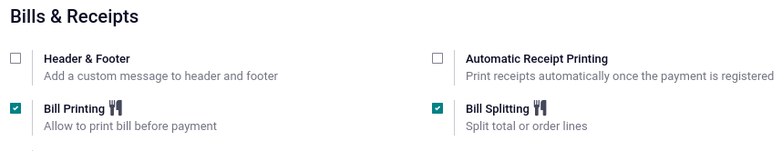

=====
Bills
=====

Typical practices in restaurants or bars are to request the bill before proceeding to payment or
splitting it based on the items ordered. Odoo POS provides two features to perform these tasks
seamlessly: **Bill Printing** and **Bill Splitting**.

Configuration
=============

To activate the features, go to :menuselection:`Point of Sale --> Configuration --> Settings`,
select the POS, and activate :guilabel:`Early Receipt Printing` and :guilabel:`Allow Bill Splitting`
in the :guilabel:`Restaurant & Bar` section.

Bill printing
=============

From an open session, click :menuselection:`Bill --> Print` at any moment to generate and print a
bill.

.. note::
   The printed bill is **not** final and will be updated to reflect any changes to the order.

Bill splitting
==============

From an open session, click :guilabel:`Split` to select the items to regroup. Once everything is
selected, click :guilabel:`Payment` and proceed to checkout for these items. Repeat for each guest.

.. note::
   - Once you return to the table, the selected items are no longer on order, as they have been paid
     for.
   - The feature is available as soon as at least two items are ordered.

.. seealso::
   - :doc:`floors_tables`
