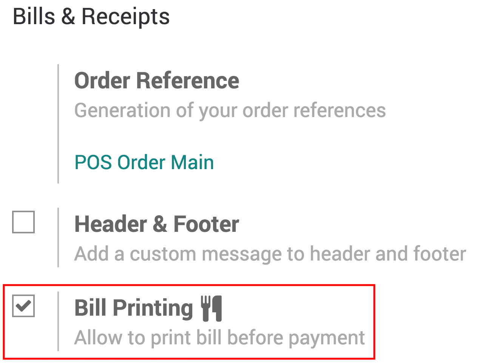
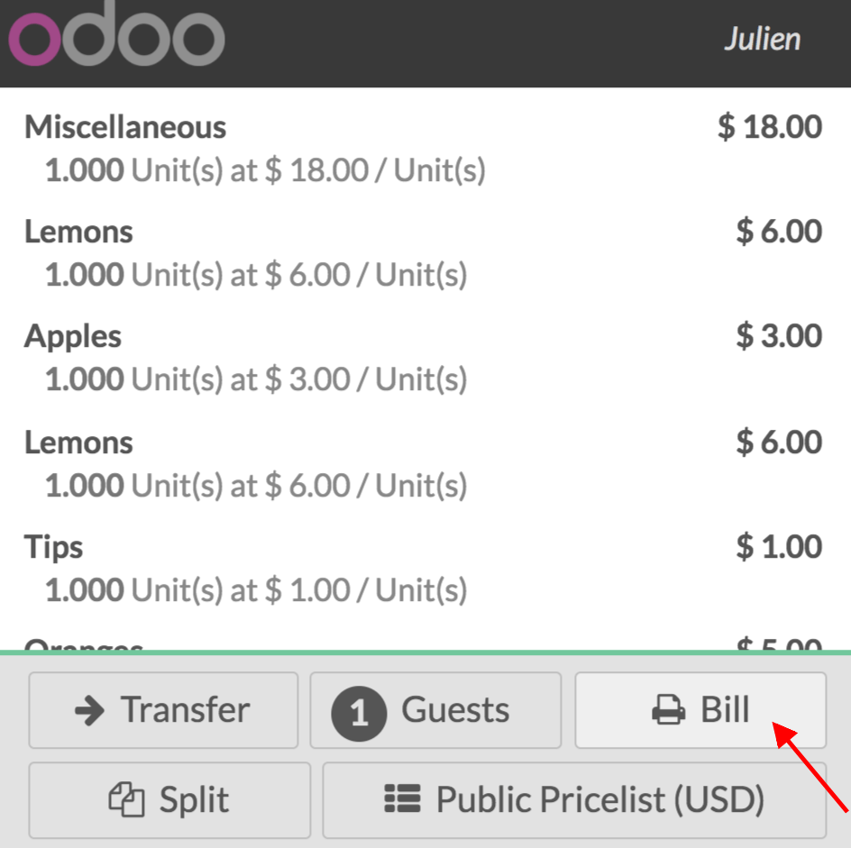

==============
Print the Bill
==============

Use the *Bill Printing* feature to print the bill before the payment.
This is useful if the bill is still subject to evolve and is thus not
the definitive ticket.

Configure Bill Printing
=======================

To activate *Bill Printing*, go to :menuselection:`Point of Sale -->
Configuration --> Point of sale` and select your PoS interface.

Under the Bills & Receipts category, you will find *Bill Printing*
option.

Split a Bill
============

On your PoS interface, you now have a *Bill* button.

When you use it, you can then print the bill.
