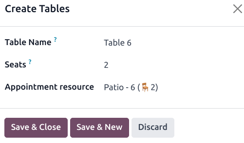
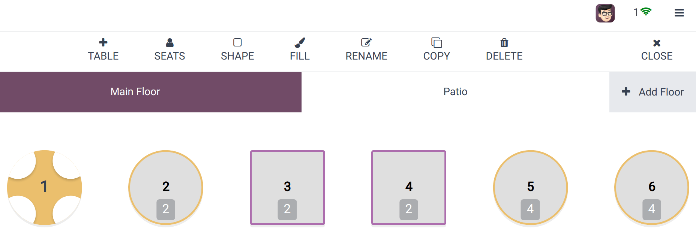

=================
Floors and tables
=================

The **Floor plan view** enables you to manage restaurant floors and table arrangements and monitor
table status in real time, including occupancy, reservations, and kitchen orders.

.. example::

   .. image:: floors_tables/plan-understand.png
      :alt: example of a floor plan view with visual keys to understand it.

   - Table 1: An order has been placed and sent to the kitchen.
   - Table 3: An order of four items has been placed and needs to be sent to the kitchen.
   - Tables 2, 4, and 5: These tables are available.
   - Tables 2, 4, and 5: These tables' total capacity is, respectively, 2, 4, and 8 people.
   - Table 1: The table of two is full.
   - Table 3: The table of four is taken by one person.
   - Table 5: "Famous Joe" has a reservation for 8 people at 12:00.

Configuration
=============

From the POS backend
--------------------

To create floors and tables from the backend, go to :menuselection:`Point of Sale --> Configuration
--> Floor Plans`, and click :guilabel:`New` to create a floor. Name it, select the related point(s)
of sales, and click :guilabel:`Add a line` to create a table. Name the table and assign a number of
seats. You can also link it to an appointment resource to make the table bookable. Once done,
click :guilabel:`Save & Close` or :guilabel:`Save & New` to confirm.

.. note::
   The POS must be opened and :ref:`edited from the frontend <floors_tables/frontend>` to create a
   map of your restaurant or bar reflecting your actual floor plan.

.. tip::
   Create floors on the spot: :ref:`access your POS settings <configuration/settings>`, type your
   floor name in the :guilabel:`Floor` field of the :guilabel:`Floors & Tables Map` category, and
   press *enter*.

   .. image:: floors_tables/floor-creation-backend.png
      :scale: 75%
      :alt: setting to create floors from the POS settings

.. _floors_tables/frontend:

From the POS frontend
---------------------

To create floors and tables from the frontend, :ref:`open a POS session <pos/session-start>`, click
the hamburger menu icon :guilabel:`≡` in the upper right corner, then :guilabel:`Edit Plan` to enter
the **edit mode**.

Click :guilabel:`+ Add Floor` to add a floor, then enter a name in the pop-up window.

Once a floor is created, add a table by clicking :guilabel:`+ TABLE`. To move it, select it and drag
and drop it as desired. You can also modify the attributes of the selected table, such as the number
of seats by clicking :guilabel:`SEATS`, the table shape using :guilabel:`SHAPE`, the table color
using :guilabel:`FILL`, or the table name by clicking :guilabel:`RENAME`. To duplicate an existing
table, select it and click :guilabel:`COPY`. You can also remove the table by clicking
:guilabel:`DELETE`.

After making all the necessary modifications, click :guilabel:`CLOSE` to save.

.. note::
   If no table is selected, the modifications are applied to the floor.

.. warning::
   Removing a table or a floor cannot be undone.

.. _floors_tables/orders:

Take orders
===========

Click a table to access the POS interface and start taking your customer's order. The system
automatically associates the orders and the table, allowing you to add more items later and generate
a bill specifically for that table's orders.

Once you have taken an order, click :guilabel:`Change table` to return to the floor plan view.

.. note::
   As soon as you click a table, the number of guests is automatically set to one. If you
   mistakenly select a table, click :guilabel:`Release table` to free it or :ref:`transfer the
   customer <floors_tables/transfer>` to another table.

.. _floors_tables/transfer:

Table transfer
==============

To move customers from one table to another, select a table and click :guilabel:`→ Transfer` on the
POS interface. This redirects you to the floor plan view, where you can choose the new table to
which you want to transfer the customers.

When you transfer customers, all of the orders they have placed and that are linked to the original
table are also transferred.
