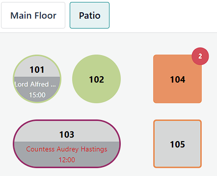
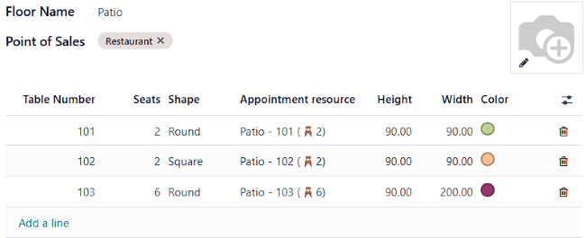
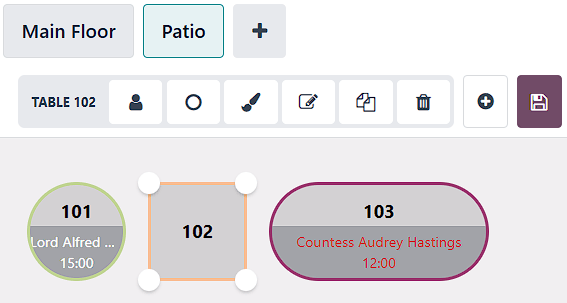

=================
Floors and tables
=================

The **Floor plan view** enables you to manage restaurant floors and table arrangements and monitor
table status in real time — including occupancy, reservations, and kitchen orders.

- Table 101: The table is available now but booked at 15:00.
- Table 102: An order has been placed and sent to the kitchen.
- Table 103: The table was booked at 12:00, but customers are late.
- Table 104: Two items are waiting to be sent to the kitchen.
- Table 105: The table is available.

Configuration
=============

From the POS backend
--------------------

To create floors and tables from the backend, go to :menuselection:`Point of Sale --> Configuration
--> Floor Plans`, and click :guilabel:`New` to create a floor. Optionally, activate additional
settings by clicking the :icon:`oi-settings-adjust` (:guilabel:`adjust settings`) icon. Then,

#. Enter a :guilabel:`Floor Name`.
#. Select the related :guilabel:`Point of Sales`.
#. Hover over the placeholder image and click the :icon:`fa-pencil` (:guilabel:`pencil`) icon to add
   a background image (e.g., your restaurant layout).
#. Click :guilabel:`Add a line` to create a table and set it up:

   - Enter a :guilabel:`Table Number`.
   - Fill in the number of :guilabel:`Seats`.
   - Select a :guilabel:`Square` or :guilabel:`Round` :guilabel:`Shape`.
   - Assign an :guilabel:`Appointment resource` to make the table bookable.
   - Adjust the :guilabel:`Height`, :guilabel:`Width`, and :guilabel:`Color`.
#. Click the :icon:`fa-trash-o` (:guilabel:`delete`) icon to delete a table.

.. tip::
   Create floors on the spot: :ref:`access your POS settings <configuration/settings>`, type your
   floor name in the :guilabel:`Floors` field of the :guilabel:`Floors & Tables Map` section, and
   press *enter* or click :guilabel:`Create and edit...` to set it up.

.. _floors_tables/frontend:

From the POS front end
----------------------

To create floors and tables from the front end, :ref:`open a POS session <pos/session-start>`, click
the :icon:`fa-bars` (:guilabel:`hamburger menu`) icon in the upper right corner, then
:guilabel:`Edit Plan`.

#. Add a floor by clicking the :icon:`fa-plus` (:guilabel:`plus`) icon, then enter a name in  the
   modal window.
#. Click the :icon:`fa-paint-brush` (:guilabel:`paintbrush`) icon to change the background color or
   image.
#. Click :icon:`fa-plus-circle` :guilabel:`Table` to add a new table.

To adjust a specific table, select it and click:

- The :icon:`fa-user` (:guilabel:`user`) icon to change the number of seats.
- The :icon:`fa-square` (:guilabel:`square`) or :icon:`fa-circle` (:guilabel:`round`)
  icon to switch the shape from round to square, and vice versa.
- The :icon:`fa-paint-brush` (:guilabel:`paintbrush`) icon to change the table's color.
- The :icon:`fa-pencil-square-o` (:guilabel:`rename`) icon to change the table number.
- The :icon:`fa-copy` (:guilabel:`clone`) icon to duplicate the table.
- The :icon:`fa-trash` (:guilabel:`bin`) icon to remove the table.

After making all the necessary modifications, click :guilabel:`Save` or the :icon:`fa-floppy-o`
(:guilabel:`floppy disk`) icon to save.

.. warning::
   Removing a table or a floor cannot be undone.

.. _pos/floors_tables/transfer:

Table transfer
==============

Select a table to move customers to another table, then click :guilabel:`Actions` and
:icon:`oi-arrow-right` :guilabel:`Transfer/Merge`.

In the floor plan view, choose the target table:

- Select a free table to transfer customers and their orders.
- Select an occupied table to merge customers and their orders.

.. seealso::
   :doc:`../restaurant`
