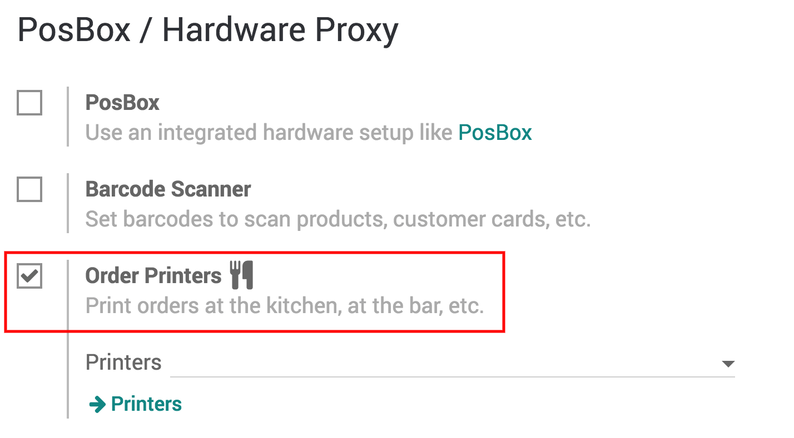
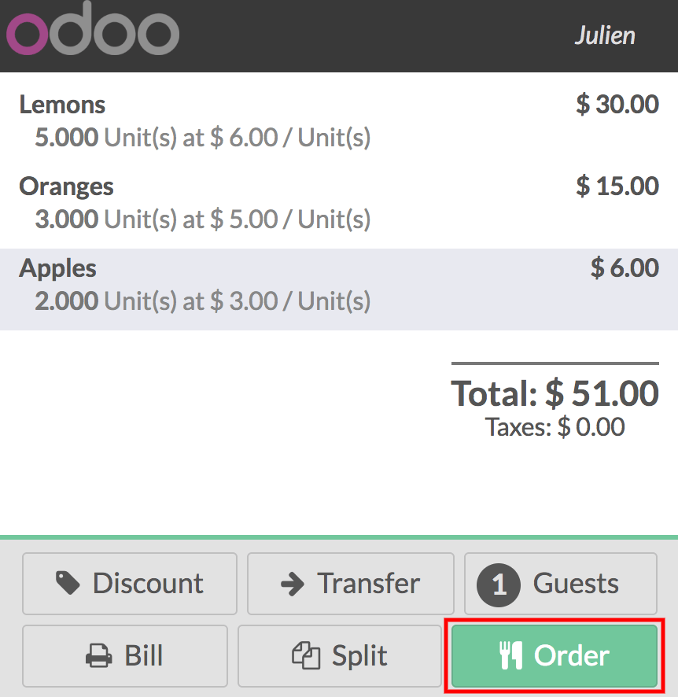

==================================
Print orders at the kitchen or bar
==================================

To ease the workflow between the front of house and the back of the
house, printing the orders taken on the PoS interface right in the
kitchen or bar can be a tremendous help.

Activate the bar/kitchen printer
================================

To activate the *Order printing* feature, go to :menuselection:`Point
of Sales --> Configuration --> Point of sale` and select your PoS
interface.

Under the IoT Box / Hardware Proxy category, you will find *Order Printers*.
Note that you need an IoT Box to connect your Printer to the PoS.

Add a printer
=============

In your configuration menu you will now have a *Order Printers* option
where you can add the printer.

.. image:: kitchen_printing/kitchen_printing01.png
    :align: center

Print a kitchen/bar order
=========================

Select or create a printer.

Print the order in the kitchen/bar
==================================

On your PoS interface, you now have a *Order* button.

When you press it, it will print the order on your kitchen/bar printer.
