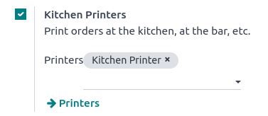
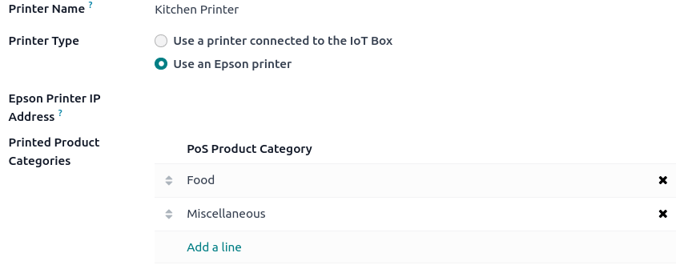

===============
Orders printing
===============

Integrating printers in a restaurant or bar's workflow can enhance communication and collaboration
between the front-of-house and back-of-house teams, leading to a more streamlined and efficient
service.

Configuration
=============

.. _kitchen_printing/enable:

Enable and create printers
--------------------------

To enable sending orders to a kitchen or bar printer, go to :menuselection:`Point of Sale -->
Configuration --> Settings`, scroll down to the :guilabel:`Restaurant & Bar` section, and enable
:guilabel:`Kitchen Printers`. Type in a name for the printer in the :guilabel:`Printers` field and
click :guilabel:`Create and edit...` to open a setup form.

To get a list of all the printers already created or to modify an already created printer, click
:guilabel:`--> Printers` and select the desired printer to open the setup form.

.. _kitchen_printing/setup-form:

Setup form
----------

From the :ref:`setup form <kitchen_printing/enable>`, select the :guilabel:`Printer Type` according
to your installation:

- If your printer is connected to an IoT box, select :guilabel:`Use a printer connected to the IoT
  Box` and select the device in the :guilabel:`IoT Device` field.
- If you use an Epson printer that does not need an IoT box, select :guilabel:`Use an Epson printer`
  and enter the printer's IP address in the :guilabel:`Epson Printer IP Address` field.

.. seealso::
   - :doc:`../../../productivity/iot/config/connect`
   - :doc:`../../../productivity/iot/devices/printer`
   - :doc:`../configuration/epos_ssc`

Set your printer to print specific products based on their POS category. To do so, click
:guilabel:`Add a line` in the :guilabel:`Printed Product Categories` field. If you leave this field
empty, all products are sent to the printer regardless of their POS category.

Print orders
============

From an open session, start taking an order and click :guilabel:`Order` to send it to the bar or the
kitchen.

.. note::
   When products can be printed, they appear in green in the cart, and the order button turns green.
