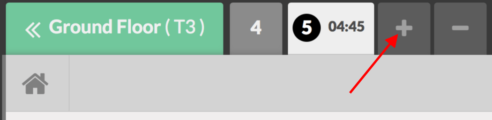

========================
Register multiple orders
========================

The Odoo Point of Sale App allows you to register multiple orders
simultaneously giving you all the flexibility you need.

Register an additional order
============================

When you are registering any order, you can use the *+* button to add
a new order.

You can then move between each of your orders and process the payment
when needed.

By using the *-* button, you can remove the order you are currently
on.
