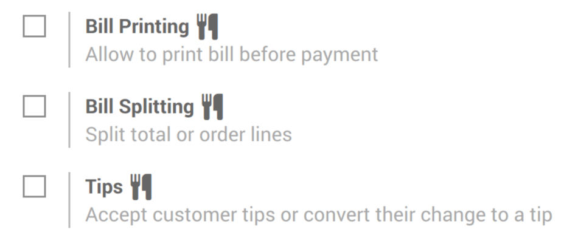
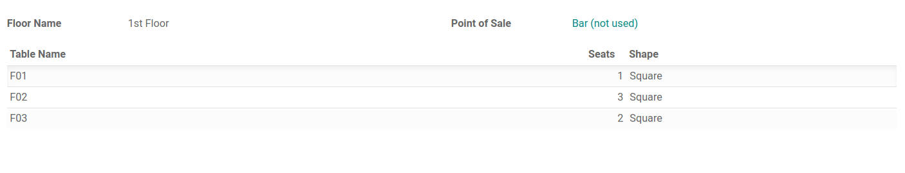
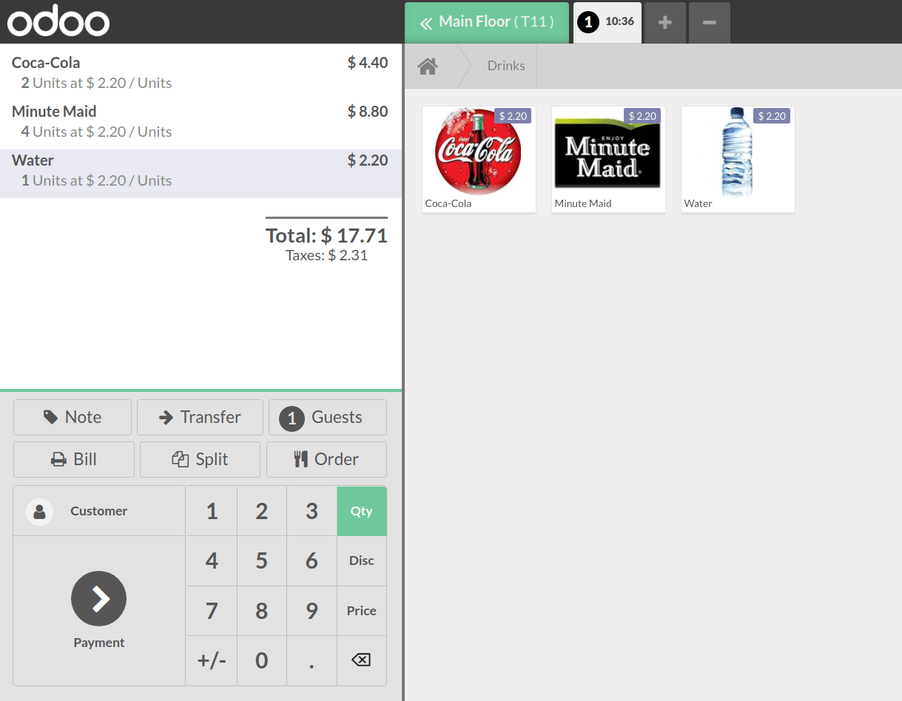

==================
Manage your tables
==================

Restaurants have specific needs that shops don’t have. That’s why
Odoo gives restaurant owners several unique features to help them manage
their business in the best possible way.

Floor and table management, bill splitting, or even the possibility to
print orders from the kitchen, everything is there to help your
business shine and your employees to work efficiently.

Configuration
=============

To activate the bar/restaurant features, go to :menuselection:`Point of
Sale --> Configuration --> Point of Sale` and open your PoS. Now,
select *Is a Bar/Restaurant*.

.. image:: restaurant/restaurant_01.png
    :align: center
    :alt: Restaurant set up. Enabling the is a bar/Restaurant feature on a PoS

New features are shown with a fork and a knife next to it, indicating
that they are restaurant-specific.

Add a floor
===========

Once your *Point of Sale* has been configured, select *Table
Management* under :menuselection:`Point of Sale --> Configuration -->
Point of Sale`. Then, click on *Floors* to create and name your floor and tables.

.. image:: restaurant/restaurant_03.png
    :align: center
    :alt: View of the table management feature. Way to manage and create floors for a pos

.. note::
   Don’t forget to link your floor to your point of sale.

Add tables
==========

To add tables, you can also open your PoS interface to see your
floor(s).

.. image:: restaurant/restaurant_05.png
    :align: center
    :alt: View of the floors menu to manage several floors at the same time

Then, click on *Edit Mode* (pencil icon on the upper right corner) to be allowed to
create, move, modify tables, etc.

.. image:: restaurant/restaurant_06.png
    :align: center
    :alt: View of the floor management. Add tables, the number of sits, their name and their shape

.. note::
   To make your table easier to be found, you can rename them, change their
   shape, size or even color. It is also possible to add the maximum number of sits the table can
   have.

Register your table(s) orders
=============================

To register an order, click on the respective table. By doing so, you are taken
to your main interface.

Transfer customer(s)
====================

If your customers want to move to another table after they already
ordered, use the transfer button. This way, the order is also moved to the new
table.

To do so, select the table your customer is currently on.

.. image:: restaurant/restaurant_08.png
    :align: center
    :alt: View of the restaurant tables, one having a pending order

Now, click on the transfer button and select the table to which you are transferring your
customer.

.. image:: restaurant/restaurant_09.png
    :align: center
    :alt: View of the pos interface and transfer button. How to transfer customers from one table
          to another

Register an additional order
============================

When registering an order, use the + button to simultaneously proceed to
another one.

Then, you can shift between your orders and process the payment
when needed.

.. image:: restaurant/restaurant_10.png
    :align: center
    :alt: View of the - button, allowing employees to close/remove an order

.. tip::
   The - button allows you to remove the order you are currently on.
