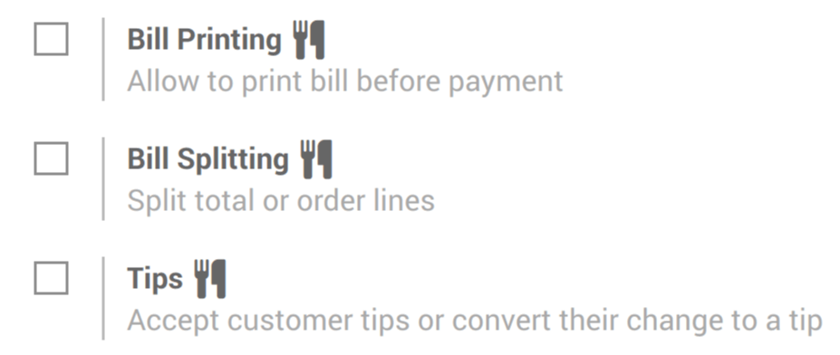
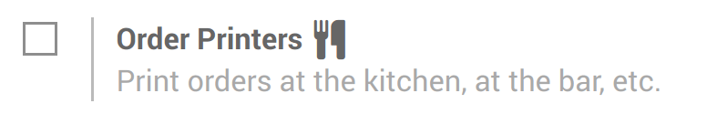

========================
Setup PoS Restaurant/Bar
========================

Food and drink businesses have very specific needs that the Odoo Point
of Sale application can help you to fulfill.

Configuration
=============

To activate the *Bar/Restaurant* features, go to
:menuselection:`Point of Sale --> Configuration --> Point of sale` and
select your PoS interface.

Select *Is a Bar/Restaurant*

.. image:: media/setup01.png
    :align: center

You now have various specific options to help you setup your point of
sale. You can see those options have a small knife and fork logo next to
them.

.. image:: media/setup02.png
    :align: center

