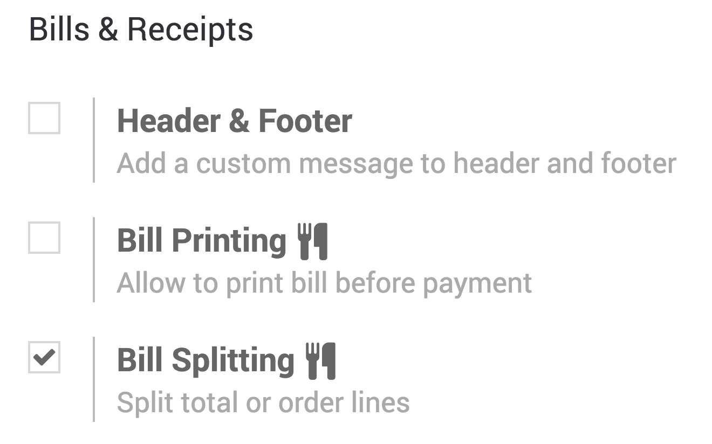
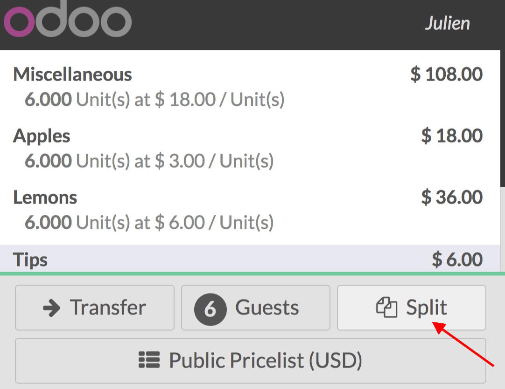
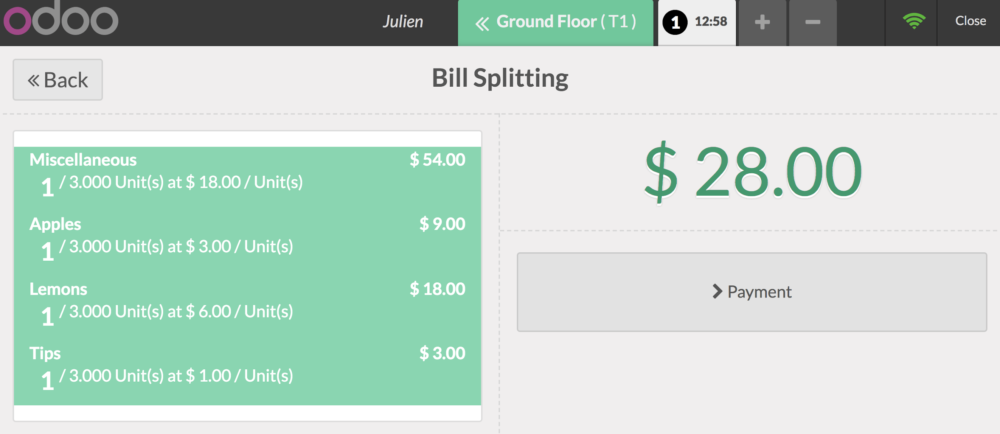

=============================
Offer a bill-splitting option
=============================

Offering an easy bill splitting solution to your customers will leave
them with a positive experience. That's why this feature is available
out-of-the-box in the Odoo Point of Sale application.

Configuration
=============

To activate the *Bill Splitting* feature, go to :menuselection:`Point
of Sales --> Configuration --> Point of sale` and select your PoS
interface.

Under the Bills & Receipts category, you will find the Bill Splitting
option.

Split a bill
============

In your PoS interface, you now have a *Split* button.

When you use it, you will be able to select what that guest should had
and process the payment, repeating the process for each guest.

