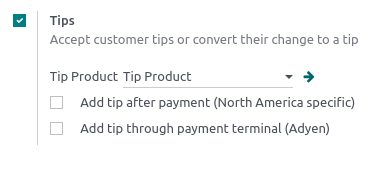
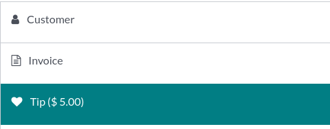
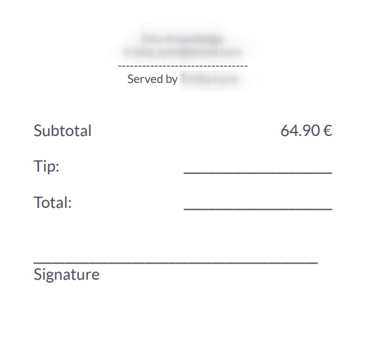
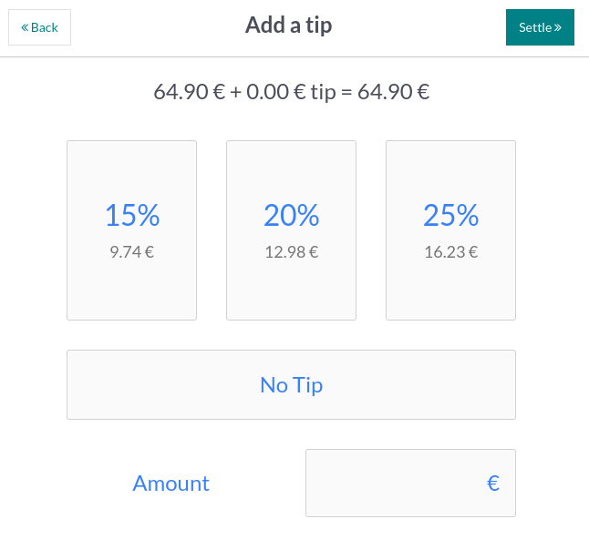

====
Tips
====

Tipping is customary in multiple countries. Point of Sale allows tipping in :ref:`shops <pos/sell>`,
:doc:`bars <../restaurant>`, or :doc:`restaurants <../restaurant>`.

.. _configuration:

Configuration
=============

To allow tipping in your POS, activate the :guilabel:`Tips` feature in :menuselection:`Point of Sale
--> Configuration --> Settings`. At the top of the page, select the POS in which you wish to allow
**tipping**, scroll down to the :guilabel:`Payment` section and check :guilabel:`Tips`. Once
enabled, add a :guilabel:`Tip Product` in the corresponding field, and save. The designated product
will be used as a reference on customers' receipts.

.. _tip-product:

Tip products
------------

**Tip products** can be created on the spot. To do so, enter a product's name in the :ref:`Tip
Product <configuration>` field and click :guilabel:`Create` or press **enter**. The product is
automatically configured to be used as a tip at the payment screen.

However, if you wish to be able to select the tip product in a POS session, you must activate the
**Available in POS** setting. To do so, click :guilabel:`Create and edit...` to open the product
configuration form. Then, go to the :guilabel:`Sales` tab, tick the :guilabel:`Available in POS`
checkbox, and click :guilabel:`Save & Close`.

.. note::
   - When you create a product to use as a tip, leave the **product type** as :guilabel:`Consumable`
     to avoid unnecessary inventory movements.
   - You can only select one tip product per POS, but you can choose a different one for each.

Tip using an Adyen terminal
---------------------------

If you use an :doc:`Adyen <../payment_methods/terminals/adyen>` payment terminal and wish to enable
**tips** using the terminal, check :guilabel:`Add tip through payment terminal (Adyen)` below the
:ref:`tip settings <configuration>`.

Tip after payment
-----------------

If you use a POS system in a bar or a restaurant, you can enable :guilabel:`Add tip after payment
(North America specific)`. Doing so generates a bill to print and complete manually by the customer
and the waiter. That bill indicates the tip value the customer chooses to give after the payment.

.. important::
   To use this feature, the selected payment method must have a bank journal attributed.

Add tips
========

To add tips to an order, :ref:`access the payment screen <pos/sell>` and click :guilabel:`♥ Tip`.
Then, enter the tipping amount, click :guilabel:`Confirm` to validate, and process the payment.

Alternatively, you can select the :ref:`tip product <tip-product>` on the POS interface to add it to
the cart. When selected, the product is automatically set as a tip, and its default value equals its
**Sales Price**.

Tip using an Adyen terminal
---------------------------

During checkout, select **Adyen** as the payment terminal, and send the payment request to the
device by clicking :guilabel:`Send`. The customers are asked to enter the desired tipping amount on
the terminal's screen before proceeding to the payment.

Tip after payment
-----------------

At checkout, select a card payment method and click :guilabel:`Close Tab`. Doing so generates a bill
to complete by the customer.

On the following screen, click the percentage (:guilabel:`15%`, :guilabel:`20%`, :guilabel:`25%`),
:guilabel:`No Tip`, or enter the tipping amount the customer chose to give. Then, click
:guilabel:`Settle` to move to the following order.

