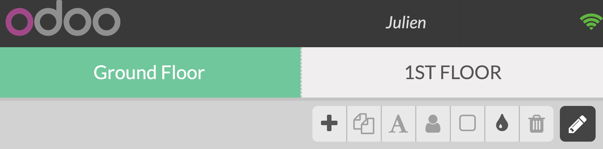

===================================
Integrate a tip option into payment
===================================

As it is customary to tip in many countries all over the world, it is
important to have the option in your PoS interface.

Configure Tipping
=================

To activate the *Tips* feature, go to :menuselection:`Point of Sale
--> Configuration --> Point of sale` and select your PoS.

Under the Bills & Receipts category, you will find *Tips*. Select it
and create a *Tip Product* such as *Tips* in this case.

.. image:: tips/tips01.png
    :align: center

Add Tips to the bill
====================

Once on the payment interface, you now have a new *Tip* button

.. image:: tips/tips02.png
    :align: center

Add the tip your customer wants to leave and process to the payment.

