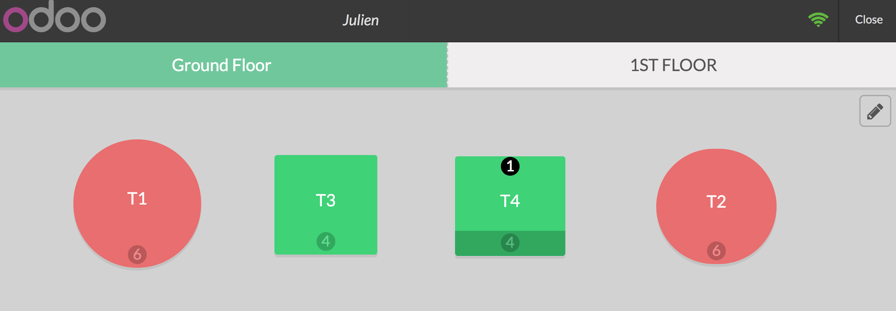
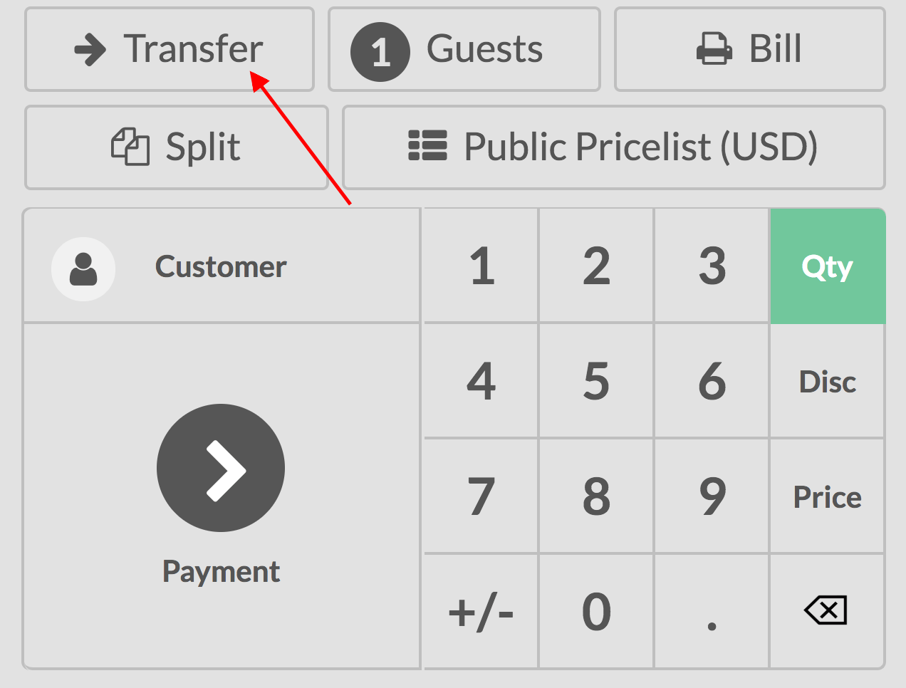

=================================
Transfer customers between tables
=================================

If your customer(s) want to change table after they have already placed
an order, Odoo can help you to transfer the customers and their order to
their new table, keeping your customers happy without making it
complicated for you.

Transfer customer(s)
====================

Select the table your customer(s) is/are currently on.

You can now transfer the customers, simply use the transfer button and
select the new table

