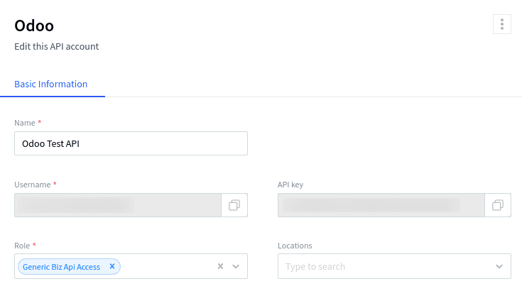
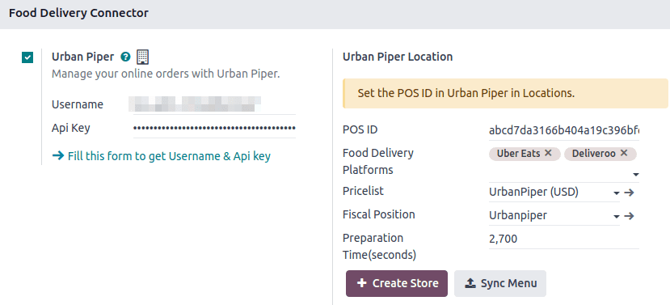
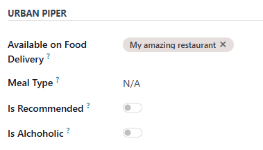
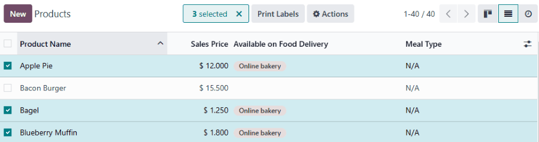
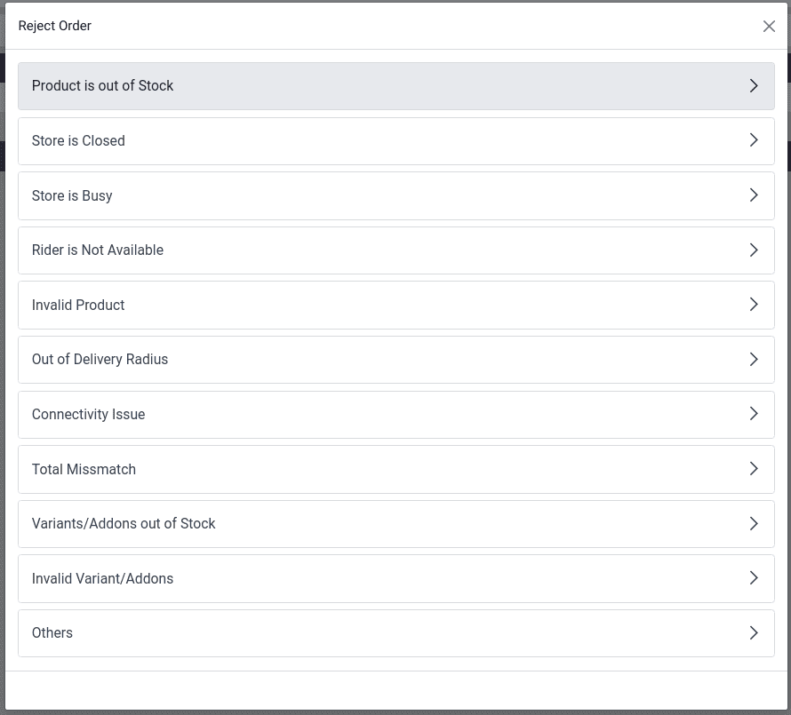

==========
UrbanPiper
==========

**UrbanPiper** is an order management system that integrates with multiple food delivery platforms.
It consolidates orders from all connected platforms into a single interface, simplifying the
delivery process.

Supported providers and locations:

.. tabs::

   .. tab:: Global and multi-region providers

      .. list-table::
         :header-rows: 1
         :stub-columns: 1
         :widths: 25 75
         :class: table-striped

         * - Providers
           - Locations
         * - `Deliveroo <https://deliveroo.co>`_
           - Belgium, France, Ireland, Italy, Kuwait, United Arab Emirates, United Kingdom
         * - `DoorDash <https://www.doordash.com>`_
           - Australia, Canada, United States
         * - `Glovo <https://glovoapp.com/en>`_
           - Armenia, Bosnia and Herzegovina, Bulgaria, Croatia, Côte d'Ivoire, Georgia, Italy,
             Kazakhstan, Kenya, Kyrgyzstan, Moldova, Montenegro, Morocco, Nigeria, Poland, Portugal,
             Romania, Serbia, Spain, Tunisia, Uganda, Ukraine
         * - `HungryPanda <https://www.hungrypanda.co>`_
           - Australia, Canada, France, Italy, Japan, New Zealand, Singapore, South Korea, United
             Kingdom, United States
         * - `Just Eat <https://www.just-eat.com>`_
           - Austria, Belgium, Bulgaria, Canada, Denmark, Germany, Ireland, Israel, Italy,
             Luxembourg, Poland, Slovakia, Spain, Switzerland, Netherlands, United Kingdom
         * - `Keeta <https://www.keeta-global.com/AE/en>`_
           - Bahrain, Brazil, Hong Kong (China), Kuwait, Qatar, Saudi Arabia, United Arab Emirates
         * - `UberEats <https://www.ubereats.com>`_
           - Argentina, Australia, Belgium, Canada, Chile, Costa Rica, Denmark, Dominican Republic,
             Ecuador, El Salvador, Finland, France, Germany, Guatemala, Ireland, Italy, Japan,
             Kenya, Luxembourg, Mexico, Netherlands, New Zealand, Norway, Panama, Poland, Portugal,
             South Africa, Spain, Sri Lanka, Sweden, Switzerland, Taiwan (ROC), United Kingdom,
             United States
         * - `Wolt <https://wolt.com>`_
           - Albania, Austria, Azerbaijan, Bulgaria, Croatia, Cyprus, Czech Republic, Denmark,
             Estonia, Finland, Georgia, Germany, Greece, Hungary, Iceland, Israel, Japan, Kazakhstan,
             Kosovo, Latvia, Lithuania, Luxembourg, Malta, North Macedonia, Norway, Poland, Romania,
             Serbia, Slovakia, Slovenia, Sweden, Uzbekistan

   .. tab:: Regional and national providers: Americas

      .. list-table::
         :header-rows: 1
         :stub-columns: 1
         :widths: 25 75
         :class: table-striped

         * - Providers
           - Locations
         * - `Grubhub <https://www.grubhub.com>`_
           - United States
         * - `Postmates <https://www.postmates.com>`_
           - Puerto Rico, United States
         * - `ChowNow <https://get.chownow.com>`_
           - Canada, United States
         * - `Rappi <https://www.rappi.com>`_
           - Argentina, Brazil, Chile, Colombia, Costa Rica, Ecuador, Mexico, Peru, Uruguay
         * - `SkipTheDishes <https://www.skipthedishes.com/en>`_
           - Canada (Alberta, British Columbia, Manitoba, New Brunswick, Newfoundland and Labrador,
             Northwest Territories, Nova Scotia, Ontario, Prince Edward Island, Quebec,
             Saskatchewan, Yukon)

   .. tab:: Regional and national providers: Middle East and North Africa

      .. list-table::
         :header-rows: 1
         :stub-columns: 1
         :widths: 25 75
         :class: table-striped

         * - Providers
           - Locations
         * - `Careem <https://www.careem.com/en-AE>`_
           - Egypt, Kuwait, Morocco, United Arab Emirates
         * - `Cari <https://www.cariapp.com>`_
           - Kuwait, Saudi Arabia, United Arab Emirates
         * - `EatEasy <https://www.eateasy.ae>`_
           - United Arab Emirates
         * - `HungerStation <https://hungerstation.com/sa-en>`_
           - Saudi Arabia (115+ regions)
         * - `Jahez <https://www.jahez.net/index-en.html>`_
           - Bahrain, Kuwait, Saudi Arabia
         * - `Mrsool <https://mrsool.co>`_
           - Bahrain, Egypt, Saudi Arabia
         * - `Ninja <https://ananinja.com/sa/en>`_
           - Bahrain, Kuwait, Qatar
         * - `NoonFood <https://food.noon.com/uae-en>`_
           - Saudi Arabia, United Arab Emirates
         * - `Rafeeq <https://www.gorafeeq.com/en>`_
           - Qatar
         * - `Talabat <https://www.talabat.com/uae>`_
           - Bahrain, Egypt, Iraq, Jordan, Kuwait, Oman, Qatar, Saudi Arabia, United Arab Emirates

   .. tab:: Regional and national providers: Asia and Oceania

      .. list-table::
         :header-rows: 1
         :stub-columns: 1
         :widths: 25 75
         :class: table-striped

         * - Providers
           - Locations
         * - `Swiggy <https://www.swiggy.com>`_
           - India
         * - `Zomato <https://www.zomato.com>`_
           - India

.. _pos/urban_piper/configuration:

Configuration
=============

Prerequisites
-------------

To use the UrbanPiper integration in a live production environment, ensure the following
requirements are satisfied:

- **UrbanPiper subscription:** A valid UrbanPiper subscription is mandatory.

  .. note::
     For any concerns or queries regarding your UrbanPiper subscription, please reach out to the
     account manager linked to your Odoo database.

- **Odoo requirements:**

  - **Odoo subscription:** An active Odoo Enterprise subscription is required. Odoo Community does
    not support this integration.
  - **Odoo version:** Odoo Enterprise version 18.0 or above.
  - **Odoo platform:** All Odoo platforms are supported, including Odoo Online, Odoo.sh, and
    On-Premise installations.

- **Delivery platform reseller account:** A registered reseller account is required with each
  delivery platform to be integrated (e.g., Uber Eats, DoorDash, Careem, Deliveroo, Zomato).

.. _pos/urban_piper/credentials:

UrbanPiper credentials
----------------------

#. Get your Atlas credentials:

   #. Go to the :ref:`POS settings <pos/use/settings>`.
   #. Scroll down to the :guilabel:`Food Delivery Connector` section.
   #. Click :guilabel:`Fill this form to get Username & Api key` and fill out the survey.
#. `Go to your Atlas account <https://atlas.urbanpiper.com>`_ and retrieve your API key and username
   by navigating to :menuselection:`Settings --> API Access`.

Point of Sale
-------------

#. Enable the :guilabel:`Urban Piper` setting:

   #. Go to the :ref:`POS settings <pos/use/settings>`.
   #. Scroll down to the :guilabel:`Food Delivery Connector` section.
   #. Check the :guilabel:`Urban Piper` setting.

#. Set up UrbanPiper:

   #. Fill in the :guilabel:`Username` and :guilabel:`Api Key` fields with your :ref:`UrbanPiper
      credentials <pos/urban_piper/credentials>`.
   #. Select the desired delivery providers in the :guilabel:`Food Delivery Platforms` field under
      the :guilabel:`Urban Piper Location` section (i.e., Zomato, Uber Eats).
#. Save the settings.
#. Click the :guilabel:`+ Create Store` button. Doing so creates a new location on the UrbanPiper
   Atlas platform.

.. note::
   - The :guilabel:`Pricelist` and :guilabel:`Fiscal Position` fields are automatically selected
     after saving.
   - A successful store creation triggers a notification.
   - The store creation process may take 2–3 minutes to reflect changes on the UrbanPiper Atlas
     platform.
   - The store is automatically named after your point of sale name.

Store timings
-------------

Configure the store timings to define when the delivery services are available:

#. Navigate to :menuselection:`Point of Sale --> Configuration --> Store Timings`.
#. Add a new timing record by clicking :guilabel:`New` to add a line, or edit an existing line.
#. Fill in the :guilabel:`Week Day`, :guilabel:`Starting Hour`, :guilabel:`Ending Hour`,
   and :guilabel:`Point of Sale associated with this timing` columns.

Products
--------

To make products available individually,

#. Go to :menuselection:`Point of Sale --> Products --> Products`.
#. Select any product to open its product form.
#. Go to the :guilabel:`Point of Sale` tab.
#. Complete the :guilabel:`Urban Piper` section:

   - Fill in the :guilabel:`Available on Food Delivery` with the desired POS.
   - Optionally, set up the :guilabel:`Meal Type` field and enable the :guilabel:`Is Recommended`
     and :guilabel:`Is Alcoholic` buttons.

To make multiple products available for food delivery at once,

#. Go to :menuselection:`Point of Sale --> Products --> Products`.
#. Click the list icon (:icon:`oi-view-list`) to switch to the list view.
#. Select the products.
#. Enter the desired POS in the :guilabel:`Available on Food Delivery` column.

.. note::
   - Currently, UrbanPiper does not support combo products.
   - As a workaround, create a product and define combo choices as :doc:`Attributes & Variants
     <../../sales/products_prices/products/variants>`.

Synchronization
---------------

To make products available on food delivery platforms, synchronize with your UrbanPiper account:

#. Go to the :ref:`POS settings <pos/use/settings>`.
#. Scroll down the :guilabel:`Food Delivery Connector` section.
#. Click the :guilabel:`Sync Menu` button.

   - The :guilabel:`Last Sync on` timestamp below the :guilabel:`Create Store` and :guilabel:`Sync
     Menu` buttons updates.

.. note::
   - A successful synchronization triggers a notification.
   - The synchronization process may take 2–3 minutes to reflect changes on the UrbanPiper Atlas
     platform.

Go live
-------

#. `Go to the Locations tab <https://atlas.urbanpiper.com/locations>`_ of your Atlas account.
#. Select the location to activate, then click :guilabel:`Request to go Live`.

   .. image:: urban_piper/go-live.png
      :alt: Request to go live button in the locations tab of the Atlas account

#. In the popup window:

   #. Select the platform(s) to activate and click :guilabel:`Next`.
   #. Enter the :guilabel:`Platform ID` and :guilabel:`Platform URL` in the corresponding fields to
      establish the connection between the platform and UrbanPiper.
   #. Click the :guilabel:`Request to Go Live` button.

   .. image:: urban_piper/go-live-parameters.png
      :alt: Go live parameters

   .. note::
      To find the location's :guilabel:`Platform ID` and :guilabel:`Platform URL`,

      #. Click the location to open its setup form.
      #. The location's parameters are available in the :guilabel:`HUB` tab.
#. Verify that your location is live:

   #. `Go to the Locations tab <https://atlas.urbanpiper.com/locations>`_ of your Atlas account.
   #. Select any provider in the :guilabel:`Assoc. platform(s)` column to review the status of that
      platform for this location.

Order flow
==========

An order placed via the configured delivery platform triggers a notification. To manage these
orders, open the orders' list view by:

#. Clicking :guilabel:`Review Orders` on the notification popup.
#. Clicking the bag-shaped icon for online orders and :guilabel:`New`.

   .. image:: urban_piper/cart-button.png
      :alt: Cart button

   .. note::
      - Clicking this icon displays the number of orders at each stage: :guilabel:`New`,
        :guilabel:`Ongoing`, and :guilabel:`Done`.
      - The :guilabel:`New` button indicates newly placed orders, :guilabel:`Ongoing` is for
        accepted orders, and :guilabel:`Done` is for orders ready to be delivered.

Then,

#. Select the desired order.
#. Click the :guilabel:`Accept` button.
#. When an order is accepted, its :guilabel:`Order Status` switches from :guilabel:`Placed` to
   :guilabel:`Acknowledged` and is automatically displayed on the preparation display.

When the order is ready,

#. Open the orders' list view.
#. Select the order.
#. Click the :guilabel:`Mark as ready` button. Its :guilabel:`Order Status` switches from
   :guilabel:`Acknowledged` to :guilabel:`Food Ready`, and its :guilabel:`Status` switches from
   :guilabel:`Ongoing` to :guilabel:`Paid`.

Order rejection
---------------

Sometimes, the shop or restaurant may want to **reject** an order. In this case, open the orders'
list view,

#. Select the desired order.
#. Click the :guilabel:`Reject` button.
#. Select one of the reasons from the popup window.

.. important::
   **Swiggy** orders cannot be directly rejected. Attempting to reject one prompts Swiggy customer
   support to contact the restaurant. Similarly, **Deliveroo**, **JustEat**, and **HungerStation**
   do not allow order rejection. Always follow the respective provider's guidelines for handling
   such cases.
