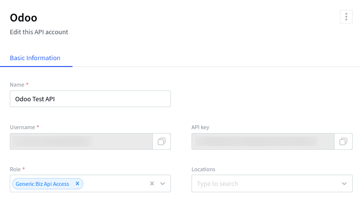
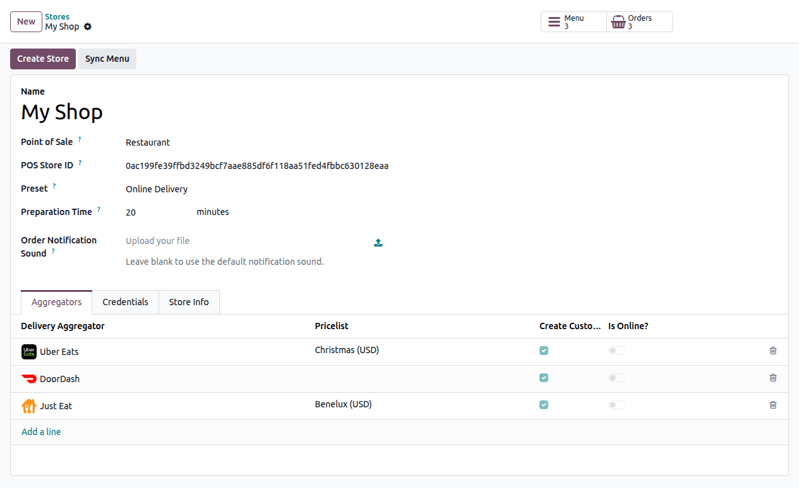
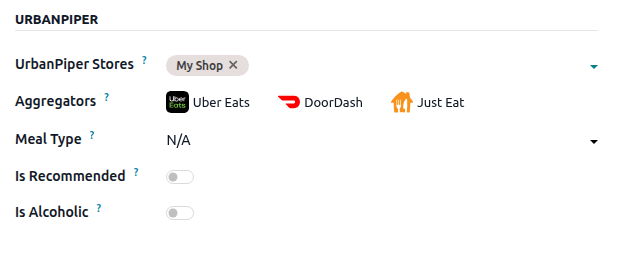
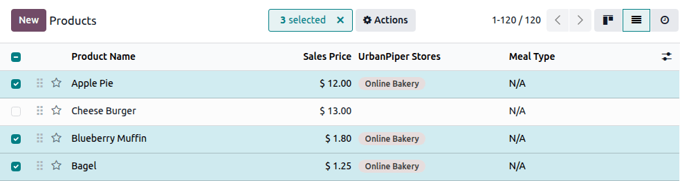
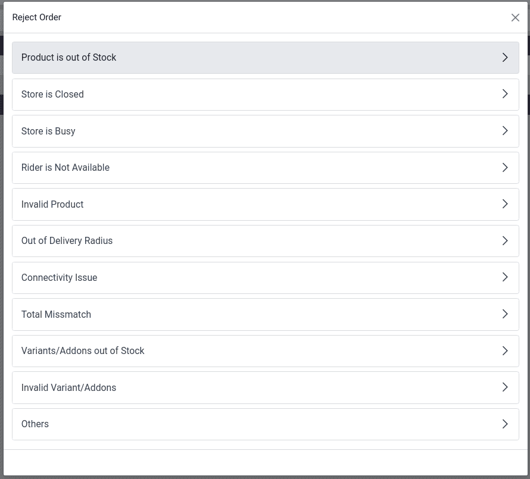

==========
UrbanPiper
==========

**UrbanPiper** is an order management system that integrates with multiple food delivery platforms.
It consolidates orders from all connected platforms into a single interface, simplifying the
delivery process.

Supported providers:

.. list-table::
   :widths: 25 25 25 25
   :class: table-striped

   * - `Careem <https://www.careem.com/en-AE>`_
     - `Cari <https://www.cariapp.com>`_
     - `ChowNow <https://get.chownow.com>`_
     - `Deliveroo <https://deliveroo.co>`_
   * - `DiDi Food <https://www.didi-food.com/>`_
     - `DoorDash <https://www.doordash.com>`_
     - `EatEasy <https://www.eateasy.ae>`_
     - `Enqueue <https://enqueue.tech>`_
   * - `FoodZapp <https://spryntz.com>`_
     - `Glovo <https://glovoapp.com/en>`_
     - `Grubhub <https://www.grubhub.com>`_
     - `HungerStation <https://hungerstation.com/sa-en>`_
   * - `HungryPanda <https://www.hungrypanda.co>`_
     - `InstaShop <http://instashop.com>`_
     - `Jahez <https://www.jahez.net/index-en.html>`_
     - `Just Eat <https://www.just-eat.com>`_
   * - `Keeta <https://www.keeta-global.com/AE/en>`_
     - `Mr Mandoob <https://mrmandoob.com>`_
     - `Mrsool <https://mrsool.co>`_
     - `Ninja <https://ananinja.com/sa/en>`_
   * - `NoonFood <https://food.noon.com/uae-en>`_
     - `Postmates <https://www.postmates.com>`_
     - `Radyes <https://lyveglobal.com/>`_
     - `Rafeeq <https://www.gorafeeq.com/en>`_
   * - `Rappi <https://www.rappi.com>`_
     - `SkipTheDishes <https://www.skipthedishes.com/en>`_
     - `Smiles <https://smiles.ae>`_
     - `Snoonu <https://www.snoonu.com>`_
   * - `Swiggy <https://www.swiggy.com>`_
     - `Talabat <https://www.talabat.com/uae>`_
     - `Talabna <https://talabnapp.com/>`_
     - `The Chefz <https://thechefz.co>`_
   * - `ToYou <https://toyou.io>`_
     - `Uber Eats <https://www.ubereats.com>`_
     - `Wolt <https://wolt.com>`_
     - `Zomato <https://www.zomato.com>`_
   * - `Zyda <https://zyda.com>`_
     -
     -
     -

.. important::
   To connect a delivery platform that is not listed above, check the
   `UrbanPiper integrations <https://www.urbanpiper.com/integrations>`_ page.
   If the platform is listed there, reach out to the account manager linked to your Odoo database.

.. _pos/urban_piper/configuration:

Configuration
=============

Prerequisites
-------------

To use the UrbanPiper integration in a live production environment, ensure the following
requirements are satisfied:

- **UrbanPiper subscription:** A valid UrbanPiper subscription is mandatory.

  .. note::
     For any concerns or queries regarding your UrbanPiper subscription, please reach out to the
     account manager linked to your Odoo database.

- **Odoo requirements:**

  - **Odoo subscription:** An active Odoo Enterprise subscription is required. Odoo Community does
    not support this integration.
  - **Odoo version:** Odoo Enterprise version 18.0 or above.
  - **Odoo platform:** All Odoo platforms are supported, including Odoo Online, Odoo.sh, and
    On-Premise installations.

- **Delivery platform reseller account:** A registered reseller account is required with each
  delivery platform to be integrated (e.g., Uber Eats, DoorDash, Careem, Deliveroo, Zomato).

.. _pos/urban_piper/credentials:

UrbanPiper credentials
----------------------

#. Get your Atlas credentials:

   #. Go to the :ref:`POS settings <pos/use/settings>`.
   #. Scroll down to the :guilabel:`Food Delivery Connector` section.
   #. Click :guilabel:`Fill this form to get Username & Api key` and fill out the survey.
#. `Go to your Atlas account <https://atlas.urbanpiper.com>`_ and retrieve your API key and username
   by navigating to :menuselection:`Settings --> API Access`.

UrbanPiper Store
----------------

Each point of sale is linked to a dedicated UrbanPiper store record that centralizes credentials,
aggregators, pricing, and schedule-related settings.

#. Go to :menuselection:`Point of Sale --> Configuration --> UrbanPiper --> Stores`.
#. Click :guilabel:`New`.
#. On the store form:

   #. Enter a :guilabel:`Name`.
   #. Select the :guilabel:`Point of Sale` that will receive online orders.
   #. Keep the generated :guilabel:`POS Store ID` which links Odoo Store to UrbanPiper.
   #. Select a :ref:`Preset<pos/urban_piper/Preset>`.
   #. Set the :guilabel:`Preparation Time`.
   #. Optionally upload an :guilabel:`Order Notification Sound` in `.mp3` format.
   #. If the company is based in India, choose the appropriate :guilabel:`Tax Type`.
#. Open the :guilabel:`Credentials` tab and enter your :ref:`UrbanPiper credentials
   <pos/urban_piper/credentials>`.
#. Open the :guilabel:`Aggregators` tab and add one line per delivery platform.

   - Use :guilabel:`Pricelist` to apply platform-specific pricing during menu synchronization.
   - Disable :guilabel:`Create Customer` if Odoo should not create customer records for orders
     received from the aggregator. In this case, Odoo will use the default customer of the
     aggregator.

#. Open the :guilabel:`Store Info` tab and confirm the :guilabel:`City`.
#. Save, then click :guilabel:`Create Store`.

.. note::
   - A point of sale can only be linked to one UrbanPiper store.
   - Once the store is created, you can update it using the :guilabel:`Update Store` button.
   - Store creation may take 2 to 3 minutes to appear in UrbanPiper Atlas.

.. _pos/urban_piper/Preset:

Preset
------

The store's :guilabel:`Preset` controls the default settings applied to incoming online orders.

#. Select or create a preset dedicated to online food delivery store.
#. Open the linked Preset by clicking the :icon:`oi-arrow-right` :guilabel:`(right arrow)` icon
   to the right of the field.
#. Configure the preset as needed:

   - Set the :guilabel:`Pricelist` to change the product prices on the UrbanPiper menu.
   - Set the :guilabel:`Fiscal Position`.
   - If needed, enable :guilabel:`Manage orders by time` and configure the :guilabel:`Schedule`.

.. tip::
   Restaurant databases include an :guilabel:`Online Delivery` preset by default.

Products
--------

To make products available individually,

#. Navigate to the :guilabel:`UrbanPiper Store` and click the :icon:`fa-bars` :guilabel:`Menu` smart button.
#. Select any product to open its product form.
#. Go to the :guilabel:`Point of Sale` tab.
#. Complete the :guilabel:`UrbanPiper` section:

   - Select one or more :guilabel:`UrbanPiper Stores`.
   - Select the :guilabel:`Aggregators` where the product should be published.
   - Optionally, set up the :guilabel:`Meal Type` field and enable the :guilabel:`Is Recommended`
     and :guilabel:`Is Alcoholic` buttons.

To make multiple products available for food delivery at once,

#. Open the :guilabel:`product` list view.
#. Select the products.
#. Enter the desired Stores in the :guilabel:`UrbanPiper Stores` column.

.. note::
   - Currently, UrbanPiper does not support combo products.
   - As a workaround, create a product and define combo choices as :doc:`Attributes & Variants
     <../../sales/products_prices/products/variants>`.

.. _pos/urban_piper/synchronization:

Synchronization
---------------

To make products available on food delivery platforms, synchronize with your UrbanPiper account:

#. Open the UrbanPiper store.
#. Click :guilabel:`Sync Menu`.

   - A Chatter note will appear confirming :guilabel:`Store menu successfully synced on UrbanPiper`,
     along with the time of the menu sync.

.. note::
   - A successful synchronization triggers a notification.
   - The synchronization process may take 2–3 minutes to reflect changes on the UrbanPiper Atlas
     platform.

Go live
-------

#. `Go to your Atlas account <https://atlas.urbanpiper.com>`_ and navigate to :menuselection:`All
   Apps --> Settings --> Platforms`.
#. In the :guilabel:`Integrations` tab, select the platform to activate (e.g., :guilabel:`Swiggy`).
   The platform's :guilabel:`Request to go live` page opens, listing the status of every storefront
   for that platform.
#. Click :guilabel:`Create Request`.

   .. image:: urban_piper/go-live.png
      :alt: Request to go live page of a platform in the Atlas account

#. On the :guilabel:`Map Storefronts` page:

   #. Find the storefront to activate, using the search bar if needed, and tick its checkbox.
   #. Enter the storefront's :guilabel:`Platform ID` and :guilabel:`Restaurant URL` to establish the
      connection between the platform and UrbanPiper.
   #. Click :guilabel:`Publish & Activate Store`.

   .. image:: urban_piper/go-live-parameters.png
      :alt: Go live parameters

   .. note::
      To find the storefront's :guilabel:`Platform ID` and :guilabel:`Restaurant URL`,

      #. Click the location to open its setup form.
      #. The location's parameters are available in the :guilabel:`HUB` tab.

#. UrbanPiper verifies the associated menus, which may take a minute or two, then initiates the
   go-live request on the selected platform.
#. Verify that your storefront is live by going back to :menuselection:`All Apps --> Settings -->
   Platforms`, selecting the platform, and checking the :guilabel:`Status` column of the
   :guilabel:`Storefront Status Overview` table.

Order flow
==========

An order placed via the configured delivery platform triggers a notification. To manage these
orders, open the orders' list view by:

#. Clicking :guilabel:`Review Orders` on the notification popup.
#. Clicking the bag-shaped icon for online orders and :guilabel:`New`.

   .. image:: urban_piper/cart-button.png
      :alt: Cart button

   .. note::
      - Clicking this icon displays the number of orders at each stage: :guilabel:`New`,
        :guilabel:`Ongoing`, and :guilabel:`Done`.
      - The :guilabel:`New` button indicates newly placed orders, :guilabel:`Ongoing` is for
        accepted orders, and :guilabel:`Done` is for orders ready to be delivered.

Then,

#. Select the desired order.
#. Click the :guilabel:`Accept` button.
#. When an order is accepted, its :guilabel:`Order Status` switches from :guilabel:`Placed` to
   :guilabel:`Acknowledged` and is automatically displayed on the preparation display.

When the order is ready,

#. Open the orders' list view.
#. Select the order.
#. Click the :guilabel:`Mark as ready` button. Its :guilabel:`Order Status` switches from
   :guilabel:`Acknowledged` to :guilabel:`Food Ready`, and its :guilabel:`Status` switches from
   :guilabel:`Ongoing` to :guilabel:`Paid`.

Order rejection
---------------

Sometimes, the shop or restaurant may want to **reject** an order. In this case, open the orders'
list view,

#. Select the desired order.
#. Click the :guilabel:`Reject` button.
#. Select one of the reasons from the popup window.

.. important::
   **Swiggy** orders cannot be directly rejected. Attempting to reject one prompts Swiggy customer
   support to contact the restaurant. Similarly, **Deliveroo**, **JustEat**, and **HungerStation**
   do not allow order rejection. Always follow the respective provider's guidelines for handling
   such cases.
