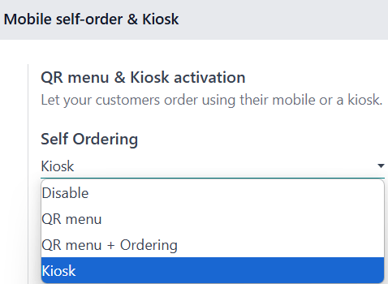

=============
Self-ordering
=============

The self-ordering feature allows customers to browse your menu or product catalog, place an order,
and complete payment using their mobile device or a self-ordering kiosk.

Configuration
=============

To enable this feature, access the :ref:`POS settings <configuration/settings>`, scroll down to the
:guilabel:`Mobile self-order & Kiosk` section and select a :guilabel:`Self Ordering` type under the
:guilabel:`QR menu & Kiosk activation` section. You can choose from:

- :guilabel:`QR menu`: by scanning a QR code, customers can access the menu.
- :guilabel:`Qr menu + ordering`: by scanning a QR code, customers can access the menu and make
  order.
- :guilabel:`Kiosk`: customers can access the menu and order from a self ordering kiosk.

Once a self-ordering type is set, the setup form alters to fit the selected type's needs.

Then, set it up:

- :guilabel:`Home buttons`

  To set up the buttons available on-screen, click :icon:`fa-arrow-right` :guilabel:`Home buttons`.
  Then,

  #. Click :guilabel:`New` to add a new button.
  #. Set the :guilabel:`Label`.
  #. Enter a :guilabel:`URL` customers are redirected to when they click that specific button.

     - To redirect them to the product menu, enter `/pos-self/3/products` in that column.
  #. Select the :guilabel:`Points of Sale` to ensure this button only appear on the selected POS.
  #. :guilabel:`Style` from the dropdown menu.

  .. note::
     - Leaving the :guilabel:`Points of Sale` field empty means that button is automatically shared
       by
       all POS.
     - The button is automatically updated in the :guilabel:`Preview` column.

- Service location and payment options

  Set where the service takes place by selecting :guilabel:`Table` or :guilabel:`Pickup zone` under
  the :guilabel:`Service` field. Set when and how customers can pay in the :guilabel:`Pay after`
  field. Customers can either pay after :guilabel:`Each meal` or :guilabel:`Each order`.

  Both can be paid online; Use this payment method for online payments (payments made on a web page
  with online payment providers)

  .. note::
     - Depending on the type of POS, the service location and payment options slightly differs.

       - **Restaurants**: customers can be served at table or at pickup zone, and they can either
         pay after each meal or each order.
       - **Shops**: customers can only be served at pickup zone and pay after each order
       - The kiosk only works with Adyen & Stripe terminals.
- :guilabel:`Language`: Click :icon:`fa-arrow-right` :guilabel:`Add Languages`
- :guilabel:`Splash screens`
- :guilabel:`Eat in/ Take out`: set it up to :doc:`use multiple fiscal positions
  <pricing/fiscal_position>` depending on whether the customers eat in or not.
- :guilabel:`Customize Header`

.. seealso::
   - :doc:`pricing/fiscal_position`
   - :doc:`../../finance/payment_providers`
   - :doc:`payment_methods`

QR codes
--------

- Click :icon:`fa-arrow-right` :guilabel:`Print QR Codes` to download a .pdf document with the
  generated QR codes.
- Click :icon:`fa-arrow-right` :guilabel:`Download QR Codes` to download a compressed file with
  the generated QR codes.

.. note::
   In restaurant, printing or downloading QR Codes generates as many QR codes as the number of
   available tables. In shops, it generates only one generic code.

Code customization
~~~~~~~~~~~~~~~~~~

If you need customized QR codes,

#. Scan the relevant QR code to acquire its URL.
#. Generate a customized QR code that redirects to this URL using a QR code generator like `QR code
   monkey <https://www.qrcode-monkey.com>`_ or `QR code generator <https://www.qr-code-generator.com>`_.

Preview
-------

Click :icon:`fa-arrow-right` :guilabel:`Preview Web interface` to ensure the interface fits your
needs.

Practical application
=====================

QR menu
-------

#. Open a POS session for the feature to be available to customers.
#. To access the self-ordering interface, scan a downloaded or printed QR code, or click the
   vertical ellipsis (:icon:`fa-ellipsis-v`) on the POS card and :guilabel:`Mobile Menu`.
#. Click the configured home button to reach the menu or catalog.
#. Select the items and click :guilabel:`Order` to place an order.
#. Follow the instructions on-screen.

Once an order is placed, it is automatically sent to the preparation screen, and added to the list
of POS orders.

.. important::
   A POS session must be open for customers to place an order.

Kiosk
-----

#. Open a POS session for the feature to be available to customers.
#. To access the self-ordering interface, click and :guilabel:`Open Kiosk` on the POS card.
#. Open the provided URL on your self-ordering kiosk.

Once open, the kiosk is ready to be used by customers. Once an order is placed, it is automatically
sent to the preparation screen, and added to the list of POS orders.

.. important::
   A POS session must be open for customers to place an order.
