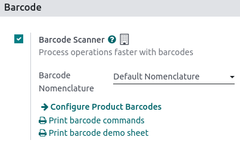

========
Barcodes
========

Using a barcode scanner to process point-of-sale orders improves your efficiency in providing
quicker customer service. Barcode scanners can be used both to scan products or to log employees
into a POS session.

Configuration
=============

To use a barcode scanner, you must enable the feature in the Inventory app. Go to
:menuselection:`Inventory --> Configuration --> Settings`, in the :guilabel:`Barcode` section, tick
:guilabel:`Barcode Scanner` and save.

.. seealso::
   - :doc:`Set up a barcode scanner<../../../inventory_and_mrp/inventory/barcode/setup/hardware>`
   - :doc:`Activate barcode scanners<../../../inventory_and_mrp/inventory/barcode/setup/software>`

Once enabled in **Inventory**, you can use the barcode feature in **Point of Sale** with products
that have a barcode number assigned.

Assign barcodes
===============

To your products
----------------

To use this feature in POS, your products must have barcodes assigned. To do so, go to
:menuselection:`Point of Sale --> Products --> Products` and open a **product form**. Add a barcode
number in the :guilabel:`Barcode` field in the :guilabel:`General Information` tab.

To your employees
-----------------

To add an identification number to an employee, go to the **Employees** app and open an **employee
form**. Choose an identification number for your employee and fill in the :guilabel:`PIN Code`
field in the :guilabel:`HR Settings` tab.

Use barcodes
============

Scan products
-------------

Scan a product's barcode using a barcode scanner. Doing so adds it directly to the cart. To change
the quantity, scan a product as many times as needed, or click :guilabel:`Qty` and enter the number
of products using the keypad.

You can also enter the barcode number manually in the search bar to look for the product. Then,
click it to add it to the cart.

Log employees
-------------

You can also use a barcode scanner to log your employees. To do so, :ref:`restrict access
<employee_login/configuration>` to the POS and :ref:`use barcodes to log your employees in
<employee_login/badge>` your POS.
