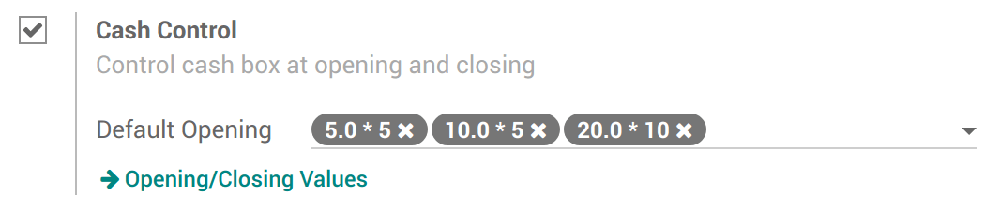
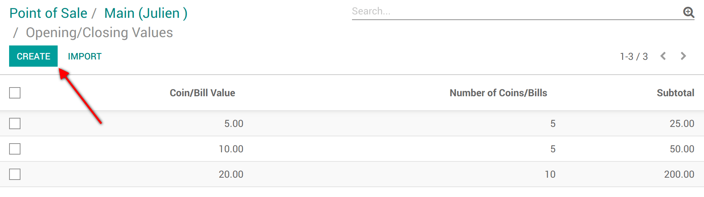
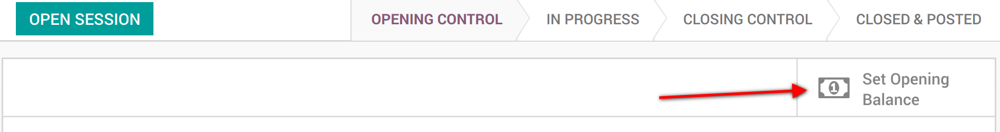
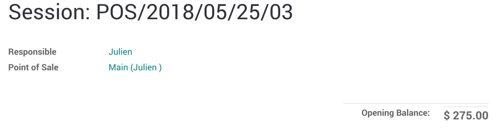
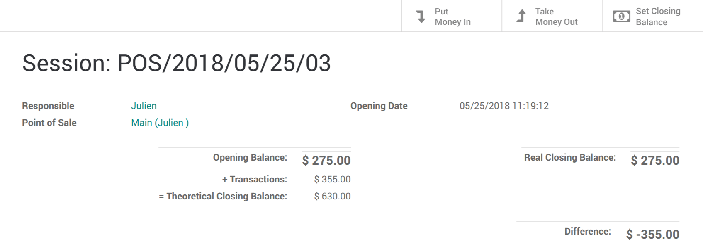
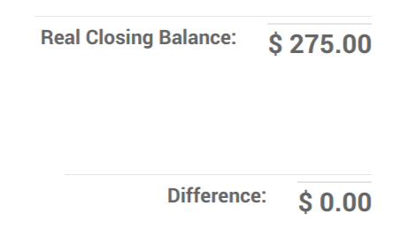

====================================
Set-up Cash Control in Point of Sale
====================================

Cash control allows you to check the amount of the cashbox at the
opening and closing. You can thus make sure no error has been made and
that no cash is missing.

Activate Cash Control
=====================

To activate the *Cash Control* feature, go to :menuselection:`Point
of Sales --> Configuration --> Point of sale` and select your PoS
interface.

Under the payments category, you will find the cash control setting.

In this example, you can see I want to have 275$ in various denomination
at the opening and closing.

When clicking on **Opening/Closing Values** you will be able to create
those values.

Start a session
===============

You now have a new button added when you open a session, *Set opening
Balance*

By default it will use the values you added before, but you can always
modify it.

Close a session
===============

When you want to close your session, you now have a *Set Closing
Balance* button as well.

You can then see the theoretical balance, the real closing balance (what
you have just counted) and the difference between the two.

If you use the *Take Money Out* option to take out your transactions
for this session, you now have a zero-sum difference and the same
closing balance as your opening balance. You cashbox is ready for the
next session.

