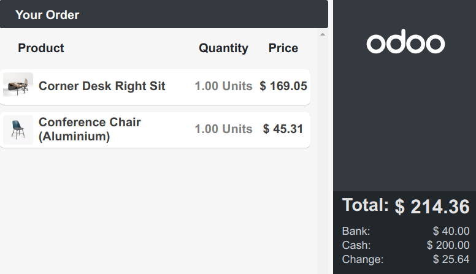
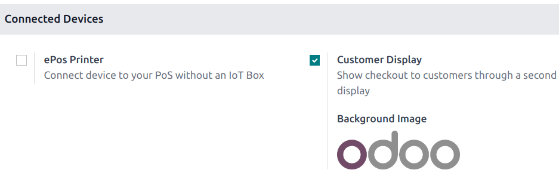
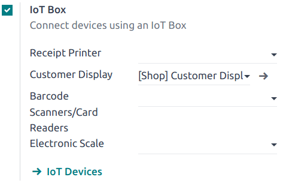

================
Customer display
================

The **customer display** feature provides customers with real-time checkout updates on a secondary
display.

Configuration
=============

Depending on your POS setup, the feature can be displayed :ref:`locally on a secondary screen
<customer_display/local>`, :ref:`remotely on another device <customer_display/remote>`, or
:ref:`another monitor connected to an IoT Box <customer_display/iot>`.

To activate the feature, go to the POS settings, scroll down to the :guilabel:`Connected Devices`
section, and tick the :guilabel:`Customer Display` checkbox.

.. _customer_display/local:

Local
-----

Connect a second screen to your POS and :ref:`open a POS session <pos/session-start>`. Then, click
:guilabel:`Customer Screen` to open a new window to drag and drop onto the second screen.

.. _customer_display/remote:

Remote
------

Access your database from another device (any computer, tablet, or smartphone), go to the POS
application, click the vertical ellipsis button (:guilabel:`⋮`) on a POS card, and then
:guilabel:`Customer Display` to open the display remotely.

.. note::
   The two devices are not required to share the same network.

.. _customer_display/iot:

IoT system
----------

Connect an IoT box to your database and the second screen to the IoT box. Then, go to
:menuselection:`Point of Sale --> Configuration --> Settings`, scroll down to the
:guilabel:`Connected Devices` section, tick the :guilabel:`IoT Box` checkbox, and select the second
monitor in the :guilabel:`Customer Display` field.

.. note::
   Both devices need to be connected to the same local network.

.. seealso::
   :doc:`../configuration/pos_iot`
