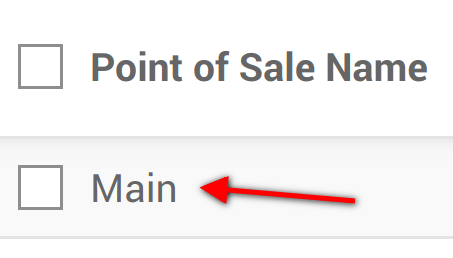
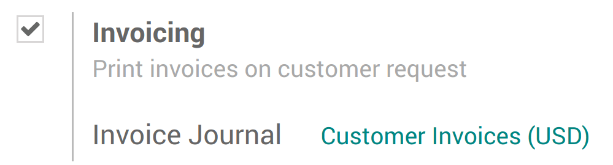

==============================
Invoice from the PoS interface
==============================

Some of your customers might request an invoice when buying from your
Point of Sale, you can easily manage it directly from the PoS interface.

Activate invoicing
==================

Go to :menuselection:`Point of Sale --> Configuration --> Point of Sale`
and select your Point of Sale:

Under the *Bills & Receipts* you will see the invoicing option, tick
it. Don't forget to choose in which journal the invoices should be
created.

Select a customer
=================

From your session interface, use the customer button

.. image:: invoice/invoice03.png
    :align: center

You can then either select an existing customer and set it as your
customer or create a new one by using this button.

.. image:: invoice/invoice04.png
    :align: center

You will be invited to fill out the customer form with its information.

Invoice your customer
=====================

From the payment screen, you now have an invoice option, use the button
to select it and validate.

.. image:: invoice/invoice05.png
    :align: center

You can then print the invoice and move on to your next order.

Retrieve invoices
-----------------

Once out of the PoS interface (:menuselection:`Close --> Confirm` on the top right corner)
you will find all your orders in :menuselection:`Point of Sale -->
Orders --> Orders` and under the status tab you will see which ones have
been invoiced. When clicking on a order you can then access the invoice.

.. image:: invoice/invoice06.png
    :align: center
