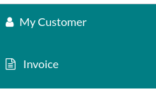

================
Invoice issuance
================

In Point of Sale, you can issue and print invoices upon payment at the cash register or retrieve all
the past invoiced orders.

Set a customer
==============

First, you need to open a session and set your customer. Open the **POS interface** by going to
:menuselection:`Point of Sale --> New session --> Open session`. Then, click :guilabel:`Customer` to
access the list of **customers**.

.. image:: invoice/select-customer-ui.png
   :align: center
   :alt: customer selection and creation button

From there, you can either set an existing customer by clicking their name or create a new one by
clicking :guilabel:`Create`. Doing so opens a customer creation form to fill in with their
information. Click :guilabel:`Save` to validate and set this new customer.

.. note::
   - You can also **edit** a customer's information by clicking :guilabel:`Details`.
   - If you did not set your customer during the order, you can do so at the payment screen by
     clicking :guilabel:`Customer`.

Invoice a customer
==================

Once an order is done, click :guilabel:`Payment` to move to the **payment screen**. Click
:guilabel:`Invoice` underneath the customer's name to enable issuing and printing invoices upon
payment.

Select the payment method and click :guilabel:`Validate`. The **invoice** is automatically issued
and ready to be downloaded and/or printed.

.. seealso::
   - :doc:`../overview/getting_started`

Retrieve invoices
-----------------

To retrieve invoices from the **POS dashboard**,

#. access all orders made through your POS by going to :menuselection:`Point of Sale --> Orders -->
   Orders`;
#. to access an order's invoice, open the **order form** by selecting the order, then click
   :guilabel:`Invoice`.

.. image:: invoice/invoice-smart-button.png
   :align: center
   :alt: invoice smart button from an order form

.. note::
   - **Invoiced orders** can be identified by the :guilabel:`Invoiced` status in the
     :guilabel:`Status` column;
   - You can filter the list of orders to invoiced orders by clicking :guilabel:`Filters` and
     :guilabel:`Invoiced`.
