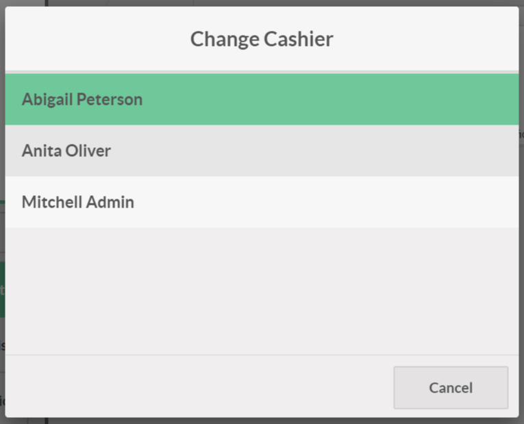
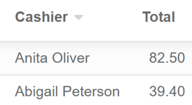

====================
Log in with employee
====================

With Odoo *Point of Sale*, you can manage multiple cashiers. This
feature allows you to keep track of who is working, when and how much
each cashier made for that session.

There are three ways to switch cashiers in Odoo: by *selecting the
cashier*, by *entering a PIN code* or by *scanning a barcode*.

.. note::
   To manage multiple cashiers, you need several employees (at least two).

Set up log in with employees
============================

To enable the feature, go to your *PoS settings* and check log in with
employees on your *PoS form*. Then, add the employees that have access
to the cash register.

.. image:: multicashiers/multicashiers01.png
    :align: center

Now, you can switch cashier easily.

Switch without pin codes
========================

The easiest way to switch cashiers is without a code. To do so, click on
the cashier name in your PoS interface.

Now, you just have to click on your name.

Switch cashier with pin codes
=============================

You can set a pin code on each cashier. To set up a pin code, go to the
employee form and add a security PIN, in the *HR settings tab*.

.. image:: multicashiers/multicashiers04.png
    :align: center

Now, when switching cashier, a PIN password will be asked.

.. image:: multicashiers/multicashiers05.png
    :align: center

Switch cashier with barcodes
============================

You can ask your employees to log themselves with their badges. To do
so, set up a barcode at the same place you add the PIN code. Print the
badge and when they will scan it, the cashier will be switched to that
employee.

.. image:: multicashiers/multicashiers06.png
    :align: center

Find who was the cashier
========================

Once you have closed your *PoS session*, you can have an overview of
the amount each cashier sold for. To do so, go to the orders menu.

Now, you can open the order and have a summary of the sold products.