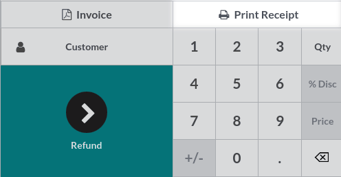

========
Receipts
========

Configuration
=============

Set up receipts by going to :menuselection:`Point of Sale --> Configuration --> Point of Sale`,
selecting a POS, and scrolling down to the :guilabel:`Bills & Receipts` section.

To **customize** the **header** and **footer**, activate :guilabel:`Header & Footer` and fill in
both fields with the information to be printed on the receipts.

To **print receipts** automatically once the payment is registered, enable the :guilabel:`Automatic
Receipt Printing` setting.

.. image:: receipts/receipt.png
   :align: center
   :alt: pos receipt

.. seealso::
   - :doc:`../restaurant/bill_printing`

Reprint a receipt
=================

From the POS interface, click :guilabel:`Orders`, open the dropdown selection menu next to the
search bar, and change the default :guilabel:`All active orders` filter to :guilabel:`Paid`. Then,
select the corresponding order and click :guilabel:`Print Receipt`.

.. note::
   You can filter the list of orders using the search bar. Type in your reference and click
   :guilabel:`Receipt Number`, :guilabel:`Date`, or :guilabel:`Customer`.
