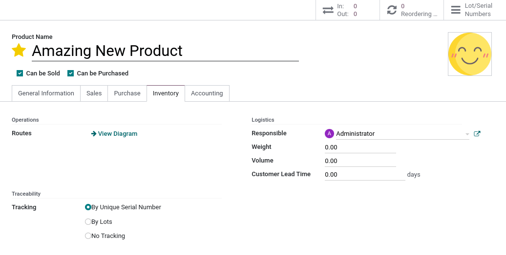
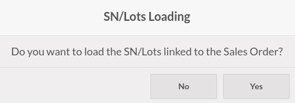
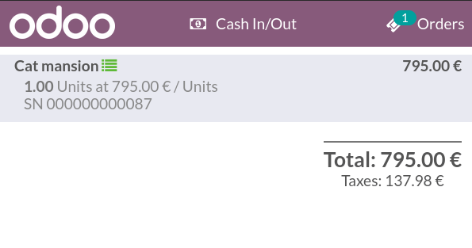
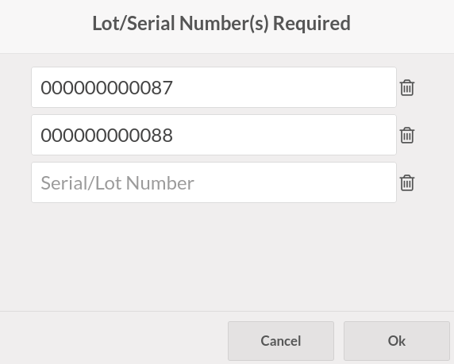

=======================
Serial numbers and lots
=======================

Working with **serial numbers** and **lots** allows tracking your products' movements. When products
are tracked, the system identifies their location based on their last movement.

To enable traceability, go to :menuselection:`Point of Sale --> Products --> Products`. Then,
select a product and check the :guilabel:`Tracking By Unique Serial Number` or the
:guilabel:`Tracking By Lots` box in the :guilabel:`Inventory` tab.

Serial numbers and lots importation
===================================

You can import serial numbers in Point of Sale. To do so, select a **sales order** or a
**quotation** containing tracked products. Then, agree to load the **Lots or Serial Numbers** linked
to the :abbr:`SO (sales order)`.

The imported tracking numbers appear below the tracked products. You can modify them by clicking on
the list-view button next to the products.

.. seealso::
   - :doc:`../shop/sales_order`

Serial numbers and lots creation
================================

If a tracked product is available in your POS, adding the product to the cart opens a pop-up window
where you can type or scan the product's serial or lot numbers. To add more than one of the same
tracked products, click on **enter** to validate and start a new line.

.. note::
   - Changing a tracked product's quantity using the numpad turns the list-view button red. Click on
     it to add the missing lot and serial numbers.
   - :guilabel:`Lot & Serial Number(s)` are :guilabel:`required` on tracked products but not
     mandatory. Meaning that not attributing some or any does **not** prevent from completing the
     sale.

.. seealso::
   - :doc:`/applications/inventory_and_mrp/inventory/management/lots_serial_numbers/serial_numbers`
   - :doc:`/applications/inventory_and_mrp/inventory/management/lots_serial_numbers/lots`
