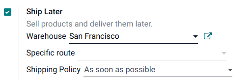
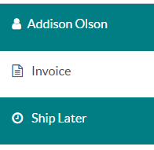

==========
Ship later
==========

The **Ship Later** feature allows you to sell products and schedule delivery at a later date. It is
useful, for example, when a product is out of stock or so voluminous that it requires to be shipped,
or if, for any reason, the customer needs their order to be shipped later, etc.

Configuration
=============

:ref:`Go to the POS settings <configuration/settings>`, scroll down to the :guilabel:`Inventory`
section, and enable :guilabel:`Allow Ship Later`.

Once activated, you can:

- Choose the location from where the products are shipped by selecting a :guilabel:`Warehouse`.
- Define a :guilabel:`Specific route`, or leave this field empty to use the default route.
- Define the :guilabel:`Shipping Policy`; select :guilabel:`As soon as possible` if the products
  can be delivered separately or :guilabel:`When all products are ready` to ship all the products at
  once.

.. seealso::
   - :doc:`../../../inventory_and_mrp/inventory/shipping_receiving/setup_configuration/delivery_method`
   - :doc:`../../../inventory_and_mrp/inventory/warehouses_storage/inventory_management/warehouses`

Practical application
=====================

#. :ref:`Open a session <pos/session-start>` and make a sale.
#. On the payment screen, set a customer and select :guilabel:`Ship Later`.
#. On the popup window, set a shipping date and click :guilabel:`Confirm` to proceed to payment.

The system instantly creates a delivery order from the warehouse to the shipping address.

.. Note::
   The selected customer must have referenced an address in the system for products to be shipped.
