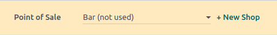
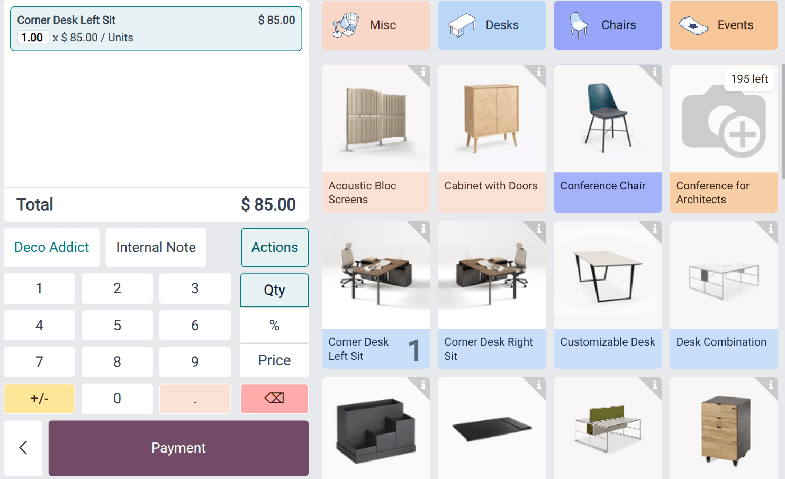
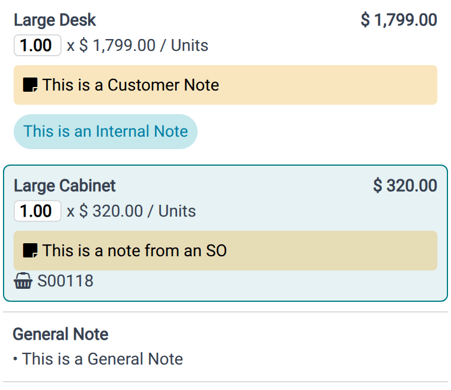

:show-content:

========
Workflow
========

Odoo Point of Sale allows for the :ref:`creation <pos/use/create-pos>` and :ref:`configuration
<pos/use/settings>` of a point of sale as well as the management of typical daily operations. These
include :ref:`opening the POS register <pos/use/open-register>` and :ref:`processing sales
transactions <pos/use/sell>`, :ref:`registering and assigning customers <pos/use/customers>`,
:ref:`handling returns and refunds <pos/use/refund>`, :ref:`managing the cash register
<pos/use/cash-register>`, and :ref:`closing the POS register <pos/use/register-close>`.

.. seealso::
   - :doc:`use/receipts`
   - :doc:`use/pos_invoices`

.. _pos/use/create-pos:

Create a POS
============

If no point of sale exists in the database, a set of POS cards is displayed on the Point of Sale
:guilabel:`Dashboard`. Each card represents a business type. Click a card to create a POS with
preconfigured settings tailored to that type. These settings can be adjusted later as needed.

To create additional POS or to create one from scratch, go to :menuselection:`Point of Sale -->
Configuration --> Settings` and click :guilabel:`+ New Shop` next to the :guilabel:`Point of Sale`
dropdown menu. Enter a name, enable :guilabel:`Is a Bar/Restaurant` if needed, and click
:guilabel:`Save`.

.. important::
   - To optimize the POS app tab's performance, disable the `Memory Saver
     <https://support.google.com/chrome/answer/12929150?hl=en#zippy=%2Cturn-memory-saver-on-or-off>`_
     setting in Google Chrome.
   - Assign a dedicated :doc:`cash payment method and a cash journal
     <../point_of_sale/payment_methods>` to each POS. This ensures that accounting entries are
     separated and traceable to specific points of sale.

.. seealso::
   - :doc:`shop`
   - :doc:`restaurant`

.. _pos/use/settings:

Access the POS settings
=======================

To access the general POS settings, go to :menuselection:`Point of Sale --> Configuration -->
Settings`. Then, open the :guilabel:`Point of Sale` dropdown menu and select the POS to configure.

.. tip::
   To configure basic settings, go to :menuselection:`Point of Sale --> Dashboard`, click the
   :icon:`fa-ellipsis-v` (:guilabel:`vertical ellipsis`) icon on the relevant POS card, then select
   :guilabel:`Configure` to perform the following actions:

   - :doc:`Enable multiple employees to log in <extra/employee_login>`.
   - :doc:`Connect and set up an IoT system <hardware_network/pos_iot>`.
   - :doc:`Connect and set up a receipt printer <hardware_network/receipt_printers>`.
   - :ref:`Connect and set up a preparation printer <pos/restaurant/orders-printing>`.

.. _pos/use/open-register:

Open the POS register
=====================

The POS register is divided into three sections: the product selector, the cart to visualize the
products added to the order, and the numpad for order actions. Once the POS is fully
:doc:`configured <../point_of_sale>`, follow these steps to access the register:

#. Go to :menuselection:`Point of Sale --> Dashboard`.
#. On the relevant POS card, click :guilabel:`Open Register`.
#. In the :guilabel:`Opening Control` popover, ensure the :guilabel:`Opening cash` amount is
   correct.
#. Click :guilabel:`Open Register`.

.. note::
   - Once the register is open, the :guilabel:`Open Register` button is replaced by the
     :guilabel:`Continue Selling` button on the :guilabel:`Dashboard's` POS card.
   - It is possible to switch between :doc:`multiple users <extra/employee_login>` from an open POS
     register, provided :ref:`multi-employee management is enabled <pos/employee_login/use>`.

From the POS interface header:

- Click :guilabel:`Register` to access the register for daily POS actions, such as :ref:`sales
  <pos/use/sell>` or :ref:`registering customers <pos/use/customers>`.
- Click :guilabel:`Orders` to access the POS :ref:`orders <pos/use/orders>` overview screen and
  retrieve past or ongoing orders, or process :ref:`refunds <pos/use/refund>`.
- Click the :icon:`fa-plus-circle` :guilabel:`(plus)` icon to put the current order aside and start
  a new one.
- Click the order numbers to switch between ongoing orders.
- Search for products using the search bar.
- Click the :icon:`fa-barcode` (:guilabel:`barcode`) icon to activate the device's webcam and use it
  as a barcode scanner.
- Click the user's avatar to switch between employees, provided :ref:`multi-employee management is
  enabled <pos/employee_login/use>`.
- Click the :icon:`fa-bars` (:guilabel:`hamburger menu`) icon to access more advanced options, as
  well as to :ref:`close the register <pos/use/register-close>`.

.. tip::
   To manually reorganize the product selector, click and drag a product to the desired position
   within the product selector.

.. _pos/use/sell:

Sell products
=============

To sell products in the :ref:`POS register <pos/use/open-register>`, follow these steps:

#. Click on products to add them to the cart.

   - To change the quantity, enter the number of products using the numpad.
   - To add a discount, click :guilabel:`%`, then enter the discount value using the numpad.
   - To modify the product price, click :guilabel:`Price`, then enter the new amount using the
     numpad.
#. Optionally, add a :ref:`customer <pos/use/customers>` or a :ref:`note <pos/use/notes>` to the
   order.
#. Once the order is complete, click :guilabel:`Payment` to proceed to the payment screen.
#. Select the :doc:`payment method <payment_methods>`, then enter the amount, if needed.
#. Click :guilabel:`Validate`.

Once payment is successful, the :doc:`receipt <use/receipts>` can be printed or sent to the
customer.

To move on to the next order, click :guilabel:`Continue`.

.. note::
   On the payment confirmation screen, click :icon:`fa-print` :guilabel:`Print` to print the
   receipt, click :icon:`fa-paper-plane` :guilabel:`Send Receipt` to send the receipt via email or
   SMS/WhatsApp message, or click :icon:`fa-pencil-square-o` :guilabel:`Edit` to return to the
   payment screen.

.. seealso::
   :doc:`Issue invoices for registered customers <use/pos_invoices>`

.. _pos/use/customers:

Register and assign customers
=============================

Registering customers is necessary to :ref:`collect their loyalty points and grant them rewards
<pos/pricing/loyalty>`, automatically apply an :ref:`attributed pricelist
<pos/pricing/pricelists>`, or :doc:`generate and print invoices <use/pos_invoices>`.

To create customers from the :ref:`POS register <pos/use/open-register>`:

#. Click :guilabel:`Customer`.
#. Click :guilabel:`Create`.
#. Enter the customer's details, then click :guilabel:`Save`.

To create customers from the backend:

#. Go to :menuselection:`Point of Sale --> Orders --> Customers`.
#. Click :guilabel:`New`.
#. Enter the customer's details and save.

To assign a customer to an order in the POS register or on the payment screen, click
:guilabel:`Customer` and select the desired customer. To select a different customer, click the
current customer's name on the numpad, then select another one.

.. tip::
   To edit the customer's details, click the customer's name on the numpad, click the
   :icon:`fa-bars` (:guilabel:`hamburger menu`) icon next to the relevant customer, then select
   :guilabel:`Edit Details`.

.. note::
   Creating a new customer in the POS register or on the payment screen automatically assigns them
   to the current order upon saving.

Send marketing messages
-----------------------

Customers' contact details, such as phone numbers or email addresses, are automatically stored when
:doc:`receipts <use/receipts>` are sent via email, SMS, or WhatsApp. They can then be used, for
example, for marketing purposes.

To send marketing messages manually from the POS backend, follow these steps:

#. Go to :menuselection:`Point of Sale --> Orders --> Orders`.
#. Click a POS order and open the :guilabel:`Extra Info` tab.
#. Under the :guilabel:`Contact Info` category, click the :icon:`fa-envelope` (:guilabel:`email`)
   icon or the :icon:`fa-whatsapp` (:guilabel:`WhatsApp`) icon next to the completed
   :guilabel:`Email` or :guilabel:`Mobile` field.

.. note::
   Make sure a customer is assigned to the order to send marketing messages manually.

.. seealso::
   - :doc:`../../marketing/email_marketing`
   - :doc:`../../marketing/sms_marketing`
   - :doc:`../../productivity/whatsapp`

.. _pos/use/orders:

Access the orders overview
==========================

The orders overview allows for viewing, searching, and retrieving orders from the POS interface. To
access it, click :guilabel:`Orders` in the POS interface header.

To filter orders based on their status, click the :guilabel:`Active` dropdown menu and select one of
the following options:

- :guilabel:`Active`: Orders currently in progress. This includes orders marked as
  :guilabel:`Ongoing`, as well as those in the :guilabel:`Payment` or the :guilabel:`Receipt` stages
  (i.e., orders for which the receipt has been emailed to the customer).
- :guilabel:`Paid`: Paid orders.
- :guilabel:`Cancelled`: Orders cancelled on online platforms through :ref:`UrbanPiper
  <pos/online_food_delivery/configuration>`.

It is also possible to search for orders based on, for example, the :guilabel:`Receipt Number`,
:guilabel:`Date`, or :guilabel:`Customer`.

To navigate between pages, click the :icon:`fa-caret-left` or :icon:`fa-caret-right`
(:guilabel:`caret`) icon.

To access an ongoing order in the register, click it, then click :guilabel:`Load Order`.

.. note::
   :guilabel:`Paid` orders can be :ref:`refunded <pos/use/refund>`.

.. tip::
   - To define the number of orders visible on a page, click `1-x / x`. Enter a number lower than
     the total number of pages, and click :guilabel:`Confirm`.
   - Click the :icon:`fa-trash` (:guilabel:`trash`) icon next to an :guilabel:`Active` order to
     delete it.
   - If using :doc:`presets <extra/presets>`, click one to view the related orders. Click it again
     to return to the main overview.
   - To display the order's details on a selected order, click the :icon:`fa-info-circle`
     (:guilabel:`info`) icon. To cancel the order, click the :icon:`fa-trash` (:guilabel:`delete`)
     icon.

.. _pos/use/refund:

Return and refund products
==========================

The steps to process a refund from the :ref:`POS register <pos/use/open-register>` depend on whether
the refund is :ref:`based on an order <pos/use/refund-order-based>` or processed as a
:ref:`standalone refund that is not based on an order <pos/use/refund-standalone>`.

In both cases, the amount can be refunded or a :ref:`gift card <pos/pricing/loyalty>` issued for the
refunded amount.

.. note::
   Once the return is validated for a :ref:`registered customer <pos/use/customers>`, a
   corresponding credit note is generated, referencing the original :doc:`receipt <use/receipts>`
   or :doc:`invoice <use/pos_invoices>`.

.. seealso::
   :doc:`/applications/finance/accounting/customer_invoices/credit_notes`

.. _pos/use/refund-order-based:

Order-based refunds
-------------------

To process a refund based on an order, follow these steps:

#. Click :guilabel:`Orders` in the POS interface header.
#. Set the :guilabel:`Active` dropdown menu to :guilabel:`Paid`.
#. Select the relevant order and, if needed, enter the number of units or items to refund.
#. Click :guilabel:`Refund`.

   - To refund the customer, on the payment screen, select a payment method, then click
     :guilabel:`Validate`.
   - To issue a :ref:`gift card <pos/pricing/loyalty>` for the refund amount, on the payment screen,
     click :guilabel:`Back`. The cart displays the returned product(s) with a negative quantity.
     Then, add the gift card from the product selector to the order; its value is automatically set
     to match the total refund amount. Click :guilabel:`Payment`, select a :doc:`payment method
     <payment_methods>`, then :guilabel:`Validate` the refund.

.. tip::
   - Refunds can also be initiated and processed from the backend. To do so, go to
     :menuselection:`Point of Sale --> Orders --> Orders`, select an order, then click
     :guilabel:`Return Products`. Note that this method can only be used to refund the entire order.
   - It is possible to process order-based refunds through an :doc:`Adyen
     <payment_methods/terminals/adyen>` or :doc:`Stripe <payment_methods/terminals/stripe>`
     :ref:`payment terminal <pos/terminals/configuration>`. However, only payments originally
     processed through the same provider's terminal can be refunded this way. Refunds cannot be
     issued for non-Adyen or non-Stripe transactions using an Adyen or Stripe terminal.
     :ref:`pos/use/refund-standalone` with Adyen or Stripe are not supported.

.. _pos/use/refund-standalone:

Standalone refunds
------------------

To process a standalone refund that is *not* based on an order, follow these steps:

#. Select the relevant product from the POS register.
#. Click :guilabel:`Qty` to enter the quantity to refund, then click :guilabel:`+/-` to set it as a
   negative quantity.
#. Optionally, select the :ref:`gift card <pos/pricing/loyalty>` if needed for the process.
#. Click :guilabel:`Payment` to open the payment screen.
#. Select a payment method, then click :guilabel:`Validate`.

.. tip::
   To facilitate management of standalone returns, create a :doc:`preset <extra/presets>` with only
   the :guilabel:`Return mode` enabled. When this preset is selected from the POS register, the
   quantity of any item added to the cart is set to negative.

.. _pos/use/notes:

Add and manage notes
====================

Notes allow for extra information to be added to specific products in an order. There are two types
of notes: :ref:`internal notes <pos/use/internal-notes>` and :ref:`customer notes
<pos/use/customer-notes>`.

.. tip::
   If the same content is frequently used, configure a note model to save time. To create or edit
   note models, go to :menuselection:`Point of Sale --> Configuration --> Note Models`, click
   :guilabel:`New` or click the relevant note model, then complete or edit the :guilabel:`Name`
   column.

.. note::
   Any customer notes added to a product from the :ref:`POS register <pos/use/open-register>` are
   displayed on the :doc:`customer display <../point_of_sale/hardware_network/customer_display>`.

.. _pos/use/internal-notes:

Internal notes
--------------

Internal notes provide information intended for staff (e.g., `no tomato` for the kitchen team) and
do not appear on the customer's receipt.

To add or edit an internal note from the POS register, follow these steps:

#. If the note applies to:

   - The entire order: Ensure no item is selected in the cart, then click :guilabel:`Note`.
   - A specific item: Select the item in the cart, then click :guilabel:`Note`.
#. Add or modify the note's content in the popover or select a previously configured note model.
#. Click :guilabel:`Apply`.

.. _pos/use/customer-notes:

Customer notes
--------------

Customer notes appear on :doc:`receipts <use/receipts>` and :doc:`invoices <use/pos_invoices>`.
They can be used, for example, to provide warranty details for a high-value item or specific care
instructions, such as `Dry clean only`.

To add or edit a customer note from the POS register, follow these steps:

#. If the note applies to:

   - The entire order: Ensure no item is selected in the cart, click the :icon:`fa-ellipsis-v`
     (:guilabel:`vertical ellipsis`) icon, then click :icon:`fa-sticky-note` :guilabel:`Customer
     Note`.
   - A specific item: Select the item in the cart, click the :icon:`fa-ellipsis-v`
     (:guilabel:`vertical ellipsis`) icon, then click :icon:`fa-sticky-note` :guilabel:`Customer
     Note`.
#. Add or modify the note's content in the popover or select a previously configured note model.
#. Click :guilabel:`Apply`.

.. note::
   Product notes from :ref:`imported sales orders <pos/shop/so>` are displayed in the same way as
   customer notes.

.. _pos/use/cash-register:

Manage the cash register
========================

Odoo POS allows accepted coins and bills to be defined. To set up the allowed coins and bills:

#. Navigate to :menuselection:`Point of Sale --> Configuration --> Coins/Bills`.
#. Click :guilabel:`New` to add a new value.
#. Select the POS where this value is accepted in the :guilabel:`Point of Sales` column, or leave
   the field empty to make it available for all POS.

To record a cash-in or cash-out transaction not associated with a sale from the POS register:

#. Click the :icon:`fa-bars` (:guilabel:`hamburger menu`) icon on the POS interface.
#. Click :guilabel:`Cash In/Out`.
#. Select :guilabel:`Cash In` or :guilabel:`Cash Out` in the popover.
#. Enter the amount in the field with the currency symbol.
#. Specify the reason for the addition or removal of cash, and click :guilabel:`Confirm`.

.. note::
   Only employees with :ref:`basic or advanced access rights <pos/employee_login/configuration>`
   are allowed to perform cash-in/out actions.

.. _pos/use/register-close:

Close the POS register
======================

To close the POS register, click the :icon:`fa-bars` (:guilabel:`hamburger menu`) icon, then
:guilabel:`Close Register`.

The :guilabel:`Closing Register` popover displays:

- The number of orders and the total amount made during the session.
- The expected amounts grouped by payment method.

Click the :icon:`fa-money` (:guilabel:`money`) icon to specify the number of coins and bills, then
click :guilabel:`Confirm`.

Click :guilabel:`Close Register` to close the register and post accounting entries.

.. note::
   - After specifying the number of coins and bills, the computed amount is set in the
     :guilabel:`Cash Count` field, and the :guilabel:`Closing details` are specified in the
     :guilabel:`Closing note` section.
   - Closing the register of a :doc:`restaurant <restaurant>` POS when orders are still in draft
     and not scheduled for later is not allowed and opens a popover with options to
     :guilabel:`Review Orders` or :guilabel:`Cancel Orders`.
   - It is strongly advised to close the POS register at the end of each day.

Set maximum difference
----------------------

When the counted money does **not** match the expected amount, a :guilabel:`Payments Difference`
window appears, prompting you to acknowledge the discrepancy. Click :guilabel:`Proceed Anyway` to
accept the difference and post it to the designated cash difference journal.

To restrict this behavior, you can prevent users from closing the register when a discrepancy occurs
by enabling the :guilabel:`Set Maximum Difference` setting in the :guilabel:`Payment` section of the
:ref:`POS settings <pos/use/settings>`. Then, specify the allowed limit in the :guilabel:`Authorized
Difference` field.

Once configured, if a discrepancy exceeds this limit, the pop-up window displays the authorized
threshold and instructs the user to contact a manager to approve the closing.

.. seealso::
   - :doc:`shop`
   - :doc:`restaurant`

.. toctree::
   :titlesonly:

   use/receipts
   use/pos_invoices
