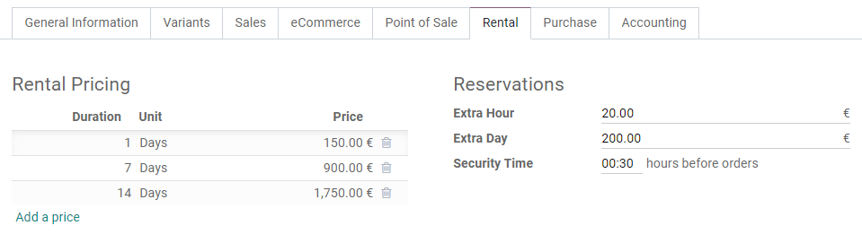
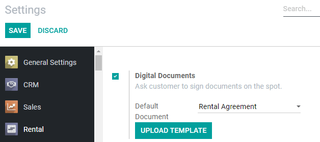
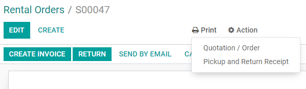

======
Rental
======

**Odoo Rental** is a comprehensive solution to manage your rentals.

From a single view, you can send out quotations, confirm orders, schedule rentals, register when
products are picked up and returned, and invoice your customers.

.. seealso::
   - `Odoo Rental: product page <https://www.odoo.com/app/rental>`_
   - `Odoo Tutorials: Rental <https://www.odoo.com/slides/rental-48>`_

.. _rental/pricing:

Rental Pricing
==============

Configuration
-------------

Go to :menuselection:`Rental --> Products`, select or create a product, and click on the product's
*Rental* tab. Under *Rental Pricing*, click on *Add a price*. Then choose a *Unit* of time (hours,
days, weeks, or months), a *Duration*, and a *Price*. You can add as many price lines as necessary,
usually to give out discounts for longer rental durations.

.. tip::
   Under *Reservations*, you can add fines for any *Extra Hour* or *Extra Day*. You can also set a
   *Security Time*, expressed in hours, to make the product temporarily unavailable between two
   rental orders.

.. note::
   If you want to rent a product created outside of the Rental app, do not forget to tick *Can be
   Rented* under the product's name. By default, this option is ticked when you create a product
   directly from the Rental app.

Computing
---------

Odoo always uses two rules to compute the price of a product when you create a rental order:

#. Only one price line is used.
#. The cheapest line is selected.

.. exercise::
   Consider the following rental pricing configuration for a product:

   - 1 day: $100
   - 3 days: $250
   - 1 week: $500

   A customer wants to rent this product for eight days. What price will they pay?

   After an order is created, Odoo selects the second line as this is the cheapest option. The
   customer has to pay three times '3 days' to cover the rental's eight days, for a total of $750.

.. _rental/customer-signature:

Customer signature
==================

You can ask your customers to sign a rental agreement outlining the arrangement between you and your
customers before they pick up products to make sure your products are returned on time and in their
original condition. To do so, go to :menuselection:`Rental --> Configuration --> Settings`, activate
*Digital Documents*, and *Save*.

.. note::
   This feature requires the :doc:`Sign <../finance/sign>` app. If necessary, Odoo installs it after
   activating *Digital Documents*.

Once the app settings are saved, you have the option to change the default *Rental Agreement* from
the dropdown menu. You can pick any document already uploaded to the *Sign* app, or upload a new one
to the *Sign* app by clicking on *Upload Template*.

To request a customer signature, select a confirmed rental order, click on *Sign Documents*, choose
the document template and click on *Sign Documents* again. On the next window, select your customer
and click on *Sign Now* to start the signing process with your customer. Once the document is
completed, click on *Validate & Send Completed Document*.

.. seealso::
   - `Odoo Tutorials: Sign <https://www.odoo.com/slides/sign-61>`_

.. _rental/pickup-return:

Pickup and Return receipt
=========================

You can print and give your customers receipts when they pick up and/or return products. To do so,
open any rental order, click on *Print* and select *Pickup and Return Receipt*. Odoo then generates
a PDF detailing all information about the current status of the rented items: which were picked up,
when they are expected to be returned, which were returned, and potential rental delay costs.

