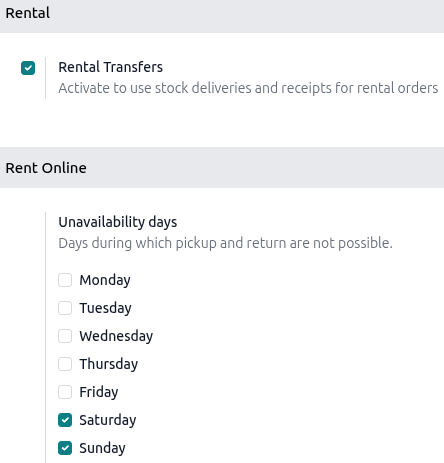
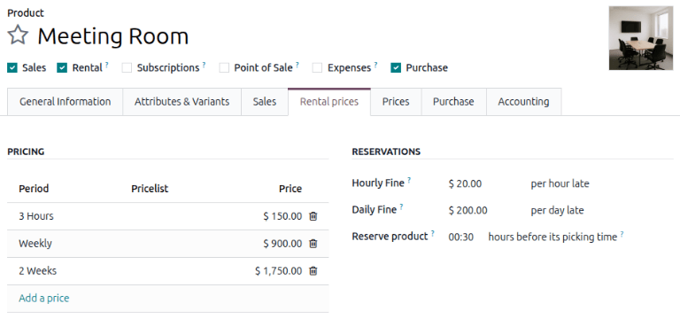

:nosearch:
:show-content:
:show-toc:

======
Rental
======

The Odoo **Rental** application provides comprehensive solutions for configuring and managing
rentals.

Send quotations, confirm orders, schedule rentals, register products at pickup and return, and
invoice customers from a single platform.

.. seealso::
   - `Odoo Rental: product page <https://www.odoo.com/app/rental>`_
   - `Odoo Tutorials: Rental <https://www.odoo.com/slides/rental-48>`_

.. cards::

   .. card:: Rental products
      :target: rental/products
      :large:

      Explore how to create and manage rental products.

   .. card:: Service products
      :target: rental/service_products
      :large:

      Discover how to rent services alongside products.
   .. card:: Manage deposits
      :target: rental/rental_orders/manage_deposits
      :large:

      Learn how to create a refundable deposit for rental products.

Settings
========

To configure transfer locations and rental item availability, go to :menuselection:`Rental app -->
Configuration --> Settings`.

In the :guilabel:`Rental` section, enable :guilabel:`Rental Transfers` to use stock deliveries and
receipts for rental orders.

If a rental business has :ref:`multiple locations <rental/multi-location-management>`, rental
products can be transferred and tracked between them.

<<<<<<< 1f0aaed795f84abe9e833b3f8f686803bb800e2f
In the :guilabel:`Rent Online` section, designate :guilabel:`Unavailability days` when pickup and
return are not allowed.
||||||| 0076c7a76a74bfaec01450707e38d6d1e16d91bd
In the :guilabel:`Rent Online` section, there are options to configure a :guilabel:`Minimal Rental
Duration` and designate :guilabel:`Unavailability days`, or days during which pickup and return are
not possible.

Rental products
===============

To view all products that can rented in the database, navigate to :menuselection:`Rentals app -->
Products`. By default, the :guilabel:`Rental` search filter appears in the search bar.

Each product Kanban card displays that product's name, rental price, and product image (if
applicable).

.. seealso::
   :doc:`rental/manage_deposits`
=======
In the :guilabel:`Rent Online` section, there are options to configure a :guilabel:`Minimal Rental
Duration` and designate :guilabel:`Unavailability days`, or days during which pickup and return are
not possible.

Rental products
===============

To view all products that can rented in the database, navigate to :menuselection:`Rentals app -->
Products`. By default, the :guilabel:`Rental` search filter appears in the search bar.

Each product Kanban card displays that product's name, rental price, and product image (if
applicable).

.. seealso::
   :doc:`rental/rental_orders/manage_deposits`
>>>>>>> 4f2793bd904af6e52ec8b6161fbccbc644f83b01

.. _rental/pricing:

<<<<<<< 1f0aaed795f84abe9e833b3f8f686803bb800e2f
||||||| 0076c7a76a74bfaec01450707e38d6d1e16d91bd
Rental pricing
==============

To adjust the rental pricing on a product, go to the :guilabel:`Products` page in the **Rental**
app, then select the desired product or click :guilabel:`New` to create a new product from scratch.

On the product form, ensure the :guilabel:`Rental` checkbox is ticked. Then, open the
:guilabel:`Rental prices` tab.

Pricing
-------

Under the :guilabel:`Pricing` section of the :guilabel:`Rental prices` tab, designate custom rental
prices and rental periods for the product.

To add pricing for a rental, click :guilabel:`Add a price`. Then, choose a *pricing period*
(:dfn:`the unit of duration of the rental`) in the :guilabel:`Period` column, or create a new
pricing period by typing in the name and clicking :guilabel:`Create`.

Next, decide whether or not to apply this custom rental price to a specific :guilabel:`Pricelist`.

Lastly, enter the desired :guilabel:`Price` for that specific :guilabel:`Period`.

.. note::
   No limit exists on how many pricing lines can be added. Multiple pricing options for rental
   products are typically used to give discounts for customers who agree to longer rental durations.

.. note::
    Remember when considering pricing that renting for a day is usually limited to operating hours,
    not 24 hours. When determining pricing, keep in mind that a rental day typically refers to
    operating hours, not a full 24-hour period.

Reservations
------------

Under the :guilabel:`Reservations` section of the :guilabel:`Rental prices` tab, there is the option
to configure additional fines for any :guilabel:`Hourly Fine` or :guilabel:`Daily Fine` that the
customer takes to return a rental.

Also, there is the option to set the :guilabel:`Reserve product` time, expressed in hours, to make the rental
product temporarily unavailable between two rental orders. Such a feature may prove useful if
maintenance or cleaning is required between rentals.

=======
Rental pricing
==============

To adjust the rental pricing on a product, go to the :guilabel:`Products` page in the **Rental**
app, then select the desired product or click :guilabel:`New` to create a new product from scratch.

On the product form, ensure the :guilabel:`Rental` checkbox is ticked. Then, open the
:guilabel:`Rental prices` tab.

Pricing
-------

Under the :guilabel:`Pricing` section of the :guilabel:`Rental prices` tab, designate custom rental
prices and rental periods for the product.

To add pricing for a rental, click :guilabel:`Add a price`. Then, choose a *pricing period*
(:dfn:`the unit of duration of the rental`) in the :guilabel:`Period` column, or create a new
pricing period by typing in the name and clicking :guilabel:`Create`.

Next, decide whether or not to apply this custom rental price to a specific :guilabel:`Pricelist`.

Lastly, enter the desired :guilabel:`Price` for that specific :guilabel:`Period`.

.. note::
   No limit exists on how many pricing lines can be added. Multiple pricing options for rental
   products are typically used to give discounts for customers who agree to longer rental durations.

.. note::
    Remember when considering pricing that renting for a day is usually limited to operating hours,
    not 24 hours. When determining pricing, keep in mind that a rental day typically refers to
    operating hours, not a full 24-hour period.

Reservations
------------

Under the :guilabel:`Reservations` section of the :guilabel:`Rental prices` tab, there is the option
to configure additional fines for any :guilabel:`Hourly Fine` or :guilabel:`Daily Fine` that the
customer takes to return a rental.

Also, there is the option to set the :guilabel:`Reserve product` time, expressed in hours, to make
the rental product temporarily unavailable between two rental orders. Such a feature may prove
useful if maintenance or cleaning is required between rentals.

>>>>>>> 4f2793bd904af6e52ec8b6161fbccbc644f83b01
Price computing
===============

Odoo uses two rules to compute the price of a product when a rental order is created:

#. Only one price line is used.
#. The cheapest line is selected.

.. example::
   A bike rental company offers the following rental prices for its electric bikes:

   - 1 day: $100
   - 3 days: $250
   - 1 week: $500

   A customer wants to rent this product for eight days. What price will they pay?

   After the order is created, Odoo chooses the second line because it is the lowest price. The
   customer pays three times the '3 days' rate to cover eight days, totaling $750.

   .. math::
      1~\text{day} * 8 &= 8~\text{days} \\
      3~\text{days} + 3~\text{days} + 3~\text{days} &= 9~\text{days} \\
      1~\text{week} + 1~\text{week} &= 14~\text{days} \\
      \\
      100 * 8 &= $800 \\
      250 + 250 + 250 &= $750 \\
      500 + 500 &= $1000

   Therefore, the customer pays $750 for the eight-day rental period.

Rental pricelist rules
======================

Extra rental prices are configured in the product's :guilabel:`Prices` tab. The prices are
configured like advanced :doc:`pricelists <sales/products_prices/prices/pricing>`, where the
following fields work as conditions for the price to be applied:

- :guilabel:`Pricelist`: The pricelist for which the pricelist rule is valid.
- :guilabel:`Min Quantity`: To trigger the Pricelist rule, the quantity must meet or exceed the
  minimum quantity value. The unit of measure follows the product's :guilabel:`Periodicity` setting.
- :guilabel:`Validity`: The starting date or date range when the pricelist rule is active.
- :guilabel:`Company`: The company for which the pricelist rule is valid.

How Minimum Quantity is computed
--------------------------------

Configuring discounted prices based on rental duration requires price rules with a :guilabel:`Min.
Quantity`. The :guilabel:`Min. Quantity` field is computed differently for the **Rental** app than
for the **Sales** and **Subscription** apps.

The :guilabel:`Min. Quantity` is computed based on the rental duration and the quantity on the sales
order line (SOL). The unit of time for the :guilabel:`Min. Quantity` field is based on the product's
:guilabel:`Periodicity` setting.

The formula used is:

.. math::
   \text{Min. Quantity} = \text{Quantity on SOL}*\text{Rental duration}

.. example::
   A sports store rents sleeping bags, and for the summer, they offer 20% off their standard rental
   rate of $20 per night. They set up a rental pricelist rule with a :guilabel:`Min. Quantity` of
   four nights to apply the discount.

   .. image:: rental/example-sleeping-bag-pricelist.png
      :alt: Sleeping bag pricelist for four nights.

   The following customer orders can trigger the discount:

   A group of people rents four sleeping bags for one night.

   .. image:: rental/example-four-sleeping-bag-one-night.png
      :alt: Rental order for four sleeping bags for one night.

   A person rents one sleeping bag for four nights.

   .. image:: rental/example-one-sleeping-bag-four-nights.png
      :alt: Rental order for one sleeping bag for four nights.

   Two people rent two sleeping bags for two nights.

   .. image:: rental/example-two-sleeping-bag-two-nights.png
      :alt: Rental order for two sleeping bags for two nights.

.. toctree::
   :titlesonly:

   rental/configure_products
   rental/rental_orders

