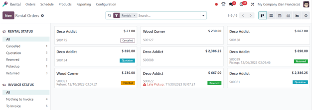

.. meta::
   :description: This page explains the Rental Orders dashboard, how to browse rentable products,
                 and how Odoo computes rental prices by selecting the cheapest applicable price
                 line.

:nosearch:
:show-content:
:show-toc:

.. _rental-products: https://youtu.be/CE-SahTUC9A?si=tqT3luHRHEuYReoH
.. _hotel-booking: https://youtu.be/2AyqLK4LFyo?si=19wPiF9WFOOKUy-V

======
Rental
======

The Odoo **Rental** application provides comprehensive solutions to configure and manage rentals.

Send quotations, confirm orders, schedule rentals, register products when they are picked up and
returned, and invoice customers from this single platform.

.. seealso::
   - `Odoo Rental: Product page <https://www.odoo.com/app/rental>`_
   - `Odoo Tutorials: Configuring Rental Products <rental-products_>`_
   - `Odoo Tutorials: Hotel booking <hotel-booking_>`_

.. cards::

   .. card:: Product types
      :target: rental/configure_products/product_type
      :large:

      Learn about the different rental product types, general configuration, and possible app
      integrations.

   .. card:: Physical service rental products
      :target: rental/configure_products/service_products
      :large:

      Discover how to create and manage a physical service rental product.

   .. card:: Labor service rental products
      :target: rental/configure_products/labor_service_products
      :large:

      Learn how to create a labor service rental product.

   .. card:: Manage deposits
      :target: rental/rental_orders/manage_deposits
      :large:

      Learn how to create a refundable deposit for rental products.

Dashboard
=========

Upon opening the **Rental** application, the :guilabel:`Rental Orders` dashboard is revealed.

In the default Kanban view, all rentals are visible. Each rental card displays the customer name,
the price of the rental, the related sales order number, along with the status of the rental.

On the left sidebar, the :guilabel:`Rental Status` for each rental can be found. Beneath that, the
:guilabel:`Invoice Status` of the rentals is accessible. Clicking any option in the left sidebar
filters the displayed rentals on the dashboard.

Rental products
===============

To view all products that can rented in the database, navigate to :menuselection:`Rentals app -->
Products`. By default, the :guilabel:`Rental` search filter appears in the search bar.

Each product Kanban card displays that product's name, rental price, and product image (if
applicable).

.. seealso::
   :doc:`rental/rental_orders/manage_deposits`

.. _rental/price-computing:

Rental price computing
======================

Odoo always uses two rules to compute the price of a product when a rental order is created:

#. Only one price line is used.
#. The cheapest line is selected.

.. exercise::
   Consider the following rental pricing configuration for a product:

   - 1 day: $100
   - 3 days: $250
   - 1 week: $500

   A customer wants to rent this product for eight days. What price will they pay?

   After an order is created, Odoo selects the second line as this is the cheapest option. The
   customer has to pay three times '3 days' to cover the rental's eight days, for a total of $750.

.. toctree::
   :titlesonly:

   rental/configure_products
   rental/rental_orders
