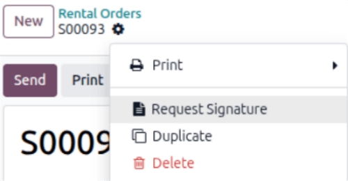
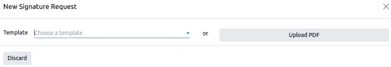

:show-content:

======
Rental
======

The Odoo **Rental** application provides comprehensive solutions to configure and manage rentals.

Send quotations, confirm orders, schedule rentals, register products when they are picked up and
returned, and invoice customers from this single platform.

.. seealso::
   - `Odoo Rental: product page <https://www.odoo.com/app/rental>`_
   - `Odoo Tutorials: Rental <https://www.odoo.com/slides/rental-48>`_

.. cards::

   .. card:: Manage deposits
      :target: rental/manage_deposits
      :large:

      Learn how to create a refundable deposit for rental products.

Dashboard
=========

Upon opening the **Rental** application, the :guilabel:`Rental Orders` dashboard is revealed.

.. image:: rental/rental-orders-dashboard.png
   :alt: Example of the Rental Orders dashboard available in the Odoo Rental application.

In the default Kanban view, all rentals are visible. Each rental card displays the customer name,
the price of the rental, the related sales order number, along with the status of the rental.

On the left sidebar, the :guilabel:`Rental Status` for each rental can be found. Beneath that, the
:guilabel:`Invoice Status` of the rentals is accessible. Clicking any option in the left sidebar
filters the displayed rentals on the dashboard.

Settings
========

To configure additional rental delay costs, availability of rental items, or minimum time of rental,
navigate to :menuselection:`Rental app --> Configuration --> Settings`.

In the :guilabel:`Rental` section, there are options to configure :guilabel:`Default Delay Costs`
and :guilabel:`Default Padding Time`. Also, there is the option to activate :guilabel:`Rental
Transfers`.

- :guilabel:`Default Delay Costs` are additional costs for late returns.
- :guilabel:`Default Padding Time` represents the minimum amount of time between two rentals.
- :guilabel:`Rental Transfers` means stock deliveries and receipts can be used for rental orders.

In the :guilabel:`Rent Online` section, there are options to configure a :guilabel:`Minimal Rental
Duration` and designate :guilabel:`Unavailability days`, or days during which pickup and return are
not possible.

Rental products
===============

To view all products that can rented in the database, navigate to :menuselection:`Rentals app -->
Products`. By default, the :guilabel:`Rental` search filter appears in the search bar.

Each product Kanban card displays that product's name, rental price, and product image (if
applicable).

.. seealso::
   :doc:`rental/manage_deposits`

.. _rental/pricing:

Rental pricing
==============

To adjust the rental pricing on a product, go to the :guilabel:`Products` page in the **Rental**
app, then select the desired product or click :guilabel:`New` to create a new product from scratch.

On the product form, ensure the :guilabel:`Rental` checkbox is ticked. Then, open the
:guilabel:`Rental prices` tab.

.. image:: rental/rental-prices-tab.png
   :alt: How the Settings page appears in the Odoo Rental application.

Pricing
-------

Under the :guilabel:`Pricing` section of the :guilabel:`Rental prices` tab, designate custom rental
prices and rental periods for the product.

To add pricing for a rental, click :guilabel:`Add a price`. Then, choose a *pricing period*
(:dfn:`the unit of duration of the rental`) in the :guilabel:`Period` column, or create a new
pricing period by typing in the name and clicking :guilabel:`Create`.

Next, decide whether or not to apply this custom rental price to a specific :guilabel:`Pricelist`.

Lastly, enter the desired :guilabel:`Price` for that specific :guilabel:`Period`.

.. note::
   No limit exists on how many pricing lines can be added. Multiple pricing options for rental
   products are typically used to give discounts for customers who agree to longer rental durations.

Reservations
------------

Under the :guilabel:`Reservations` section of the :guilabel:`Rental prices` tab, there is the option
to configure additional fines for any :guilabel:`Hourly Fine` or :guilabel:`Daily Fine` that the
customer takes to return a rental.

Also, there is the option to set the :guilabel:`Reserve product` time, expressed in hours, to make the rental
product temporarily unavailable between two rental orders. Such a feature may prove useful if
maintenance or cleaning is required between rentals.

Price computing
---------------

Odoo always uses two rules to compute the price of a product when a rental order is created:

#. Only one price line is used.
#. The cheapest line is selected.

.. exercise::
   Consider the following rental pricing configuration for a product:

   - 1 day: $100
   - 3 days: $250
   - 1 week: $500

   A customer wants to rent this product for eight days. What price will they pay?

   After an order is created, Odoo selects the second line as this is the cheapest option. The
   customer has to pay three times '3 days' to cover the rental's eight days, for a total of $750.

.. _rental/order:

Rental orders
=============

To create a rental order in the *Rental* app, navigate to :menuselection:`Rental app --> Orders -->
Orders`, and click :guilabel:`New`. Doing so reveals a blank rental order form to be filled in
accordingly.

Start by adding a :guilabel:`Customer`, then configure the desired duration of the rental in the
:guilabel:`Rental period` field.

To adjust the rental duration, click the first date in the :guilabel:`Rental period` field, and
select the range of dates to represent the rental duration from the pop-up calendar form that
appears.

.. image:: rental/rental-period-field-popup.png
   :alt: Sample of a rental period calendar pop-up window in the Odoo Rental application.

Once complete, click :guilabel:`Apply` in the calendar pop-up form. Following that, the pop-up form
disappears, and the designated time period of the rental is represented in the :guilabel:`Duration`
field.

Next, add a rental product in the :guilabel:`Order Lines` tab, by clicking :guilabel:`Add a
product`, and selecting the desired rental product to add to the form.

.. note::
   If a rental product is added *before* the :guilabel:`Rental period` field has been properly
   configured, the user can *still* adjust the :guilabel:`Rental period` field accordingly.

   Select the desired range of dates to represent the duration of the rental, then click
   :guilabel:`Update Rental Prices` in the :guilabel:`Duration` field.

   .. image:: rental/rental-update-rental-prices.png
      :alt: The update rental prices option that appears in the Odoo Rental application.

   Doing so reveals a :guilabel:`Confirmation` pop-up window. If everything is correct, click
   :guilabel:`Ok`, and Odoo recalculates the rental price accordingly.

Once all the information has been entered correctly on the rental order form, click the
:guilabel:`Send` button to send the quotation to the customer, or click the :guilabel:`Confirm`
button to confirm the order.

.. _rental/customer-signature:

Customer signature
==================

.. note::
   Requesting a signature can be done during any stage of the order. Consult the industry best
   practices for when signatures are required. This feature also requires the :doc:`Sign
   <../productivity/sign>` app.

If signatures are required, go to the **Rental** app and from the default :guilabel:`Rental Orders`
view, select the desired rental order. To go the :icon:`fa-cog` :guilabel:`(Actions)` icon, and
click :guilabel:`Request Signature`. This gives the ability to request the customer sign a rental
agreement, outlining the arrangement between the company and customer, *before* they pick up the
rental products. Such documents can ensure everything is returned on-time and in its original
condition.

A :guilabel:`Sign Documents` pop-up window displays.

Select the desired document from the :guilabel:`Template` field. Doing so reveals a :guilabel:`New
Signature Request` pop-up window.

.. image:: rental/new-signature-request-form.png
   :alt: The New Signature Request pop-up window that appears in the Odoo Rental application.

Upon confirming the information in the :guilabel:`New Signature Request` pop-up form, click
:guilabel:`Send` to initiate the signing process.

A link to the signature request will appear in the record's chatter. The document is accessible
to the customer via the customer portal or email.

The customer clicks the :guilabel:`Sign document` button, a separate page is then revealed,
showcasing the document to be signed. The customer is prompted to begin the process by clicking the
:guilabel:`Click to start` button. The app guides the signee to the required signature locations and
allows them to create electronic signatures to complete the form.

.. image:: rental/adopt-signature-popup.png
   :alt: The adopt your signature pop-up window that appears in the Odoo Rental application.

Once the document has been signed and completed, click the :guilabel:`Validate & Send Completed
Document` button at the bottom of the document.

.. image:: rental/validate-send-doc-button.png
   :alt: The validate and send completed document button in the Odoo Rental application.

Upon clicking the :guilabel:`Validate & Send Completed Document` button, Odoo presents the option to
download the signed document for record-keeping purposes, if necessary.

.. seealso::
   `Odoo Tutorials: Sign <https://www.odoo.com/slides/sign-61>`_

.. _rental/pickup-return:

Pickup products
===============

When a customer picks up the product, navigate to the appropriate rental order, click the
:guilabel:`Pickup` button, and then click :guilabel:`Validate` in the :guilabel:`Validate a pickup`
pop-up form that appears.

Doing so places a :guilabel:`Picked-up` status banner on the rental order.

.. _rental/return:

Return products
===============

When a customer returns the products, navigate to the appropriate rental order, click the
:guilabel:`Return` button, and validate the return by clicking :guilabel:`Validate` in the
:guilabel:`Validate a return` pop-up form that appears.

Doing so places a :guilabel:`Returned` status banner on the rental order.

Print pickup and return receipts
================================

Pickup and return receipts can be printed for customers when they pick up and/or return rental
products.

To print pickup and/or return receipts, navigate to the appropriate rental order, click the
:icon:`fa-cog` :guilabel:`(Actions)` icon to reveal a drop-down menu.

From this drop-down menu, hover over the :guilabel:`Print` option to reveal a sub-menu. Then select
:guilabel:`Pickup and Return Receipt`.

Odoo generates and downloads a PDF, detailing all information about the current status of the rented
items.

.. toctree::
   rental/manage_deposits
