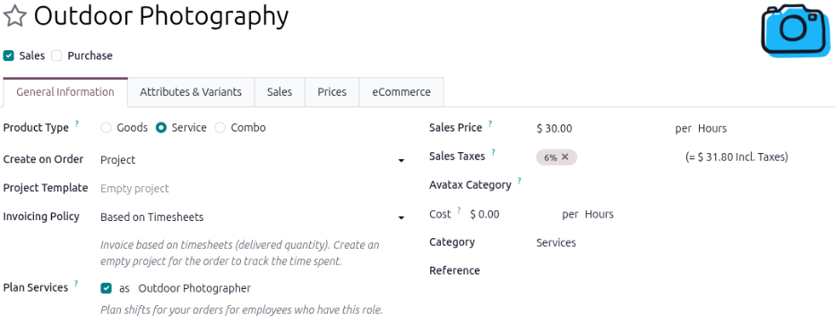
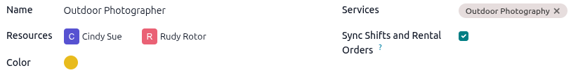
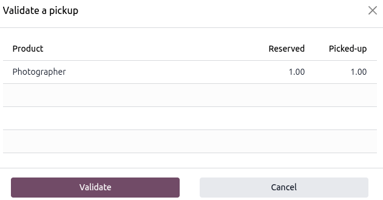

=============================
Labor service rental products
=============================

There are two types of service products in the **Rental** app that require different configurations:
:doc:`physical <service_products>` and non-physical (labor). This document focuses on the
configuration of non-physical rental service products and will refer to them as labor services going
forward. A labor service is an intangible good that sometimes requires an employee to execute. Some
examples are:

- Rental insurance or a warranty
- Housekeeping
- Catering services like bartending or waitstaffing for events

Configuration
=============

Depending on the type of service product, the requirements differ. To learn more about the default
settings for rental products, refer to the :ref:`Configuration <rental/product_type/configuration>`
section on the *Rental product types* page.

To access the **Rental** app's settings, navigate to :menuselection:`Rental app --> Configuration
--> Settings`.

The following configurations assume the **Rental**, **Planning**, **Timesheets**, and **Sales** apps
are installed.

Configure employee roles
========================

Before creating a labor service product in the **Rental** app, it's recommended to :ref:`create
<planning/roles>` and :ref:`assign <planning/employees>` employee roles in the **Planning** app to
enable employee shift planning. Employees are linked to the labor service product through their
assigned role. Whenever the service is added to a rental order, the **Rental** app syncs with the
**Planning** app to update the employee shift availability.

.. example::

   Sneak Peak Studio has a new Outdoor Photography service and two dedicated employees. Add the new
   employees by navigating to the :menuselection:`Planning app --> Employees`. Click :guilabel:`New`
   and enter the necessary information for the employee. Repeat those steps for all employees.

   To create a Photographer role, navigate to the :menuselection:`Planning app --> Configuration -->
   Roles`. Click :guilabel:`New`, enter `Outdoor Photographer` for the role name, and assign the two
   employees as :guilabel:`Resources`.

   .. image:: labor_service_products/example-planning-create-role.png
      :alt: Example of a role form in the Planning app.

   Create a new service product by navigating to the :menuselection:`Rental app --> Product`. Click
   :guilabel:`New`, then configure the Outdoor Photography service with the :guilabel:`Plan
   Services` checkbox enabled, and the :guilabel:`Outdoor Photography` role assigned.

   .. image:: labor_service_products/example-rental-plan-services-checkbox.png
      :alt: Example of the enabled Plan Services feature on a product form in the Rental app.

Create a new service product
============================

To set up a new rental service, go to the :menuselection:`Rental app --> Products --> Products` and
then click :guilabel:`New`. The new product form displays with the *General Information* tab open as
default.

Initial product configuration
-----------------------------

.. important::
   The **Sales**, **Planning**, and **Timesheets** apps must be installed for the following fields
   to be available:

   - :guilabel:`Based on Timesheets` option of the *Invoicing Policy* field.
   - :guilabel:`Plan Services` field to be available.

In the new product window, the :guilabel:`Sales` checkbox is already selected by default. Select the
:guilabel:`Product Type` as :guilabel:`Service`. In the :guilabel:`Invoicing Policy` drop-down menu,
select :guilabel:`Based on Timesheets`. Enable the :guilabel:`Plan Services` checkbox and either
create a new role or select a pre-existing one.

Click the :icon:`oi-arrow-right` :guilabel:`(Internal link)` icon to open the product's *Role* page.
Enable the :guilabel:`Sync Shifts and Rental Orders` checkbox.

Set a base rental period and price
----------------------------------

Set the base rental price by entering the lowest rental price in the :guilabel:`Sales Price` field.
Next, click the :guilabel:`Sales` tab, then configure the following *Rental* section fields where
applicable:

- :guilabel:`Periodicity`: The unit of time the product will use for rental prices.
- :guilabel:`Padding Time`: Blocks a rental product from being available for reservations. The
  setting is set to an hourly unit. This is available only if Hours is selected in the Periodicity
  field.
- :guilabel:`Pickup`: The earliest time the customer can pick up the product to begin the rental
  period.
- :guilabel:`Return`: The latest time the customer can return the product.

Optional: specify rental variants
---------------------------------

.. important::
   The *Variant* feature in the **Sales** app must be enabled for this tab to display.

Click :guilabel:`Add a line`, then select or create a option :guilabel:`Attribute` drop-down menu.
To create a new one, enter the name and click :guilabel:`Create and edit…` to :ref:`configure the
attribute and values <products/variants/attributes>`.

.. example::
   A moving company rates their services based on distance. Any move within San Francisco uses the
   flat rate of $165 per hour. Depending on the distance the customer is moving outside of San
   Francisco, the company adds an additional fee.

   Go to the :menuselection:`Rental app --> Products` and click :guilabel:`New` to create a new
   product. Configure the base rental price and period using the *General Information* and *Sales*
   tabs.

   On the *Attributes & Variants* tab, click :guilabel:`Add a line` and select `Distance` as an
   :guilabel:`Attribute`. In the :guilabel:`Values` column, add `50 mi`, `100 mi`, and `200 mi`.

   .. image:: labor_service_products/example-rental-service-variants.png
      :alt: Example of service variants in the Attributes & Variants tab.

Add multiple rental prices
--------------------------

There are two ways to configure additional rental rates in the Rental app: :ref:`Pricelists
<rental/labor_service_products/pricelists-method>` and the :ref:`Prices
<rental/labor_service_products/prices-tab>` tab.

.. _rental/labor_service_products/pricelists-method:

Using the Pricelists method
~~~~~~~~~~~~~~~~~~~~~~~~~~~

Creating a :ref:`new pricelist <sales/products/create-edit-pricelists>` allows for better
customization when applying rental rates to specific time periods, products, or customers using
*Pricelist Rules*. It is a separate form that users can apply to quotations or select on the rental
product form to add new price rules to. To create a new pricelist, go to :guilabel:`Rental app -->
Products --> Pricelists` and click :guilabel:`New`.

.. _rental/labor_service_products/pricelists-example:

.. example::
   **Part 1**

   A photography studio rents out its photographers on an hourly and daily basis. The hourly rate is
   $30, but the studio offers a 20% discount for all-day sessions (eight hours or more). All
   reservations require a 24-hour notice to reserve a photographer. Navigate to
   :menuselection:`Rental app --> Products --> Products` and click the desired product.

   Enter the :guilabel:`Sales Price` and then click the :guilabel:`Sales` tab to configure the
   :guilabel:`Periodicity` and the :guilabel:`Padding Time`.

   .. image:: labor_service_products/example-rental-service-periodicity.png
      :alt: Example of Periodicity configuration on the Sales tab.

   Using the Pricelist method, navigate to :menuselection:`Rental app --> Products --> Pricelists`
   and click :guilabel:`New`. Configure :guilabel:`Pricelist Rules` for the daily rate.

   .. image:: labor_service_products/example-pricelist-rules.png
      :alt: Example of a configured Pricelist Rules form.

.. _rental/labor_service_products/prices-tab:

Using the Prices tab method
~~~~~~~~~~~~~~~~~~~~~~~~~~~

.. important::
   The :ref:`Pricelists <sales/products/pricelist-configuration>` feature must be enabled for this
   tab to display.

Rental rates can also be configured as a new price rule for an existing pricelist using the
:guilabel:`Prices` tab on the product form. If no pricelist is configured beforehand, the *Default*
pricelist is selected.

It is recommended to create a new pricelist first instead of using the *Default* pricelist. Keeping
the *Default* pricelist blank ensures there is a clean pricelist for the base rental rate.

Navigate to :menuselection:`Products --> Products`, then click the desired product. Click the
:guilabel:`Prices` tab and click :guilabel:`Add a price`.

Select the desired :guilabel:`Pricelist`, then enter the minimum time required for the price change
to trigger in the :guilabel:`Min. Quantity` column. The :guilabel:`Min. Quantity` column is based on
the *Periodicity* field in the :guilabel:`Sales` tab.

Lastly, enter the :guilabel:`Price` rate. Click the :icon:`fa-cloud-upload` :guilabel:`(Save
manually)` icon near the top to save.

.. tip::
   Add a date range in the :guilabel:`Validity` column. To add a :guilabel:`Validity` column, click
   the :icon:`oi-settings-adjust` :guilabel:`(Settings)` icon and enable :guilabel:`Validity`.

.. example::

   **Part 2**

   Using the same scenario in the :ref:`Pricelists method example
   <rental/labor_service_products/pricelists-example>`, use the :guilabel:`Prices` tab method by
   navigating to :menuselection:`Rental app --> Products --> Products` and click the desired product
   to configure. Click the :guilabel:`Prices` tab and select the `Photographer Rental` option for
   the :guilabel:`Pricelist column`. Enter `8` in the :guilabel:`Min. Quantity` column and enter
   `24` for the :guilabel:`Price` column.

   .. image:: labor_service_products/example-prices-tab.png
      :alt: Sample of the Prices tab of service product in the Rental app.

eCommerce features
------------------

.. important::
   This tab is only available if the :guilabel:`eCommerce` module is installed.

The :guilabel:`eCommerce` tab configures the product page on the website. Refer to the :ref:`Product
visibility <ecommerce/products/publish-products>` and :ref:`Product configuration
<ecommerce/products/product-configuration>` sections for the **eCommerce** module for configuration
instructions.

Any selected days in the *Unavailability days* section in the :ref:`Rental app's settings
<rental/product_type/configuration>` are only applied to online booking. If the product isn't
published to the website then the setting does not go into effect.

.. _rental/labor_service_products/pickup:

Process a rental order pickup
=============================

When a product is rented alongside a service, it is advised to pick it up before entering time on
the associated task.

If time is entered on the :guilabel:`Timesheets` tab of an associated task before the physical
rental product is picked up, the rental order status automatically changes to :guilabel:`Picked-up`.
The :guilabel:`Pickup` button is still available on the rental order if time is entered before
picking up the product.

When a customer picks up the product, navigate to the appropriate rental order and click
:guilabel:`Pickup`. Verify the list, then click :guilabel:`Validate` in the *Validate a pickup*
pop-up window that appears.

Doing so places a :guilabel:`Picked-up` status banner on the rental order.

.. _rental/labor_service_products/return:

Process a rental order return
=============================

Regardless of whether there is a product rented along with a service, the service or product must be
returned on the rental order.

When a customer returns the products or when the service has been completed, navigate to the
appropriate rental order and click :guilabel:`Return`. Validate the return by clicking
:guilabel:`Validate` in the *Validate a return* pop-up window that appears.

.. image:: labor_service_products/validate-a-return-window.png
   :alt: Sample of returning a service product in the Rental app.

Doing so places a :guilabel:`Returned` status banner on the rental order.

.. example::
   The photography studio had a customer who wanted to rent one of their photographers and banner
   decorations for a home photo shoot. The booking was for two hours.

   On the :guilabel:`Validate a return` form for rental order, the banner line item matches the
   number of banners picked up, and the photographer line item matches the number of hours submitted
   on the :guilabel:`Timesheets` tab on the related task.

   .. image:: labor_service_products/return-form-example-product-service.png
      :alt: Sample of a Validate a return form with a rental product and service listed.

.. seealso::
   - :doc:`service_products`
   - :doc:`../../../services/planning`
   - :doc:`../../sales/products_prices/prices/pricing`
   - :doc:`../../sales/products_prices/products/variants`
