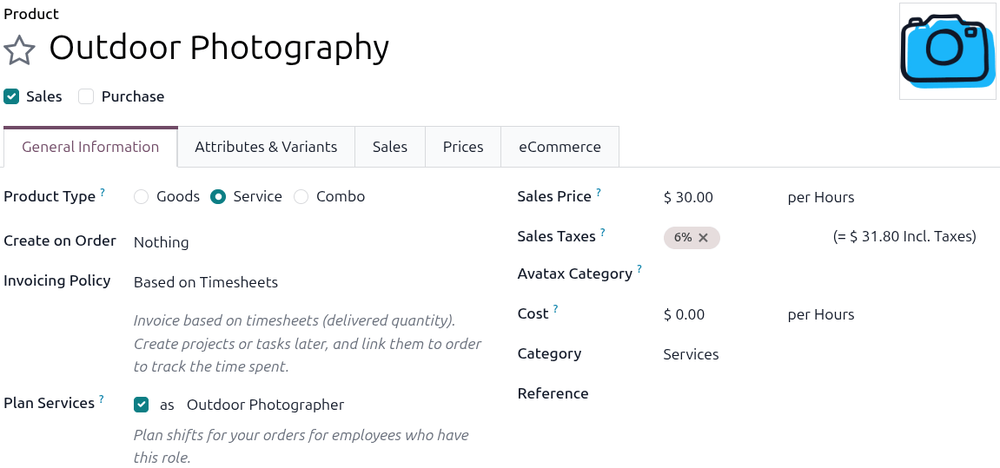
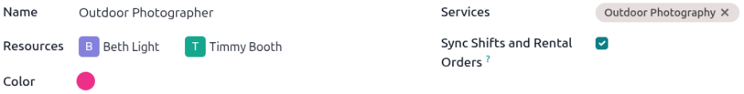
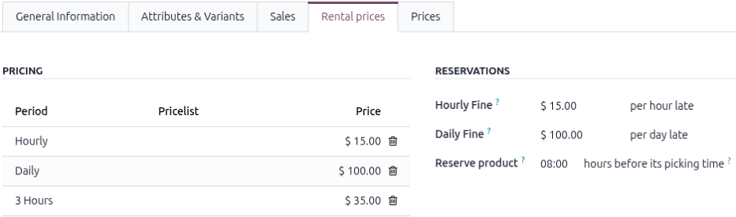

.. meta::
   :description: This document explains how to configure a labor service rental product in the
                 Rental app.

=============================
Labor service rental products
=============================

There are two types of service products in the **Rental** app that require different configurations:
:doc:`physical <service_products>` and non-physical (labor). This document focuses on the
configuration of non-physical rental service products and refers to them as labor services going
forward. A labor service is an intangible good that sometimes requires an employee to execute. Some
examples are:

- Rental insurance or a warranty
- Housekeeping
- Catering services like bartending or waitstaffing for events

.. _rental/labor_service_products/configuration:

Configuration
=============

Configuration requirements differ depending on the type of service product. To learn more about the
default settings for rental products, refer to the :ref:`Configuration
<rental/product_type/configuration>` section on the *Rental product type* page.

To access the **Rental** app's settings, navigate to :menuselection:`Rental app --> Configuration
--> Settings`.

The following configurations assume the **Rental**, **Planning**, **Timesheets**, and **Sales** apps
are installed.

.. _rental/labor_service_products/configure-employee-roles:

Configure employee roles
========================

Before creating a labor service product in the **Rental** app, it's recommended to :ref:`create
<planning/roles>` and :ref:`assign <planning/employees>` employee roles in the **Planning** app to
enable employee shift planning. Employees are linked to the labor service product through their
assigned role. Whenever the service is added to a rental order, the **Rental** app syncs with the
**Planning** app to update the employee shift availability.

Create a new service product
============================

To set up a new rental service, go to :menuselection:`Rental app --> Products --> Products` and then
click :guilabel:`New`. The new product form displays with the *General Information* tab open by
default.

Initial product configuration
-----------------------------

In the new product form, select the :guilabel:`Sales` checkbox. In the *General Information* tab,
select :guilabel:`Service` as the :guilabel:`Product Type`. In the :guilabel:`Invoicing Policy`
drop-down menu, select :guilabel:`Based on Timesheets`. Enable the :guilabel:`Plan Services`
checkbox and either create a new role or select a pre-existing one. Optionally, in the
:guilabel:`Create on Order` field, select :guilabel:`Project`.

.. important::
   The **Sales**, **Planning**, **Project**, and **Timesheets** apps must be installed for the
   following fields to be available:

   - :guilabel:`Project` option of the :guilabel:`Create on Order` field.
   - :guilabel:`Project Template` field.
   - :guilabel:`Based on Timesheets` option of the *Invoicing Policy* field.
   - :guilabel:`Plan Services` field.

Click the :icon:`oi-arrow-right` :guilabel:`(Internal link)` icon next to the chosen role to open
the product's *Role* page. Enable the :guilabel:`Sync Shifts and Rental Orders` checkbox.

.. _rental/labor_service_products/rental-periods-prices:

Configuring rental periods and prices
-------------------------------------

No limit exists on how many rental prices can be added to a product. Multiple pricing options for
rental products are typically used to give discounts for customers who agree to longer rental
durations. When creating multiple pricing options for a rental product, remember the **Rental**
app's :ref:`price computing logic <rental/price-computing>`.

To set rental rates for the product, click the *Rental prices* tab. Then, in the *Pricing* section,
click :guilabel:`Add a price` to enter a new rental rate:

#. Select a :ref:`rental period <rental/labor_service_products/rental-period>` (:dfn:`the unit of
   duration of the rental`) from the :guilabel:`Period` column.
#. (Optional) Select a pricelist option from the :guilabel:`Pricelist` column. This adds the new
   rental rate to the assigned pricelist.
#. Enter the :guilabel:`Price` for the chosen :guilabel:`Period`.

.. tip::
   Remember when considering pricing that renting for a day is usually limited to operating hours,
   not 24 hours.

The *Reservations* section contains the delay costs and padding time that are automatically
populated from the *Default Delay Costs* section, provided they have been configured in
:menuselection:`Rental app --> Configuration --> Settings`. If configured on the product form, the
settings override the settings in the *Default Delay Costs* section.

- :guilabel:`Hourly Fine`: The price per hour charged when the rental product is returned after the
  scheduled time.
- :guilabel:`Daily Fine`: The price per day charged when the rental product is returned after the
  scheduled time.
- :guilabel:`Reserve product`: The time the rental product is temporarily unavailable between two
  rental orders. Useful if maintenance or cleaning is required between rentals.

.. _rental/labor_service_products/rental-period:

Creating a rental period
~~~~~~~~~~~~~~~~~~~~~~~~

The **Rental** app allows users to :ref:`create custom rental periods
<rental/products/rental-period>` to use in the *Rental prices* tab. This is helpful when renting
services with special pricing for a set amount of time, such as offering a four-hour photo shoot for
$100 when the hourly rate is $30.

To create a new rental period, go to :menuselection:`Rental app --> Configuration --> Rental
periods`.

.. _rental/labor_service_products/variants:

Optional: specify rental variants
---------------------------------

.. important::
   The *Variants* feature in the **Sales** app must be enabled for this tab to display.

In the *Attributes & Variants* tab, click :guilabel:`Add a line`, then select or create an option
from the :guilabel:`Attribute` drop-down menu. To create a new one, enter the name and click
:guilabel:`Create and edit` to :ref:`configure the attribute and values
<products/variants/attributes>`.

.. example::
   A moving company rates their services based on distance. Any move within San Francisco uses the
   flat rate of $165 per hour. Depending on the distance the customer is moving outside of San
   Francisco, the company adds an additional fee.

   Go to :menuselection:`Rental app --> Products --> Products` and click :guilabel:`New` to create a
   new product. Configure the base rental price and period using the *General Information* and
   *Sales* tabs.

   On the *Attributes & Variants* tab, click :guilabel:`Add a line` and select `Distance` as an
   :guilabel:`Attribute`. In the :guilabel:`Values` column, add `50 mi`, `100 mi`, and `200 mi`.

   .. image:: labor_service_products/example-rental-service-variants.png
      :alt: Example of service variants in the Attributes & Variants tab.

.. _rental/labor_service_products/ecommerce:

eCommerce features
------------------

.. important::
   The *Ecommerce* sections are only available if the **eCommerce** module is installed.

The *Sales* tab has the following sections that configure the product page on the website:
*Ecommerce shop*, *Ecommerce media*, and *Ecommerce description*. Refer to the :ref:`Product
visibility <ecommerce/products/publish-products>` and :ref:`Product configuration
<ecommerce/products/product-configuration>` sections for the **eCommerce** module for configuration
instructions.

.. seealso::
   - :doc:`service_products`
   - :doc:`products`
   - :doc:`../../../services/planning`
   - :doc:`../../sales/products_prices/prices/pricing`
   - :doc:`../../sales/products_prices/products/variants`
