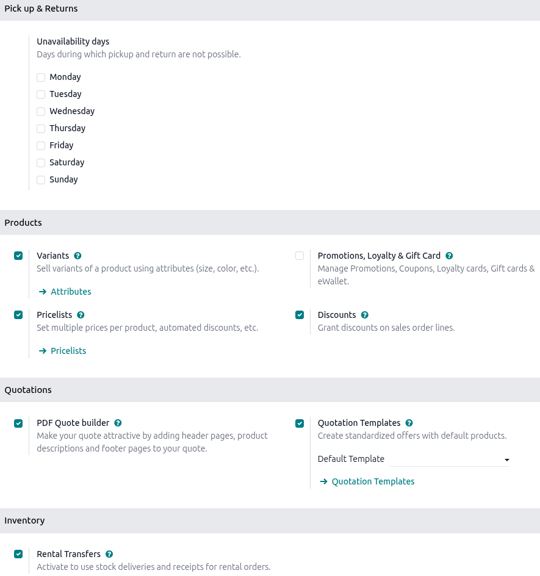

===================
Rental product type
===================

Odoo allows for two :ref:`product types <inventory/type/good-or-services>` when configuring a rental
product: Goods or Services.

*Goods*: Includes physical items. Goods are removed from the company’s stock, delivered to the
customer, and then returned.

*Services*: Includes labor, non-physical, or a physical item that never leaves the company’s stock,
such as a hotel room, work station, or storage unit.

The following sections detail basic settings and app integration configurations for goods and
services.

.. _rental/product_type/configuration:

Configuration
=============

.. important::
   The *Configuration* menu changes if the **Inventory** app or **Sales** module is
   installed.

   - For the :guilabel:`Rental Transfers` setting, the **Inventory** app must be installed.
   - For the :guilabel:`PDF Quote Builder` and :guilabel:`Quotation templates` settings, the
     **Sales** app must be installed.

To configure default settings on rental products, navigate to :menuselection:`Rental app -->
Configuration --> Settings`.

In the *Pick up & Returns* section, the :guilabel:`Unavailability days` limit what days of the week
customers can book or return rental products online.

In the *Products* section, users can enable the following features: :doc:`Variants
<../../sales/products_prices/products/variants>`, :doc:`Pricelists
<../../sales/products_prices/prices/pricing>`, :doc:`Promotions, Loyalty & Gift Card
<../../sales/products_prices/loyalty_discount>`, and
:doc:`../../sales/products_prices/prices/discounts`.

In the *Quotations* section, users can enable the
:doc:`../../sales/sales_quotations/pdf_quote_builder` and
:doc:`../../sales/sales_quotations/quote_template` features to use when creating a quotation.

If the **Inventory** app is installed, the *Inventory* section is displayed. The :guilabel:`Rental
Transfers` checkbox enables automatic creation of delivery and return receipts for a rental product.

.. note::
   The **Inventory** app automatically creates an internal default location once the
   :guilabel:`Rental Transfers` feature is enabled. Odoo uses the new default location,
   `Customer/Rental`, to track products during the rental period (moving them from Stock to
   Customer/Rental upon rental, and back upon return). **Do not** modify this location to avoid
   corrupting inventory tracking.

Click :guilabel:`Save` to apply the changes.

App integration configuration
=============================

The **Rental** app relies on additional Odoo app integration to expand its settings and product
configurations. The following apps are essential for workflow efficiency and automation when
creating a product and rental order:

- **Sales**: Enables online payments and signatures within the **Rental** app.
- **Sign**: Allows uploading and customization of various rental and service agreements. These
  documents are used to facilitate the :guilabel:`Request Signature` feature.
- **Planning**: Integrates with the **Rental** app to automatically match service products with
  employees or materials based on availability. This setting is configured on the product form.
- **Project**: Enables automatic creation of a project, a task, or both when a rental quote that
  includes the configured product is confirmed. This setting is configured on the product form.
- **Inventory**: Enables warehouse delivery and return receipts, product tracking options, variants,
  and product downtime.
- **eCommerce**: Allows product configuration for the online shop. This setting is configured on the
  product form.

.. seealso::
   - :doc:`../../sales/sales_quotations/get_paid_to_validate`
   - :doc:`../../sales/sales_quotations/get_signature_to_validate`
   - :doc:`../../../services/planning`
   - :doc:`../../../productivity/sign`
   - :doc:`../../../services/project`

Search for rental products
==========================

To view all products available for rent in the database, navigate to :menuselection:`Rentals app -->
Products`. By default, the :guilabel:`Rental` filter appears in the search bar, and the view is
Kanban. Click the search bar and from the preset filters, select :guilabel:`Goods`,
:guilabel:`Services`, or both. All the selected options appear as Kanban cards. For Goods, the card
displays the name, rental rate, and amount on hand. For Services, the card displays the name, the
number of variants if configured, and the rental price.

.. seealso::
   - :doc:`Configure a service product <service_products>`
   - :doc:`Configure a physical product <products>`

