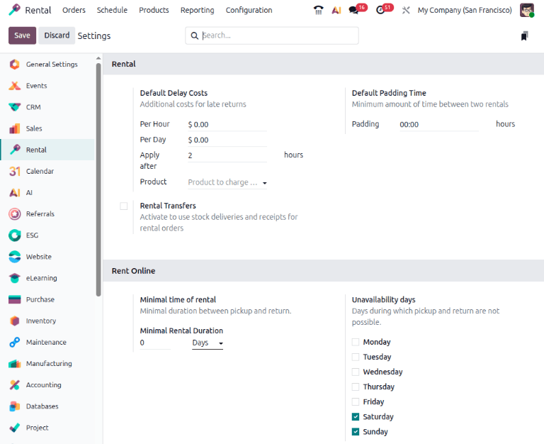

.. _configure-rental-product: https://youtu.be/CE-SahTUC9A?si=Gae5tLAZk6wt70TW

===================
Rental product type
===================

Odoo allows for two :ref:`product types <inventory/product_management/goods-or-services>` when
configuring a rental product: Goods or Services.

A rental *Goods* product is a physical item, such as a computer, vehicle, bike, camera, or an item
of clothing. Goods are removed from the company’s stock, delivered to the customer, and then
returned to the company.

A rental *Service* can be labor or something non-physical, such as installation, photography, or a
deposit. It can also be a physical item that never leaves the company’s stock, such as a hotel room,
work station, or storage unit.

The following sections detail basic settings and app integration configurations for Goods and
Services.

Settings
========

.. important::
   For the :guilabel:`Default Padding time` and :guilabel:`Rental Transfers` settings, the
   **Inventory** app must be installed. For the *Rent Online section* settings, the **eCommerce**
   module must be installed.

To configure default settings on rental products, navigate to :menuselection:`Rental app -->
Configuration --> Settings`.

In the *Rental* section, the *Default Delay Costs* subsection is used to set up late fees. These are
the base settings that come with the **Rental** app installation. To apply delay costs and times to
rental products, fill in the:

- :guilabel:`Per Hour`: The late fee amount is applied each hour the rental product is past due.
- :guilabel:`Per Day`: The late fee amount is applied each day the rental product is past due.
- :guilabel:`Apply after`: The number of hours necessary to trigger a late fee.
- :guilabel:`Product`: Limit the default delay costs setting to one product from the field’s
  drop-down list. Leave the :guilabel:`Product` field blank if the defaults apply to all products.

If the **Inventory** app is installed, the *Default Padding Time* section displays. The time
inputted into the :guilabel:`Padding` field blocks a rental product from being available for
reservations. The setting is set to an hourly unit.

.. note::
   For more control, configure the costs for late returns and padding time in the :guilabel:`Hourly
   Fine`, :guilabel:`Daily Fine`, and :guilabel:`Reserve product` fields on the product form.

The :guilabel:`Rental Transfers` checkbox enables automatic creation of delivery and return receipts
for a rental product. This feature also needs the **Inventory** app to be installed.

.. note::
   The **Inventory** app automatically creates an internal default location once the
   :guilabel:`Rental Transfers` feature is enabled. Odoo uses the new default location,
   `Customer/Rental`, to track products during the rental period (moving them from Stock to
   Customer/Rental upon rental, and back upon return). **Do not** modify this location to avoid
   corrupting inventory tracking.

If the **eCommerce** module is installed, the *Rent Online* section is available to configure. The
*Minimal time of rental* section contains:

- :guilabel:`Minimal Rental Duration`: The minimum duration of time a rental product must be booked.
  The available units of time are: Hours, Days, Weeks, and Months.
- :guilabel:`Unavailability days`: Designated days that are not available for online rental pick ups
  or returns.

Click :guilabel:`Save` to apply the changes.

App integration configuration
=============================

The **Rental** app relies on additional Odoo app integrations to expand its settings and product
configurations. The following apps are essential for workflow efficiency and automation when
creating a product and rental order:

- **Sales**: Enables online payments and signatures, uses quotation templates, variants, and PDF
  Quote Builder.
- **Sign**: Allows uploading and customization of various rental and service agreements. These
  documents are used to facilitate the *Request Signature* feature.
- **Planning**: Integrates with the **Rental** app to automatically match service products with
  employees or materials based on availability. This setting is configured on the product form.
- **Project**: Integrates with the **Rental** app to automatically creation of a project, a task, or
  both when a rental quote that includes the configured product is confirmed. This setting is
  configured on the product form.
- **Inventory**: Enables warehouse delivery and return receipts, product tracking options, variants,
  and product downtime.
- **eCommerce**: Allows product configuration for the online shop. This setting is configured on the
  product form.

.. seealso::
   - :doc:`../../sales`
   - :doc:`../../sales/sales_quotations/pdf_quote_builder`
   - :doc:`../../../services/planning`
   - :doc:`../../../productivity/sign`
   - :doc:`../../../services/project`
   - :doc:`../../../inventory_and_mrp/inventory`
   - :doc:`../../../websites/ecommerce`

Search for rental products
==========================

To view all products available for rent in the database, navigate to :menuselection:`Rentals app -->
Products`. By default, the :guilabel:`Rental` filter appears in the search bar, and the view is
Kanban. Remove the filter, then click the search bar. From the preset filters, select
:guilabel:`Goods`, :guilabel:`Services`, or both.

All the selected options appear as Kanban cards. For *Goods*, the card displays the name, rental
rate, and amount on hand. For *Services*, the card displays the name, the number of variants if
configured, and the rental price.

.. seealso::

   - :doc:`products`
   - :doc:`service_products`
   - `Tutorial: Configuring a rental product <configure-rental-product_>`_

Rental periods
==============

A rental period is the unit of time used to calculate the rental rate. This setting is configured on
the *Rental prices* tab on the product form. To edit a default rental rate, navigate to
:menuselection:`Rental app --> Configuration --> Rental Periods`.

Select a rental period to open the *Period* form. With the exception of the :guilabel:`Nightly`
rental period, all period forms have the following fields:

- :guilabel:`Name`: A short description or title for the period.
- :guilabel:`Duration`: The minimum amount of time before the rule is applied. Set to `0` to
  represent a fixed rental price.
- :guilabel:`Unit`: A drop-down list of time periods the shortest being Hours and the longest is
  Years.

To create a new rental period, click :guilabel:`New`.

Nightly rental period
---------------------

The *Nightly* rental period form replaces the :guilabel:`Duration` field with two new fields
:guilabel:`Check-in` and :guilabel:`Check-out`. Both fields use a 24-hour clock to set the time.
This setting is recommended for space or storage rentals that require specific times to begin and
end the rental period.

