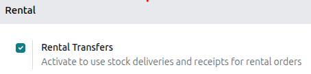

========================
Physical rental products
========================

Odoo **Rental** app allows users to customize the scheduling, pricing, and inventory for rental
physical products. Users can set up multiple pickup and drop-off locations and track rental products
by serial number.

Settings
========

To configure default settings on rental products, navigate to :menuselection:`Rental app -->
Configuration --> Settings`.

In the **Rental** section, under the :guilabel:`Default Delay Costs` subsection, fill in the
:guilabel:`Apply after` field.

.. note::
   For finer control, configure the costs of late returns for the :guilabel:`Per Hour` and
   :guilabel:`Per Day` fields at the product level. If the defaults apply to all products, leave the
   :guilabel:`Product` field blank.

In the :guilabel:`Default Padding Time` section, fill in the :guilabel:`Padding` field. Next, enable
:guilabel:`Rental Transfers`.

In the :guilabel:`Rent Online` section, fill in the :guilabel:`Minimal Rental Duration` field and
designate :guilabel:`Unavailability` days.

Click **Save** to apply the changes.

Rental products
===============

To view all products that can be rented in the database, navigate to :menuselection:`Rentals app -->
Products`. By default, the :guilabel:`Rental` filter appears in the search bar, and the view is
Kanban.

Each product Kanban card displays the name of the product, rental rate, amount of units on hand, and
product image (if applicable).

Create a new physical product
=============================

To set up a new physical rental product, go to the :menuselection:`Rental app --> Products`, then
click :guilabel:`New`. In the new product window, the :guilabel:`Rental` checkbox is already ticked
by default.

.. image:: products/new-product.png
   :alt: The new product view in the Rental app.

Select the :guilabel:`Product Type` as :guilabel:`Goods` and tick the :guilabel:`Track Inventory`
checkbox. Next to the :guilabel:`Track Inventory` checkbox, select the :guilabel:`By Unique Serial
Number` from the drop-down menu. For the :guilabel:`Category` field, select :guilabel:`Goods` from
the drop-down menu or create a new category by typing in the name and clicking :guilabel:`Create`.

Click the :guilabel:`Rental prices` tab and in the :guilabel:`Pricing` section, click :guilabel:`Add
a price` to enter a new rental rate. Choose a *pricing period* (:dfn:`the unit of duration of the
rental`) in the :guilabel:`Period` column, or create a new pricing period by typing in the name and
clicking :guilabel:`Create and edit`.

.. note::
   Creating a new pricing period opens a pop-up :guilabel:`Create period` window. Fill in the
   :guilabel:`Name`, :guilabel:`Duration`, and :guilabel:`Unit`, and click :guilabel:`Save`. The new
   pricing period automatically applies.

   .. image:: products/new-rental-period.png
      :alt: Sample of a New Period view in the Rental app.

Next, enter the :guilabel:`Price` for that specific :guilabel:`Period`. To apply the configured
rental rate to an existing pricelist, click in the :guilabel:`Pricelist` column and select the
desired list from the drop-down menu.

In the :guilabel:`Reservations` section, fill in the :guilabel:`Hourly Fine`, :guilabel:`Daily
Fine`, and the :guilabel:`Reserve product` time. These values are automatically populated from the
:guilabel:`Default Delay Costs` section, provided they have been configured in the
:menuselection:`Rental app --> Configuration --> Settings`.

Click the :icon:`fa-cloud-upload` :guilabel:`(Save manually)` icon near the top to save.

.. example::
   A bike rental business only rents out tandem bikes for the local park for two hours. The hourly
   rental rate for their tandem bikes is $20, but since tandem bikes are popular they want to set a
   fixed price of $35. To ensure the business gets their bikes returned on time they set the late
   return fee as $20 per hour and $160 per day ($20 x 8 hrs).

   Create a new pricing period by navigating to :menuselection:`Rental app --> Configuration -->
   Rental periods`. Click :guilabel:`New` and configure a the period for 2 hours.

   Navigate to the tandem bike product and in the :guilabel:`Rental prices` tab and add the 2 hour
   period set at $35. Manually save to apply changes.

   .. image:: products/rental-prices-tab-with-rental-period.png
       :alt: Sample of a rental product with the custom rental period applied.

Multi-location management and transfers
=======================================

Tracking the location of high-value physical products between locations is essential. The **Rental**
app helps with the *Rental Transfers* feature. Activating rental transfers means the system treats
rental movements similarly to sales, requiring a receipt and a delivery order every time a physical
product is rented or returned.

For multi-location management and rental item transfer tracking, navigate to the
:menuselection:`Rental app > Configuration > Settings` and in the :guilabel:`Rental` section, tick
the :guilabel:`Rental Transfers` checkbox.

.. image:: products/rental-transfers-checkbox.png
   :alt: Sample of the Rental settings with the Rental Transfers enabled.

.. note::
   The **Inventory** app automatically creates an internal default location once the *Rental
   Transfers* feature is enabled. Odoo uses the new default location, :guilabel:`Customer/Rental`,
   to track products during the rental period (moving them from :guilabel:`Stock` to
   :guilabel:`Customer/Rental` upon rental, and back upon return). Do not modify to avoid corrupting
   inventory tracking.

Next, go to the :menuselection:`Inventory app --> Configuration --> Settings` and in the
:guilabel:`Warehouse` section, tick the :guilabel:`Storage Locations` checkbox. Click
:guilabel:`Save` to apply the changes.

To configure new locations, navigate to :menuselection:`Inventory app --> Configuration -->
Locations`. Click :guilabel:`New` to configure a new internal location.

On the new location page, enter the :guilabel:`Location Name` and ensure the :guilabel:`Parent
Location` field is set to :guilabel:`WH`. Click the :icon:`fa-cloud-upload` :guilabel:`Save
manually` icon near the top to save.

.. example::
   A bike rental business has two store locations within the same city. Both locations allow for
   pick-up and drop-off of their bikes. The company wants to track its bikes accurately at each
   location.

   Ensure the **Rental** and **Inventory** apps are configured by enabling :guilabel:`Rental
   Transfers` in the **Rental app** and :guilabel:`Storage Locations` in the **Inventory** app.

   Next, go to the :menuselection:`Inventory app > Configuration > Locations`. Create a new location
   for each storefront.

   .. image:: products/configured-locations.png
      :alt: Sample of internal inventory locations that represent different rental store locations.

Pickup products
===============

When a customer picks up products, navigate to the appropriate rental order, click
:guilabel:`Pickup`. The **Rental** app displays a warehouse delivery form listing the reserved
rental products. Click :guilabel:`Validate` to move the order to the :guilabel:`Done` stage.

.. image:: products/pickup-page.png
   :alt: Sample of a Pickup page in the Rental app.

Doing so places a :guilabel:`Pickedup` status banner on the rental order.

.. _rental/return-products:

Return products
===============

When a customer returns products, navigate to the desired rental order, click :guilabel:`Return`.
The **Rental** app displays a warehouse receipt form listing the checked out rental products.

Enter the same amount of products the customer returned in the :guilabel:`Quantity` column. If any
of the products have serial numbers, enter them into the :guilabel:`Serial Numbers` column.

.. image:: products/return-page.png
   :alt: Sample of the Return page in the Rental app.

Click :guilabel:`Validate` to move the order to the :guilabel:`Done` stage. A :guilabel:`Returned`
status banner appears on the rental order.

Print pickup and return receipts
================================

Pickup and return receipts can be printed for customers when they pick up and/or return rental
products.

To print pickup and/or return receipts, navigate to the appropriate rental order, click the
:icon:`fa-cog` :guilabel:`(Actions)` icon to reveal a drop-down menu.

.. image:: products/print-pickup-return-receipt.png
   :alt: The pickup and return receipt print option in the Odoo Rental application.

From this drop-down menu, hover over the :guilabel:`Print` option to reveal a sub-menu. Then select
:guilabel:`Pickup and Return Receipt`.

Odoo generates and downloads a PDF, detailing all information about the current status of the rented
items.

