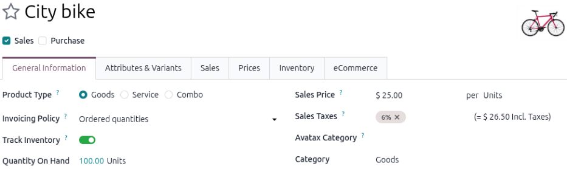
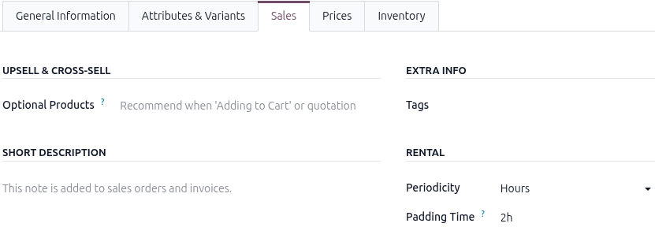
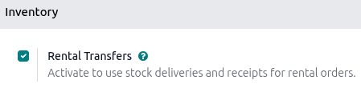
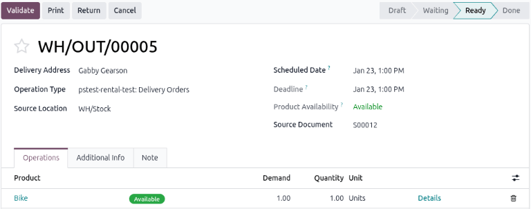
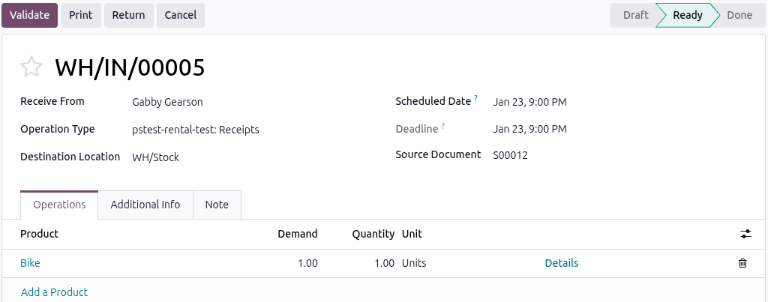
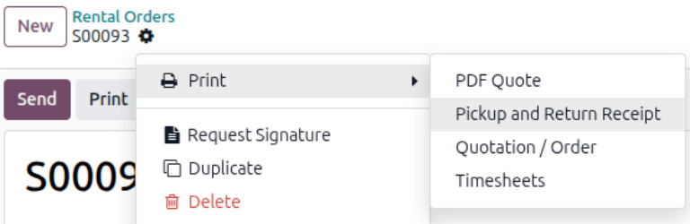

========================
Physical rental products
========================

The Odoo **Rental** app allows users to customize scheduling, pricing, and inventory for physical
rental products that require stock movement, otherwise known as *Goods*. Users can set up multiple
pickup and drop-off locations and track rental products by serial number.

Settings
========

The **Rental** app offers many app-integration features. Depending on the installed Odoo apps,
specific settings are available. To learn more about the default settings for rental products, refer
to the :ref:`rental/product_type/configuration` section on the *Rental product types* page.

To access the **Rental** app's settings, navigate to :menuselection:`Rental app --> Configuration
--> Settings`. If only the **Rental** app is installed, then the :guilabel:`Configuration` menu is
disabled and can't be accessed.

The following configurations assume the **Rental**, **Inventory**, and **Sales** apps are installed.

.. _rental/products/physical-products:

Create a new physical product
=============================

To set up a new physical rental product, go to the :menuselection:`Rental app --> Products -->
Products`, then click :guilabel:`New`. The new product form displays with the :guilabel:`General
Information` tab open as default.

Initial product configuration
-----------------------------

In the new product form, the :guilabel:`Sales` checkbox is selected by default. In the
:guilabel:`General Information` tab, set the :guilabel:`Product Type` as :guilabel:`Goods`.

The :guilabel:`Track Inventory` toggle is enabled by default. Enter the number of products that are
available to rent in the :guilabel:`Quantity On Hand` field. For the :guilabel:`Category` field,
select :guilabel:`Goods` from the drop-down menu or create a new category by typing in the name and
clicking :guilabel:`Create`.

.. note::
   For products that have *By Lots* or *By Unique Serial Number* enabled, refer to the
   :ref:`rental/products/product-tracking` section.

.. _rental/products/base-rental-period-price:

Set a base rental period and price
----------------------------------

Set up a base rental rate by entering the lowest rental price in the :guilabel:`Sales Price` field
of the *General Information* tab. Next, click the :guilabel:`Sales` tab, then in the *Rental*
section, select a unit of time from the :guilabel:`Periodicity` drop-down menu.

The :guilabel:`Pickup` and :guilabel:`Return` fields are displayed for every :guilabel:`Periodicity`
field option except :guilabel:`Hours` (which only displays the :guilabel:`Padding Time` field). The
:guilabel:`Pickup` and :guilabel:`Return` times only apply to online rental orders. The
:guilabel:`Padding Time` field makes the product unavailable to rent for the selected duration (in
hours).

Additional rental rates can be configured on the :ref:`Prices tab <rental/products/prices-tab>`,
though these rates are restricted to the :guilabel:`Periodicity` value selected in the *Sales* tab.
In other words, a rental product can only have one :guilabel:`Periodicity` value (or unit of time)
configured at a time.

Optional: specify rental variants
---------------------------------

.. important::
   The *Variants* feature in the **Inventory** app must be enabled for this tab to display.

In the *Attributes & Variants* tab, add the appropriate :ref:`attribute and its values
<products/variants/attributes>` by clicking :guilabel:`Add a line`. Attributes and values are useful
for keeping the product library manageable, tracking and differentiating the inventory, and
providing more detailed reports. Examples of rental variants for a *Goods* product are: sizes,
brand, color, and material.

.. _rental/products/prices-tab:

Add multiple rental prices
--------------------------

.. important::
   The **Sales** app must be installed and the *Pricelists* feature enabled for this tab to display.

There are two ways to configure additional rental rates in the **Rental** app: :ref:`Pricelists
method <rental/products/pricelist>` and the :ref:`Prices tab method <rental/products/price-tab>`.
The **Rental** app follows specific conditions when using pricelists. Refer to the
:ref:`rental/rental-pricelist-rules` section on the *Rental* page.

.. tip::
   It is recommended to create a new :guilabel:`Pricelist` first, then select the customized
   :guilabel:`Pricelist` in the :guilabel:`Prices` tab instead of using the :guilabel:`Default`
   pricelist. Keeping the :guilabel:`Default` pricelist blank ensures there is a clean pricelist for
   the base rental rate.

.. _rental/products/pricelist:

Using the Pricelists method
~~~~~~~~~~~~~~~~~~~~~~~~~~~

Creating a :ref:`new pricelist <sales/products/create-edit-pricelists>` allows for better
customization when applying rental rates to specific time periods, products, or customers by using
*Pricelist Rules*. It is a separate form that users can apply on quotations or select on the rental
product form to add new price rules to.

Navigate to :menuselection:`Rental app --> Products --> Pricelists` and click :guilabel:`New`. The
*Create Pricelist Rules* window displays.

.. _rental/products/price-tab:

Using the Prices tab method
~~~~~~~~~~~~~~~~~~~~~~~~~~~

Rental rates can also be configured as a new price rule to an existing pricelist using the
:guilabel:`Prices` tab on the product form. If there is no configured pricelist created beforehand,
then the *Default* pricelist is selected.

.. note::
   It is recommended to create a new Pricelist first instead of using the *Default* pricelist.
   Keeping the *Default* pricelist blank ensures there is a clean pricelist for the base rental
   rate.

Navigate to :menuselection:`Rental app --> Products --> Products`, then click the desired product.
Click the :guilabel:`Prices` tab and click :guilabel:`Add a price`.

Select the desired :guilabel:`Pricelist`. In the :guilabel:`Min. Quantity` column, enter the minimum
amount needed to trigger the price change. The :guilabel:`Min. Quantity` column is based on the unit
of time selected in the *Periodicity* field in the *Sales* tab.

Lastly, enter the :guilabel:`Price` rate.

.. example::
   A bike rental business rents out its bikes on an hourly basis but offers a 20% discount for
   summer break. The regular hourly rate for their bikes is $20.

   Enter the :guilabel:`Sales Price` in the *General Information* tab of the product form, then
   click the :guilabel:`Sales` tab to configure the :guilabel:`Periodicity` and :guilabel:`Padding
   Time`.

   .. image:: products/sales-tab-rental-section.png
      :alt: Example of a rental product configured as a Goods type in the Rental app.

   Using the Pricelist method, navigate to :menuselection:`Rental app --> Products --> Pricelists`
   and click :guilabel:`New`. Configure :guilabel:`Pricelist Rules` for the 20% discount.

   .. image:: products/example-pricelist-method.png
      :alt: Sample of a rental product with the custom rental pricelist applied.

   Using the :guilabel:`Prices` tab method, navigate to :menuselection:`Rental app --> Products -->
   Products` and click the bike product. Click the :guilabel:`Prices` tab, then add a new discounted
   price for the hourly rate. To add the :guilabel:`Validity` column, click the
   :icon:`oi-settings-adjust` :guilabel:`(Settings adjust)` icon and select :guilabel:`Validity`.
   Then enter the date range in which the discount is applicable.

   .. image:: products/example-prices-tab-method.png
      :alt: Sample of a rental product's Price tab.

.. _rental/products/product-tracking:

Configure product tracking
==========================

.. important::
   To configure a physical rental product for product tracking, the **Inventory** app must be
   installed, and *Lots & Serial Numbers* must be enabled.

Go to the :menuselection:`Rental app --> Products --> Products`, then click :guilabel:`New`. In the
new product window, the :guilabel:`Sales` checkbox is already selected by default. Select
:guilabel:`Goods` as the :guilabel:`Product Type`. The :guilabel:`Tracking` field defaults to
:guilabel:`By Quantity`.

Click into the :guilabel:`Tracking` field and select either :guilabel:`By Lots` or :guilabel:`By
Unique Serial Number`. Enter the number of products available to rent in the :guilabel:`Quantity On
Hand` field.

For the :guilabel:`Category` field, select :guilabel:`Goods` from the drop-down menu or create a new
category by typing in the name and clicking :guilabel:`Create`. Configure :ref:`basic rental rate
<rental/products/base-rental-period-price>` and any :ref:`additional rates
<rental/products/prices-tab>`.

Rental Transfers feature
========================

The :guilabel:`Rental Transfers` feature automatically creates a delivery receipt when the rental
product is picked up and a return receipt when it is returned to stock. Documenting stock movement
creates a clean paper trail and has a variety of uses:

- Tracking high-value products.
- Tracking stock levels across multiple stores or warehouse locations.
- Tracking products between different store locations that allow pick up and returns.

To enable the :guilabel:`Rental Transfers` feature, navigate to the :menuselection:`Rental app -->
Configuration --> Settings` and in the *Inventory* section, select the :guilabel:`Rental Transfers`
checkbox.

.. _rental/products/rental-transfer-note:

.. note::
   The **Inventory** app automatically creates an internal default location once the
   :guilabel:`Rental Transfers` feature is enabled. Odoo uses the new default location,
   :guilabel:`Customer/Rental`, to track products during the rental period (moving them from
   :guilabel:`Stock` to :guilabel:`Customer/Rental` upon rental, and back upon return).

   Do not modify :guilabel:`Customer/Rental` to avoid corrupting inventory tracking.

.. _rental/products/multi-location:

Multi-location management and transfers
=======================================

.. important::
   Refer to the :ref:`Rental Transfers note <rental/products/rental-transfer-note>` for information
   about internal location configuration and inventory tracking.

Tracking the location of high-value physical products between locations is essential. The **Rental**
app helps with the :guilabel:`Rental Transfers` feature. Activating rental transfers means the
system treats rental movements similarly to sales, requiring a receipt and a delivery order every
time a physical product is rented or returned.

For multi-location management and rental item transfer tracking, navigate to the
:menuselection:`Rental app --> Configuration --> Settings` and in the *Inventory* section, select
the :guilabel:`Rental Transfers` checkbox.

Next, go to the :menuselection:`Inventory app --> Configuration --> Settings` and in the *Warehouse*
section, select the :guilabel:`Storage Locations` checkbox. Click :guilabel:`Save` to apply the
changes.

Create a :ref:`new location <inventory/use_locations/new-location>` and on the new location page,
enter the :guilabel:`Location Name` and ensure the :guilabel:`Parent Location` field is set to
:guilabel:`WH`.

.. example::
   A bike rental business has two store locations within the same city. Both locations allow for
   pickup and dropoff of their bikes. The company wants to track its bikes accurately at each
   location.

   Ensure the **Rental** and **Inventory** apps are configured by enabling :guilabel:`Rental
   Transfers` in the **Rental app** and :guilabel:`Storage Locations` in the **Inventory** app.

   Next, go to the :menuselection:`Inventory app > Configuration > Locations`. Create a new location
   for each storefront.

   .. image:: products/configured-locations.png
      :alt: Sample of internal inventory locations that represent different rental store locations.

Process physical pickups
========================

When a customer picks up rental products, navigate to the desired rental order and click
:guilabel:`Pickup`. The **Rental** app displays a warehouse delivery form listing the reserved
rental products. Verify the list, then click :guilabel:`Validate` to move the order to the
:guilabel:`Done` stage.

Doing so places a :guilabel:`Pickedup` status banner on the rental order.

.. _rental/return-products:

Process physical returns
========================

When a customer returns products, navigate to the desired rental order and click :guilabel:`Return`.
The **Rental** app displays a warehouse receipt form listing the checked-out rental products.

Enter the same amount of each product being returned by the customer in the :guilabel:`Quantity`
column. If any of the products have serial numbers, enter them in the :guilabel:`Serial Numbers`
column.

Click :guilabel:`Validate` to move the order to the :guilabel:`Done` stage. A :guilabel:`Returned`
status banner appears on the rental order.

Print pickup and return receipts
================================

Pickup and return receipts can be created and downloaded for customers when they pick up and/or
return rental products.

To create pickup and/or return receipts, navigate to the desired rental order, click the
:icon:`fa-cog` :guilabel:`(Actions)` icon to reveal a drop-down menu.

From this drop-down menu, hover over the :guilabel:`Print` option to reveal a sub-menu. Then select
:guilabel:`Pickup and Return Receipt`.

Odoo downloads a PDF detailing all information about the current status of the rented items.

.. seealso::
   - :doc:`../../../inventory_and_mrp/inventory`
   - `Odoo Tutorials: Configuring a rental product
     <https://youtu.be/CE-SahTUC9A?si=APacZmYDIsVnHOnj>`_

