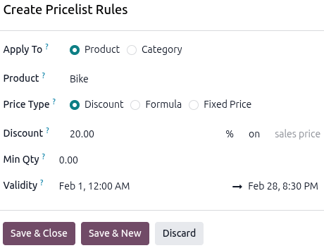

========================
Physical rental products
========================

The Odoo **Rental** app allows users to customize scheduling, pricing, and inventory for physical
rental products that require stock movement, otherwise known as *Goods*. Users can set up multiple
pickup and drop-off locations and track rental products by serial number.

Settings
========

The **Rental** app offers many app-integration features. Depending on the installed Odoo apps,
specific settings are available. To learn more about the default settings for rental products, refer
to the :ref:`rental/product_types/configuration` section on the *Rental product types* page.

To access the **Rental** app's settings, navigate to :menuselection:`Rental app --> Configuration
--> Settings`. If only the **Rental** app is installed, then the :guilabel:`Configuration` menu is
disabled and cannot be accessed.

The following configurations assume the **Rental**, **Inventory**, and **Sales** apps are installed.

.. _rental/products/physical-products:

Create a new physical product
=============================

To set up a new physical rental product, go to the :menuselection:`Rental app --> Products -->
Products`, then click :guilabel:`New`. On the rental product form, fill out each tab accordingly:

General Information tab
-----------------------

In the new product window, the :guilabel:`Sales` checkbox is already selected by default. Select
:guilabel:`Goods` as the :guilabel:`Product Type`.

Select the :guilabel:`Track Inventory` checkbox and select :guilabel:`By Quantity` from the
drop-down menu. For the :guilabel:`Category` field, select :guilabel:`Goods` from the drop-down menu
or create a new category by typing in the name and clicking :guilabel:`Create`.

.. image:: products/new-product.png
   :alt: The new product view in the Rental app.

.. _rental/products/base-rental-period-price:

Set a base rental period and price
~~~~~~~~~~~~~~~~~~~~~~~~~~~~~~~~~~

Set up the base rental rate by entering the lowest rental price in the :guilabel:`Sales Price` field
on the *General Information* tab. Next, click the :guilabel:`Sales` tab, then in the *Rental*
section select a unit of time from the :guilabel:`Periodicity` drop-down menu.

The :guilabel:`Periodicity` field changes depending on the selected time value or on whether the
*eCommerce* module is installed. If the :guilabel:`Periodicity` value is :guilabel:`Hours`, the
:guilabel:`Padding Time` field is displayed. Configure it to make the product unavailable to rent
for the selected duration.

If the *eCommerce* module is installed, the :guilabel:`Pickup` and :guilabel:`Return` fields are
displayed for every :guilabel:`Periodicity` field option except :guilabel:`Hours`. The
:guilabel:`Pickup` and :guilabel:`Return` times only apply to online rental orders.

All additional rental rates can be configured on the :ref:`rental/products/prices-tab`, but they are
restricted to the configured :guilabel:`Periodicity` value selected in the *Sales* tab. In other
words, a rental product can only have one :guilabel:`Periodicity` value configured at a time.

.. image:: products/rental-periodicity.png
   :alt: Sample of the Rental product's Periodicity and Padding time in the Rental app.

Attributes & Variants tab
-------------------------

.. important::
   The :guilabel:`Variant` feature in the **Inventory** app must be enabled for this tab to display.

Add the appropriate :ref:`attribute and its values <products/variants/attributes>` by clicking the
:guilabel:`Add a line`. Attributes and values are useful for keeping the product library manageable,
tracking and differentiating the inventory, and providing more detailed reports. Examples of rental
variants for a *Goods* product are: sizes, brand, color, and material.

.. _rental/products/prices-tab:

Prices tab
----------

.. important::
   The **Sales** app must be installed, the *Pricelist* feature must be enabled for this tab to
   display.

There are two ways to configure additional rental rates in the **Rental** app: the :ref:`Pricelists
method <rental/products/pricelist>` and the :ref:`Prices tab method <rental/products/price-tab>`. To
learn how the **Rental** app follows specific conditions when using pricelists, refer to the
:ref:`rental/rental-pricelist-rules` section of the *Rental* documentation.

.. _rental/products/pricelist:

Using the Pricelists method
~~~~~~~~~~~~~~~~~~~~~~~~~~~

Creating a new :guilabel:`Pricelist` enables better customization of rental rates for specific time
periods, products, or customers through :guilabel:`Pricelist Rules`. To set up additional rental
rates, go to :menuselection:`Rental app --> Products --> Pricelists` and click :guilabel:`New` to
:ref:`create a new pricelist <sales/products/create-edit-pricelists>`. A *Create Pricelist Rules*
window displays.

.. tip::
   It is recommended to create a new :guilabel:`Pricelist` first, then select the customized
   :guilabel:`Pricelist` in the :guilabel:`Prices` tab instead of using the :guilabel:`Default`
   pricelist. Keeping the :guilabel:`Default` pricelist blank ensures there is a clean pricelist for
   the base rental rate.

.. _rental/products/price-tab:

Using the Prices tab method
~~~~~~~~~~~~~~~~~~~~~~~~~~~

Rental rates can also be configured as a new price rule to an existing pricelist using the
:guilabel:`Prices` tab on the product form. Navigate to :menuselection:`Rental app --> Products -->
Products`, then click the desired product.

Click the :guilabel:`Prices` tab and click :guilabel:`Add a price`. Select the desired
:guilabel:`Pricelist`, then enter the minimum time required for the price change to trigger in the
:guilabel:`Min. Quantity` column. The :guilabel:`Min. Quantity` column is based on the configured
:guilabel:`Periodicity` value chosen in the :guilabel:`Sales` tab.

Lastly, enter the :guilabel:`Price` rate. Click the :icon:`fa-cloud-upload` :guilabel:`(Save
manually)` icon near the top to save.

.. example::
   A bike rental business rents out its bikes on an hourly basis but offers a 20% discount for
   summer break. The regular hourly rate for their bikes is $20.

   Enter the :guilabel:`Sales Price` in the *General Information* tab of the product form, then
   click the :guilabel:`Sales` tab to configure the :guilabel:`Periodicity` and :guilabel:`Padding
   Time`.

   .. image:: products/rental-sales-tab-rental-section.png
      :alt: Example of a product's Periodicity setting configured for hours.

   Using the Pricelist method, navigate to :menuselection:`Rental app --> Products --> Pricelists`
   and click :guilabel:`New`. Configure :guilabel:`Pricelist Rules` for the 20% discount.

   .. image:: products/example-pricelist-method.png
       :alt: Sample of a rental product with the custom rental pricelist applied.

   Using the :guilabel:`Prices` tab method, navigate to :menuselection:`Rental app --> Products -->
   Products` and click the bike product. Click the :guilabel:`Prices` tab, then add a new discounted
   price for the hourly rate. To add the :guilabel:`Validity` column, click the
   :icon:`oi-settings-adjust` :guilabel:`(Settings adjust)` icon and select :guilabel:`Validity`.
   Then enter the date range in which the discount is applicable.

   .. image:: products/example-prices-tab-method.png
      :alt: Sample of a rental product's Price tab.

.. _rental/products/product-tracking:

Configure a physical rental product for product tracking
========================================================

.. important::
   To configure a physical rental product for product tracking, the **Inventory** app must be
   installed, and :guilabel:`Lots & Serial Numbers` must be enabled.

Go to the :menuselection:`Rental app --> Products --> Products`, then click :guilabel:`New`. In the
new product window, the :guilabel:`Sales` checkbox is already selected by default. Select
:guilabel:`Goods` as the :guilabel:`Product Type`, then select the :guilabel:`Track Inventory`
checkbox. The :guilabel:`Tracking` and :guilabel:`Quantity On Hand` fields display.

Click into the :guilabel:`Tracking` field and select either :guilabel:`By Lots` or :guilabel:`By
Unique Serial Number`. Enter the number of products available to rent in the :guilabel:`Quantity On
Hand` field.

For the :guilabel:`Category` field, select :guilabel:`Goods` from the drop-down menu or create a new
category by typing in the name and clicking :guilabel:`Create`. Configure :ref:`basic rental rate
<rental/products/base-rental-period-price>` and any :ref:`additional rates
<rental/products/prices-tab>`. Click the :icon:`fa-cloud-upload` :guilabel:`(Save manually)` icon
near the top to save.

Rental Transfers feature
========================

The :guilabel:`Rental Transfers` feature automatically creates a delivery receipt when the rental
product is picked up and a return receipt when it is returned to stock. Documenting stock movement
creates a clean paper trail and has a variety of uses:

- Tracking high-value products.
- Tracking stock levels across multiple stores or warehouse locations.
- Tracking products between different store locations that allow pick up and returns.

To enable the :guilabel:`Rental Transfers` feature, navigate to the :menuselection:`Rental app -->
Configuration --> Settings` and in the *Rental* section, select the :guilabel:`Rental Transfers`
checkbox.

.. image:: products/rental-transfers-checkbox.png
   :alt: Sample of the Rental settings with the Rental Transfers enabled.

.. note::
   The **Inventory** app automatically creates an internal default location once the
   :guilabel:`Rental Transfers` feature is enabled. Odoo uses the new default location,
   :guilabel:`Customer/Rental`, to track products during the rental period (moving them from
   :guilabel:`Stock` to :guilabel:`Customer/Rental` upon rental, and back upon return). Do not
   modify :guilabel:`Customer/Rental` to avoid corrupting inventory tracking.

.. _rental/configure_products/multi-location:

Multi-location management and transfers
=======================================

.. important::
   The **Inventory** app must be installed to set up this configuration. The **Inventory** app
   automatically creates an internal default location once the :guilabel:`Rental Transfers` feature
   is enabled. Odoo uses the new default location, :guilabel:`Customer/Rental`, to track products
   during the rental period (moving them from :guilabel:`Stock` to :guilabel:`Customer/Rental` upon
   rental, and back upon return).

   Do not modify :guilabel:`Customer/Rental` to avoid corrupting inventory tracking.

Tracking the location of high-value physical products between locations is essential. The **Rental**
app helps with the :guilabel:`Rental Transfers` feature. Activating rental transfers means the
system treats rental movements similarly to sales, requiring a receipt and a delivery order every
time a physical product is rented or returned.

For multi-location management and rental item transfer tracking, navigate to the
:menuselection:`Rental app --> Configuration --> Settings` and in the *Rental* section, select the
:guilabel:`Rental Transfers` checkbox.

Next, go to the :menuselection:`Inventory app --> Configuration --> Settings` and in the *Warehouse*
section, select the :guilabel:`Storage Locations` checkbox. Click :guilabel:`Save` to apply the
changes.

To configure new locations, navigate to :menuselection:`Inventory app --> Configuration -->
Locations`. Click :guilabel:`New` to configure a new internal location.

On the new location page, enter the :guilabel:`Location Name` and ensure the :guilabel:`Parent
Location` field is set to :guilabel:`WH`. Click the :icon:`fa-cloud-upload` :guilabel:`(Save
manually)` icon near the top to save.

.. example::
   A bike rental business has two store locations within the same city. Both locations allow for
   pickup and dropoff of their bikes. The company wants to track its bikes accurately at each
   location.

   Ensure the **Rental** and **Inventory** apps are configured by enabling :guilabel:`Rental
   Transfers` in the **Rental app** and :guilabel:`Storage Locations` in the **Inventory** app.

   Next, go to the :menuselection:`Inventory app --> Configuration --> Locations`. Create a new
   location for each storefront.

   .. image:: products/configured-locations.png
      :alt: Sample of internal inventory locations that represent different rental store locations.

Pickup products
===============

When a customer picks up rental products, navigate to the desired rental order and click
:guilabel:`Pickup`. The **Rental** app displays a warehouse delivery form listing the reserved
rental products. Verify the list, then click :guilabel:`Validate` to move the order to the
:guilabel:`Done` stage.

.. image:: products/pickup-page.png
   :alt: Sample of a Pickup page in the Rental app.

Doing so places a :guilabel:`Pickedup` status banner on the rental order.

.. _rental/return-products:

Rental order return
===================

When a customer returns products, navigate to the desired rental order and click :guilabel:`Return`.
The **Rental** app displays a warehouse receipt form listing the checked-out rental products.

Enter the same amount of each product being returned by the customer in the :guilabel:`Quantity`
column. If any of the products have serial numbers, enter them in the :guilabel:`Serial Numbers`
column.

.. image:: products/return-page.png
   :alt: Sample of the Return page in the Rental app.

Click :guilabel:`Validate` to move the order to the :guilabel:`Done` stage. A :guilabel:`Returned`
status banner appears on the rental order.

Print pickup and return receipts
================================

Pickup and return receipts can be created and downloaded for customers when they pick up and/or
return rental products.

To create pickup and/or return receipts, navigate to the desired rental order, click the
:icon:`fa-cog` :guilabel:`(Actions)` icon to reveal a drop-down menu.

.. image:: products/print-pickup-return-receipt.png
   :alt: The pickup and return receipt print option in the Odoo Rental application.

From this drop-down menu, hover over the :guilabel:`Print` option to reveal a sub-menu. Then select
:guilabel:`Pickup and Return Receipt`.

Odoo downloads a PDF detailing all information about the current status of the rented items.

.. seealso::
   - :doc:`../../../inventory_and_mrp/inventory`
   - `Odoo Tutorials: Configuring a rental product
     <https://youtu.be/CE-SahTUC9A?si=APacZmYDIsVnHOnj>`_

