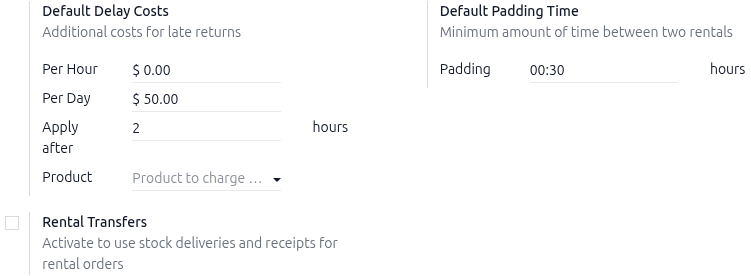
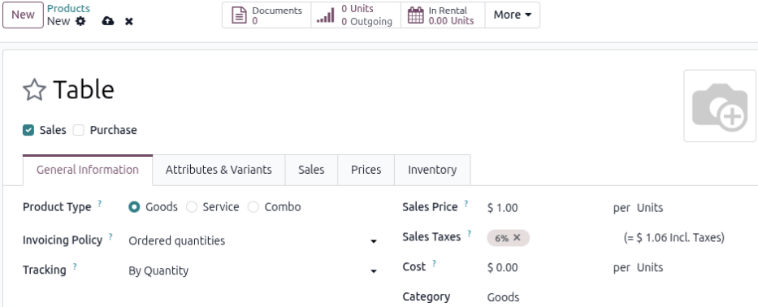
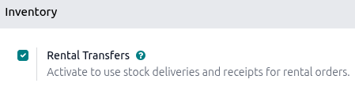

.. meta::
   :description: This page explains how to create and configure a new physical rental product
                 (Goods), including initial setup, rental periods and pricing, variants, and product
                 tracking by serial number.

========================
Physical rental products
========================

The Odoo **Rental** app allows users to customize scheduling, pricing, and inventory for physical
rental products that require stock movement, otherwise known as *Goods*. Users can set up multiple
pickup and drop-off locations and track rental products by serial number.

.. _rental/products/default-settings:

Configuration
=============

The **Rental** app offers many app-integration features. Depending on the installed Odoo apps,
specific settings are available. To learn more about the default setting for rental products, refer
to the :ref:`Settings <rental/product_type/configuration>` section of the *Rental product type*
page. The following configurations assume the **Rental** and **Inventory** apps are installed.

Navigate to :menuselection:`Rental app --> Configuration --> Settings`, and configure the
:guilabel:`Default Delay Costs` in the *Rental* section for late fees. Optionally, configure the
:guilabel:`Default Padding Time` to make rentals unavailable for booking. Refer to the
:ref:`rental/products/rental-transfer-feature` section to learn what it does and how to configure
it.

In the **Rental** section, under the :guilabel:`Default Delay Costs` subsection, fill in the
:guilabel:`Apply after` field.

.. note::
   For more control, configure the costs of late returns in the :guilabel:`Per Hour` and
   :guilabel:`Per Day` fields on the product form. If the defaults apply to all products, leave the
   :guilabel:`Product` field blank.

Click :guilabel:`Save` to apply the changes.

.. _rental/products/physical-product:

Create a new physical product
=============================

To set up a new physical rental product, go to the :menuselection:`Rental app --> Products`, then
click :guilabel:`New`. On the rental product form, fill out each tab accordingly:

Initial product configuration
-----------------------------

In the new product window, the :guilabel:`Rental` checkbox is already selected by default. Select
the :guilabel:`Product Type` as :guilabel:`Goods`.

Enable the :guilabel:`Track Inventory` checkbox and select :guilabel:`By Quantity` from the
drop-down menu. For the :guilabel:`Category` field, select :guilabel:`Goods` from the drop-down menu
or create a new category by typing in the name and clicking :guilabel:`Create`.

.. _rental/products/rental-periods-prices:

Configuring rental periods and prices
-------------------------------------

No limit exists on how many rental prices can be added to a product. Multiple pricing options for
rental products are typically used to give discounts for customers who agree to longer rental
durations. When creating multiple pricing options for a rental product remember the **Rental** app's
:ref:`price computing logic <rental/price-computing>`.

To set rental rates for the product, click the :guilabel:`Rental prices` tab, in the *Pricing*
section, click :guilabel:`Add a price`. To enter a new rental rate:

#. Select a :guilabel:`rental period` (:dfn:`the unit of duration of the rental`) from the
   :guilabel:`Period` column.
#. (Optional) Select a pricelist option from the :guilabel:`Pricelist` column. This adds the new
   rental rate to the assigned pricelist.
#. Enter the price for that specific :guilabel:`Period`.

.. tip::
   Remember when considering pricing that renting for a day is usually limited to operating hours,
   not 24 hours. When determining pricing, keep in mind that a rental day typically refers to
   operating hours, not a full 24-hour period.

In the *Reservations* section, are the delay costs and padding time that when configured are
automatically populated from the *Default Delay Costs* section, provided they have been configured
in the :menuselection:`Rental app --> Configuration --> Settings`. If configured on the product
form, the settings override the settings in the *Default Delay Costs* section.

- :guilabel:`Hourly Fine`: The price per hour charged when the rental product is returned after the
  scheduled time.
- :guilabel:`Daily Fine`: The price per day charged when the rental product is returned after the
  scheduled time.
- :guilabel:`Reserve product`: The time the rental product is temporarily unavailable between two
  rental orders. Useful if maintenance or cleaning is required between rentals.

.. _rental/products/rental-period:

Creating a rental period
~~~~~~~~~~~~~~~~~~~~~~~~

The **Rental** app allows users to create custom rental periods to use in the *Rental Prices* tab.
This is helpful when renting services with special pricing for a set amount of time, such as
offering a four hour photo shoot for $100 when the hourly rate is $30.

To create a new rental period go to :menuselection:`Rental app --> Configuration --> Rental
periods`. The *Periods* page displays and lists all the default rental periods in the **Rental**
app. Click :guilabel:`New` and on the period form filling the following fields:

- :guilabel:`Name`: The assigned name displays in the  :guilabel:`Period` drop-down list on the
  *Rental Prices* tab.
- :guilabel:`Duration`: The minimum amount of time to trigger the pricing rule. If set to `0` it
  represents a fixed price.
- :guilabel:`Unit`: The time unit the :guilabel:`Duration` is based on. If :guilabel:`Nightly` is
  selected for the unit then the :guilabel:`Check-in` and :guilabel:`Check-out` fields display.

.. example::
   A bike rental business rents tandem bikes for two hours at the local park. The hourly rental rate
   for their tandem bikes is $20, but since tandem bikes are popular, they want to set a new price
   of $35. To ensure the business gets their bikes returned on time, they set the late return fee as
   $20 per hour and $160 per day ($20 x 8 hrs).

   Create a new pricing period by navigating to :menuselection:`Rental app --> Configuration -->
   Rental periods`. Click :guilabel:`New`, then configure the period for `2` hours.

   Navigate to the tandem bike product and in the :guilabel:`Rental prices` tab add the `2` hour
   period set at `$35`. Manually save to apply changes.

   .. image:: products/rental-prices-tab-with-rental-period.png
      :alt: Sample of a rental product with the custom rental period applied.

.. _rental/products/variants:

Optional: specify rental variants
---------------------------------

.. important::
   The *Variant* feature in the **Inventory** app must be enabled for this tab to display.

In the :guilabel:`Attributes & Variants` tab, :ref:`add the appropriate attribute and its values
<products/variants/attributes>` by clicking :guilabel:`Add a line`. Attributes and values are useful
for keeping the product library manageable, tracking and differentiating the inventory, and
providing more detailed reports. Examples of rental variants for a *Goods* product are size, brand,
color, and material.

.. _rental/products/configure-product-tracking:

Configure product tracking
==========================

.. important::
   To configure a physical rental product for product tracking, the **Inventory** app must be
   installed, and :guilabel:`Lots & Serial Numbers` must be enabled.

   For rental products, only :guilabel:`By Unique Serial Number` tracking can be used. Selecting
   :guilabel:`By Lots` instead results in an error message, since that setting doesn't apply to
   rentals.

Go to the :menuselection:`Rental app --> Products`, then click :guilabel:`New`. In the new product
window, the :guilabel:`Rental` checkbox is already selected by default.

Select the :guilabel:`Product Type` as :guilabel:`Goods`. Enable the :guilabel:`Track Inventory`
checkbox and select :guilabel:`By Unique Serial Number` from the drop-down menu.

For the :guilabel:`Category` field, select :guilabel:`Goods` from the drop-down menu or create a new
category by typing in the name and clicking :guilabel:`Create`. Configure rental rates on the
:ref:`Rental prices <rental/products/rental-periods-prices>` tab. Click the :icon:`fa-cloud-upload`
:guilabel:`(Save manually)` icon near the top to save.

.. _rental/products/rental-transfer-feature:

Rental Transfers feature
========================

The *Rental Transfers* feature automatically creates a delivery receipt when the rental product is
picked up and a return receipt when it is returned to stock. Documenting stock movement creates a
clean paper trail and has a variety of uses:

- Tracking high-value products.
- Tracking stock levels across multiple stores or warehouse locations.
- Tracking products between different store locations that allow pick up and returns.

To enable the :guilabel:`Rental Transfers` feature, navigate to the :menuselection:`Rental app -->
Configuration --> Settings` and in the *Rental* section, enable the :guilabel:`Rental Transfers`
checkbox.

.. _rental/products/rental-transfers-note:

.. note::
   The **Inventory** app automatically creates an internal default location once the *Rental
   Transfers* feature is enabled. Odoo uses the new default location, :guilabel:`Customer/Rental`,
   to track products during the rental period (moving them from :guilabel:`Stock` to
   :guilabel:`Customer/Rental` upon rental, and back upon return). Do not modify to avoid corrupting
   inventory tracking.

.. _rental/products/multi-location:

Multi-location management and transfers
=======================================

.. important::
   Refer to the :ref:`Rental Transfers note <rental/products/rental-transfers-note>` for information
   about internal location configuration and inventory tracking.

Tracking the location of high-value physical products between locations is essential. The **Rental**
app helps with the *Rental Transfers* feature. Activating rental transfers means the system treats
rental movements similarly to sales, requiring a receipt and a delivery order every time a physical
product is rented or returned.

For multi-location management and rental item transfer tracking, navigate to the
:menuselection:`Rental app --> Configuration --> Settings` and in the *Rental* section, enable the
:guilabel:`Rental Transfers` checkbox.

Next, go to the :menuselection:`Inventory app --> Configuration --> Settings` and in the *Warehouse*
section, enable the :guilabel:`Storage Locations` checkbox. Click :guilabel:`Save` to apply the
changes.

To configure new locations, navigate to :menuselection:`Inventory app --> Configuration -->
Locations`. Click :guilabel:`New` to configure a new internal location.

On the new location page, enter the :guilabel:`Location Name` and ensure the :guilabel:`Parent
Location` field is set to :guilabel:`WH`. Click the :icon:`fa-cloud-upload` :guilabel:`Save
manually` icon near the top to save.

.. example::
   A bike rental business has two store locations within the same city. Both locations allow for
   pick-up and drop-off of their bikes. The company wants to track its bikes accurately at each
   location.

   Ensure the **Rental** and **Inventory** apps are configured by enabling :guilabel:`Rental
   Transfers` in the **Rental** app and :guilabel:`Storage Locations` in the **Inventory** app.

   Next, go to the :menuselection:`Inventory app --> Configuration --> Locations`. Create a new
   location for each storefront.

   .. image:: products/configured-locations.png
      :alt: Sample of internal inventory locations that represent different rental store locations.

.. _rental/products/ecommerce:

eCommerce features
------------------

.. important::
   The *Ecommerce* sections are only available if the :guilabel:`eCommerce` module is installed.

The :guilabel:`Sales` tab has the following sections that configure the product page on the website:
*Ecommerce shop*, *Ecommerce media*, and *Ecommerce description*. Refer to the :ref:`Product
visibility <ecommerce/products/publish-products>` and :ref:`Product configuration
<ecommerce/products/product-configuration>` sections for the **eCommerce** module for configuration
instructions.

.. seealso::
   - :doc:`../../../inventory_and_mrp/inventory`
   - :doc:`../rental_orders/create_rental_order`
   - :doc:`../rental_orders/pickup_return`
   - `Tutorial: Your First Rental Product <https://youtu.be/CE-SahTUC9A?si=kWfYEOTd2nT_ASp9>`_
