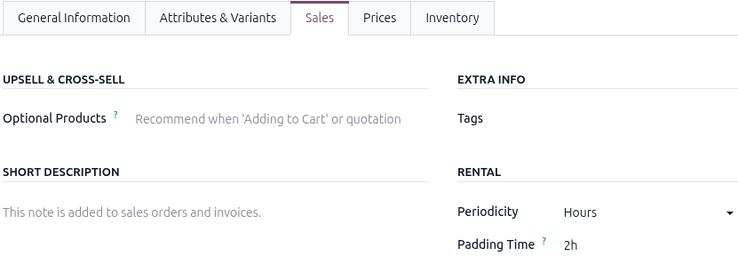
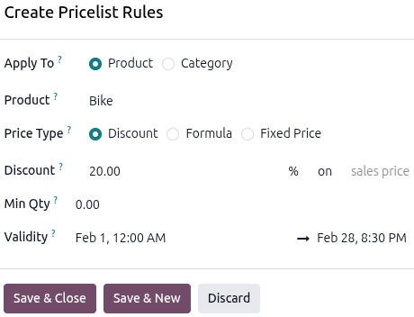
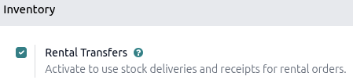
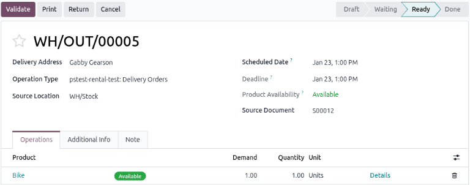
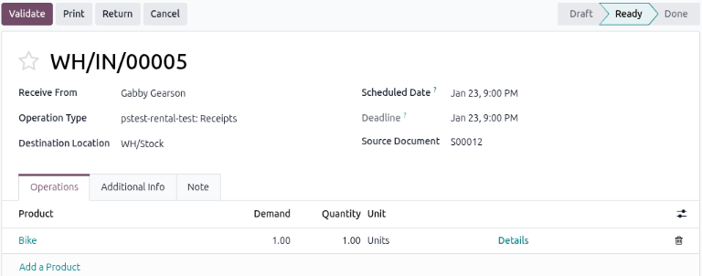
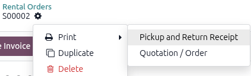

========================
Physical rental products
========================

The Odoo **Rental** app allows users to customize scheduling, pricing, and inventory for physical
rental products that require stock movement, otherwise known as *Goods*. Users can set up multiple
pickup and drop-off locations and track rental products by serial number. Some examples are:

- Bikes
- Clothes
- Furniture

Configuration
=============

The **Rental** app offers many app-integration features. Depending on the installed Odoo apps,
specific settings are available. To learn more about the default settings for rental products, refer
to the :ref:`Configuration <rental/product_type/configuration>` section on the *Rental product
types* page.

To access the **Rental** app's settings, navigate to :menuselection:`Rental app --> Configuration
--> Settings`.

The following configurations assume the **Rental**, **Inventory**, and **Sales** apps are installed.

.. _rental/physical-products:

Create a new physical product
=============================

To set up a new physical rental product, go to the :menuselection:`Rental app --> Products`, then
click :guilabel:`New`. A new product window displays with the *General Information* tab open as a
default.

Initial product configuration
-----------------------------

In the new form, the :guilabel:`Sales` checkbox is already ticked by default. In the *General
Information* tab, select :guilabel:`Goods` for the :guilabel:`Product Type`. The
:guilabel:`Tracking` field is set to :guilabel:`By Quantity` by default. For the
:guilabel:`Category` field, select :guilabel:`Goods` from the drop-down menu or create a new
category by typing in the name and clicking :guilabel:`Create`.

.. image:: products/new-product.png
   :alt: Example of a Goods rental product form.

Click the :icon:`fa-cloud-upload` :guilabel:`(Save manually)` icon and in the new
:guilabel:`Quantity on Hand` field, enter the number of products that are available to rent.

.. note::
   For products that have the *By Lots or By Unique Serial Number* enabled, refer to the
   :ref:`Configure product tracking <rental/products/product-tracking>` section.

.. _rental/products/base-rental-period-and-price:

Set a base rental period and price
----------------------------------

Set up a base rental rate by entering the lowest rental price in the :guilabel:`Sales Price` field.
Next, click the :guilabel:`Sales` tab, then in the *Rental* section select a unit of time from the
:guilabel:`Periodicity` drop-down menu.

The :guilabel:`Pickup` and :guilabel:`Return` fields are displayed for every :guilabel:`Periodicity`
field option except :guilabel:`Hours` (which only displays the :guilabel:`Padding Time` field). The
:guilabel:`Pickup` and :guilabel:`Return` times only apply to online rental orders. The
:guilabel:`Padding Time` field makes the product unavailable to rent for the selected duration (in
hours).

Additional rental rates can be configured on the *Prices* tab, though these rates are restricted to
the :guilabel:`Periodicity` value selected in the *Sales* tab. In other words, a rental product can
only have one :guilabel:`Periodicity` value (or unit of time) configured at a time.

Optional: specifying rental variants
------------------------------------

.. important::
   The *Variants* feature in the **Inventory** app must be enabled for this tab to display.

In the *Attributes & Variants* tab, add the appropriate attribute and its values by clicking
:guilabel:`Add a line`. Attributes and values are useful for keeping the product library manageable,
tracking and differentiating the inventory, and providing more detailed reports. Examples of rental
variants for a *Goods* product are: sizes, brand, color, and material.

.. _rental/products/multiple-rental-prices:

Adding multiple rental prices
-----------------------------

.. important::
   The **Sales** app must be installed and the *Pricelists* feature enabled for this tab to display.

There are two ways to configure additional rental rates in the **Rental** app: :ref:`Pricelists
method <rental/products/pricelist-method>` and the :ref:`Prices tab method
<rental/products/price-tab-method>`. The **Rental** app follows specific conditions when using
pricelists. Refer to the :ref:`Rental pricelist rules <rental/rental-pricelist-rules>` section on
the *Rental* page.

.. tip::
   It is recommended to create a new :guilabel:`Pricelist` first, then select the customized
   :guilabel:`Pricelist` in the *Prices* tab instead of using the *Default* pricelist. Keeping the
   *Default* pricelist blank ensures there is a clean pricelist for the base rental rate.

.. _rental/products/pricelist-method:

Using the Pricelists method
~~~~~~~~~~~~~~~~~~~~~~~~~~~

Creating a :ref:`new pricelist <sales/products/create-edit-pricelists>` allows for better
customization when applying rental rates to specific time periods, products, or customers by using
*Pricelist Rules*. It is a separate form that users can apply to quotations or select on the rental
product form to add new price rules to.

Navigate to :menuselection:`Rental app --> Products --> Pricelists` and click :guilabel:`New`. A
*Create Pricelist Rules* window displays.

.. _rental/products/pricelists-method-example:

.. example::
   **Part 1**

   A bike rental business rents out its bikes on an hourly basis, but offers a 20% discount for
   summer break. The regular hourly rate for their bikes is $20.

   Enter the :guilabel:`Sales Price` in the *General Information* tab of the product form, then
   click the :guilabel:`Sales` tab to set the :guilabel:`Periodicity` to :guilabel:`Hours` and enter
   `30 min` for the :guilabel:`Padding Time`.

   .. image:: products/rental-sales-tab-rental-section.png
      :alt: Add alt text.

   Using the Pricelist method, navigate to :menuselection:`Rental app --> Products --> Pricelists`
   and click :guilabel:`New`. Configure :guilabel:`Pricelist Rules` for the 20% discount using the
   following settings:

   - :guilabel:`Apply To`: Select :guilabel:`Product`
   - :guilabel:`Product`: Select *City bike* from the drop-down menu
   - :guilabel:`Price Type`: Select :guilabel:`Discount`
   - :guilabel:`Discount`: Enter `20`
   - :guilabel:`Validity`: Select `Aug 1` to `Aug 31`

   .. image:: products/example-rental-pricelist-rules.png
       :alt: Sample of a rental product with the custom rental pricelist applied.

.. _rental/products/price-tab-method:

Using the Prices tab method
~~~~~~~~~~~~~~~~~~~~~~~~~~~

Prices can also be configured directly on the product using the *Prices* tab. It is recommended to
create a new :guilabel:`Pricelist` first, then select the customized :guilabel:`Pricelist` in the
*Prices* tab instead of using the *Default* pricelist. Keeping the *Default* pricelist blank ensures
there is a clean pricelist for the base rental rate.

Navigate to :menuselection:`Products --> Products`, then click the desired product. Click the
:guilabel:`Prices` tab and click :guilabel:`Add a price`.

Select the desired :guilabel:`Pricelist`. In the :guilabel:`Min. Quantity` column, enter the minimum
amount needed to trigger the price change. The :guilabel:`Min. Quantity` column is based on the unit
of time selected in the :guilabel:`Periodicity` field in the *Sales* tab.

Lastly, enter the :guilabel:`Price` rate.

.. example::
   **Part 2**

   Using the same scenario in the :ref:`Pricelists method example
   <rental/products/pricelists-method-example>`, use the *Prices* tab method by navigating to
   :menuselection:`Rental app --> Products --> Products` and clicking the bike product. Click the
   :guilabel:`Prices` tab, then select the desired pricelist for the :guilabel:`Pricelist` column.
   Enter `16` for the :guilabel:`Unit Price` column.

   To add the :guilabel:`Validity` column, click the :icon:`oi-settings-adjust` :guilabel:`(Settings
   adjust)` icon and select :guilabel:`Validity`. Then select `Aug 1` to `Aug 31` for the date range
   in which the discount is applicable.

   .. image:: products/example-rental-prices-tab.png
      :alt: Sample of a rental product's Price tab.

.. _rental/products/product-tracking:

Configure product tracking
==========================

.. important::
   To configure a physical rental product for product tracking, the **Inventory** app must be
   installed, and *Lots & Serial Numbers* must be enabled.

   For rental products, only :guilabel:`By Unique Serial Number` tracking can be used. Selecting
   :guilabel:`By Lots` instead results in an error message, since that setting doesn't apply to
   rentals.

Go to the :menuselection:`Rental app --> Products --> Products`, then click :guilabel:`New`. In the
new product window, the :guilabel:`Sales` checkbox is already selected by default. Select
:guilabel:`Goods` as the :guilabel:`Product Type`. The :guilabel:`Tracking` field defaults to
:guilabel:`By Quantity`.

Click into the :guilabel:`Tracking` field and select :guilabel:`By Unique Serial Number`.
Enter the number of products available to rent in the :guilabel:`Quantity On Hand` field.

For the :guilabel:`Category` field, select :guilabel:`Goods` from the drop-down menu or create a new
category by typing in the name and clicking :guilabel:`Create`. Configure :ref:`basic rental rate
<rental/products/base-rental-period-and-price>` and any :ref:`additional rates
<rental/products/multiple-rental-prices>`.

.. _rental/products/rental-transfers:

Rental Transfers feature
========================

The *Rental Transfers* feature automatically creates a delivery receipt when the rental product is
picked up and a return receipt when it is returned to stock. Documenting stock movement creates a
clean paper trail and has a variety of uses:

- Tracking high-value products.
- Tracking stock levels across multiple stores or warehouse locations.
- Tracking products between different store locations that allow pick up and returns.

To enable *Rental Transfers*, navigate to the :menuselection:`Rental app --> Configuration -->
Settings` and in the *Inventory* section, select the :guilabel:`Rental Transfers` checkbox.

.. _rental/products/rental-transfers-note:

.. note::

   The **Inventory** app automatically creates an internal default location once the *Rental
   Transfers* feature is enabled. Odoo uses the new default location, `Customer/Rental`, to track
   products during the rental period (moving them from `Stock` to `Customer/Rental` upon rental, and
   back upon return).

   Do not modify `Customer/Rental` to avoid corrupting inventory tracking.

.. _rental/products/multi-location:

Multi-location management and transfers
=======================================

.. important::
   Refer to the :ref:`Rental Transfers note <rental/products/rental-transfers-note>` for information
   about internal location configuration and inventory tracking.

Tracking the location of high-value physical products between locations is essential. The **Rental**
app helps with the *Rental Transfers* feature. Activating rental transfers means the system treats
rental movements similarly to sales, requiring a receipt and a delivery order every time a physical
product is rented or returned.

For multi-location management and rental item transfer tracking, navigate to the
:menuselection:`Rental app --> Configuration --> Settings` and in the *Inventory* section, select
the :guilabel:`Rental Transfers` checkbox.

Next, go to the :menuselection:`Inventory app --> Configuration --> Settings` and in the *Warehouse*
section, select the :guilabel:`Storage Locations` checkbox. Click :guilabel:`Save` to apply the
changes.

Create a :ref:`new location <inventory/use_locations/new-location>` and on the new location page,
enter the :guilabel:`Location Name` and ensure the :guilabel:`Parent Location` field is set to
:guilabel:`WH`.

.. example::
   A bike rental business has two store locations within the same city. Both locations allow for
   pickup and dropoff of their bikes. The company wants to track its bikes accurately at each
   location.

   Ensure the **Rental** and **Inventory** apps are configured by enabling :guilabel:`Rental
   Transfers` in the **Rental app** and :guilabel:`Storage Locations` in the **Inventory** app.

   Next, go to the :menuselection:`Inventory app > Configuration > Locations`. Create a new location
   for each storefront.

   .. image:: products/configured-locations.png
      :alt: Sample of internal inventory locations that represent different rental store locations.

<<<<<<< c1e48aef332970ca85b2043464f10cdbcc83a0b6
Process a rental order pickup
=============================

When a customer picks up rental products, navigate to the desired rental order and click
:guilabel:`Pickup`. The **Rental** app displays a warehouse delivery form listing the reserved
rental products. Verify the list, then click :guilabel:`Validate` to move the order to the
:guilabel:`Done` stage.

Doing so places a :guilabel:`Pickedup` status banner on the rental order.

.. _rental/return-products:

Process a rental order return
=============================

When a customer returns products, navigate to the desired rental order and click :guilabel:`Return`.
The **Rental** app displays a warehouse receipt form listing the checked-out rental products.

Enter the same amount of each product being returned by the customer in the :guilabel:`Quantity`
column. If any of the products have serial numbers, enter them in the :guilabel:`Serial Numbers`
column.

Click :guilabel:`Validate` to move the order to the :guilabel:`Done` stage. A :guilabel:`Returned`
status banner appears on the rental order.

Download pickup and return receipts
===================================

Pickup and return receipts can be created and downloaded for customers when they pick up and/or
return rental products.

To create pickup and/or return receipts, navigate to the desired rental order, click the
:icon:`fa-cog` :guilabel:`(Actions)` icon to reveal a drop-down menu. From this drop-down menu,
hover over the :guilabel:`Print` option to reveal a sub-menu. Then select :guilabel:`Pickup and
Return Receipt`.

Odoo downloads a PDF detailing all information about the current status of the rented items.
||||||| c20a296ac4488b6dccbed066f43a9ba38813202e
Process physical pickups
========================

When a customer picks up rental products, navigate to the desired rental order and click
:guilabel:`Pickup`. The **Rental** app displays a warehouse delivery form listing the reserved
rental products. Verify the list, then click :guilabel:`Validate` to move the order to the
:guilabel:`Done` stage.

Doing so places a :guilabel:`Pickedup` status banner on the rental order.

.. _rental/return-products:

Process physical returns
========================

When a customer returns products, navigate to the desired rental order and click :guilabel:`Return`.
The **Rental** app displays a warehouse receipt form listing the checked-out rental products.

Enter the same amount of each product being returned by the customer in the :guilabel:`Quantity`
column. If any of the products have serial numbers, enter them in the :guilabel:`Serial Numbers`
column.

Click :guilabel:`Validate` to move the order to the :guilabel:`Done` stage. A :guilabel:`Returned`
status banner appears on the rental order.

Print pickup and return receipts
================================

Pickup and return receipts can be created and downloaded for customers when they pick up and/or
return rental products.

To create pickup and/or return receipts, navigate to the desired rental order, click the
:icon:`fa-cog` :guilabel:`(Actions)` icon to reveal a drop-down menu.

From this drop-down menu, hover over the :guilabel:`Print` option to reveal a sub-menu. Then select
:guilabel:`Pickup and Return Receipt`.

Odoo downloads a PDF detailing all information about the current status of the rented items.

.. seealso::
   - :doc:`../../../inventory_and_mrp/inventory`
   - `Odoo Tutorials: Configuring a rental product
     <https://youtu.be/CE-SahTUC9A?si=APacZmYDIsVnHOnj>`_

=======
.. seealso::
   - :doc:`../../../inventory_and_mrp/inventory`
   - :doc:`../rental_orders/create_rental_order`
   - `Odoo Tutorials: Configuring a rental product
     <https://youtu.be/CE-SahTUC9A?si=APacZmYDIsVnHOnj>`_

>>>>>>> f308da24f54d3afb0b21e69e508cbdf42da32db5
