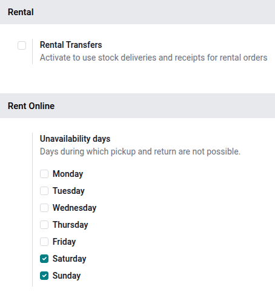
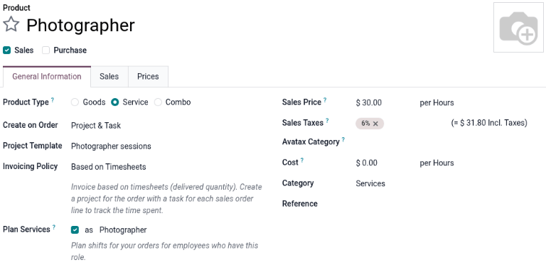
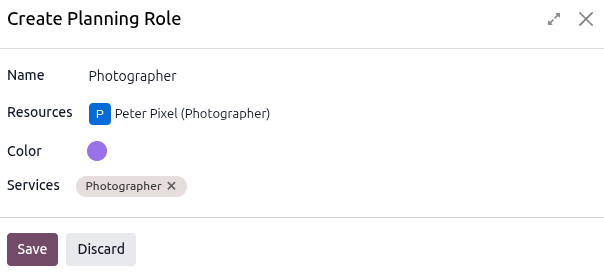
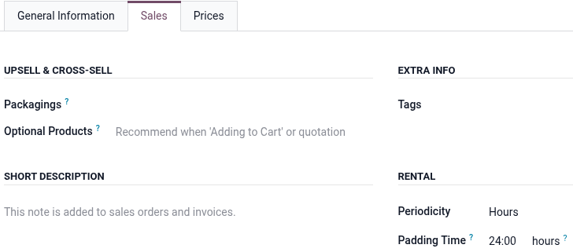
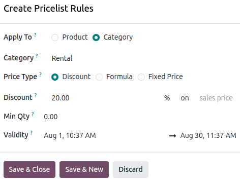
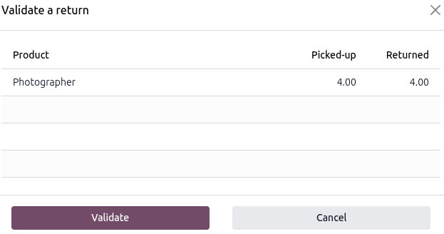

=======================
Service rental products
=======================

The **Rental** app is a comprehensive tool that enables users to customize scheduling, pricing, and
inventory for both physical rental products and non-physical goods (services) within a single
platform. This flexibility allows for combining products and services like bike rentals with guided
tours, or booking a studio with a photographer.

This document covers how to configure a rental service to automatically sync with staff shifts,
track time sheet hours, and create project tasks based on a rental order.

.. _rental/service_products/settings:

Settings
========

To configure default settings on rental products, navigate to :menuselection:`Rental app -->
Configuration --> Settings`.

In the :guilabel:`Rental` section, enable :guilabel:`Rental Transfers`. In the :guilabel:`Rent
Online` section, designate :guilabel:`Unavailability days`.

Click :guilabel:`Save` to apply the changes.

.. _rental/service_products/app-integration-config:

App integration configuration
=============================

The following apps are essential for workflow efficiency and automation when creating a service
product and rental order:

 - **Sales** app: Enables the *Prices* tab, the use of pricelists, online payments, and quotation
   templates within the **Rental** app.
 - **Sign** app: Allows for the upload and customization of different rental and service agreements.
   These documents are used to facilitate the *Request Signature* feature.
 - **Project** app: Enables the automation of creating projects and tasks whenever a rental order is
   confirmed through the configuration on the rental product form.
 - **Planning** app: Enables the automation of matching rental orders with services with employee
   shifts based on availability.
 - **Timesheet** app: Allows employees to log time worked on tasks that are automatically created
   when confirming a rental order.
 - **eCommerce** app: Allows rental products and services to be rented directly from the website.

.. seealso::
   - :doc:`../../sales/sales_quotations/quote_template`
   - :doc:`../../sales/sales_quotations/get_paid_to_validate`
   - :doc:`../../../services/project/project_management`
   - :doc:`../../../services/planning`
   - :doc:`../../../productivity/sign`
   - :doc:`../../../services/timesheets`
   - :doc:`../../../websites/ecommerce`

.. _rental/service_products/service:

View rental services
====================

To view all products that can be rented in the database, navigate to :menuselection:`Rentals app -->
Products`. By default, the :guilabel:`Rental` filter appears in the search bar, and the view is
Kanban. Remove the filter, then click the search bar. From the preset filters, select
:guilabel:`Services`. All the configured services appear.

Each service product Kanban card displays the service name, rental rate, and product image (if
applicable).

.. _rental/service_products/new-service:

Create a new service product
============================

.. important::
   The **Project**, **Planning**, and **Sales** apps *must* be installed for the following options
   to be available on the product form:

   - :guilabel:`Create on Order`
   - :guilabel:`Project Template`
   - :guilabel:`Invoicing Policy`
   - :guilabel:`Project & Task`
   - :guilabel:`Planning Services`

   The :guilabel:`Sales` checkbox enables the :guilabel:`Create on Order` and :guilabel:`Invoicing
   Policy` fields and also the :guilabel:`Prices` tab.

To set up a new rental service, go to the :menuselection:`Rental app --> Products --> Products` and
then click :guilabel:`New`. In the new product window, the :guilabel:`Sales` checkbox is enabled by
default.

Set the :guilabel:`Product Type` as :guilabel:`Service`. In the :guilabel:`Create on Order`
drop-down menu, select :guilabel:`Project & Task`, then select a template for the :guilabel:`Project
Template` field. In the :guilabel:`Invoicing Policy` drop-down menu, select :guilabel:`Based on
Timesheets`.

Tick the :guilabel:`Plan Services` checkbox and either create a new role or select a pre-existing
one. To create a new role, type in the name of the role in the blank field and click
:guilabel:`Create and edit` that appears.

In the *Create Planning Role* pop-up window, enter the role's name. Select an option for the
:guilabel:`Services` and :guilabel:`Resources`, and click :guilabel:`Save`.

.. _rental/service_products/rental-periods-pricing:

Set a base rental period and price
----------------------------------

Set up a base rental rate by entering the lowest rental price in the :guilabel:`Sales Price` field.
Next, click the :guilabel:`Sales` tab, then in the *Rental* section, select the
:guilabel:`Periodicity` (:dfn:`the unit of duration of the rental`) from the dropdown menu.

Then enter the :guilabel:`Padding Time` to make the product unavailable for pick up for the
configured duration.

.. important::
   To set a pricelist for additional rental rates, the **Sales** app must be installed, and
   :guilabel:`Pricelists` must be enabled. Otherwise, the :guilabel:`Prices` tab is not available.

Set additional rental periods and pricing
-----------------------------------------

There are two ways to configure additional rental rates in the **Rental** app: :ref:`Pricelists
<rental/service_products/pricelist-method>` and the :ref:`Prices tab
<rental/service_products/prices-tab>`.

.. _rental/service_products/pricelist-method:

Using the Pricelists method
~~~~~~~~~~~~~~~~~~~~~~~~~~~

Creating a new :guilabel:`Pricelist` allows for better customization when applying rental rates to
specific time periods, products, or customers by using :guilabel:`Pricelist Rules`. To set up
additional rental rates, go to :menuselection:`Rental app --> Products --> Pricelists` and click
:guilabel:`New` to :ref:`create a new pricelist <sales/products/create-edit-pricelists>`. A *Create
Pricelist Rules* window displays.

.. tip::
   It is recommended to create a new :guilabel:`Pricelist` first, then select the customized
   :guilabel:`Pricelist` in the :guilabel:`Prices` tab instead of using the :guilabel:`Default`
   pricelist. Keeping the :guilabel:`Default` pricelist blank ensures there is a clean pricelist for
   the base rental rate.

.. _rental/service_products/pricelists-example:

.. example::
   **Part 1**

   A photography studio rents out its photographers on an hourly and daily basis. The hourly rate is
   $30, but the studio offers a 20% discount for all-day sessions (eight hours or more). All
   reservations require a 24-hour notice to reserve a photographer. Navigate to
   :menuselection:`Rental app --> Products --> Products` and click the desired product.

   Enter the :guilabel:`Sales Price` and then click the :guilabel:`Sales` tab to configure the
   :guilabel:`Periodicity` and the :guilabel:`Padding Time`.

   .. image:: service_products/rental-sales-tab-rental-section.png
      :alt: Sample of the Rental section of the Sales tab of a service product.

   Using the Pricelist method, navigate to :menuselection:`Rental app --> Products --> Pricelists`
   and click :guilabel:`New`. Configure :guilabel:`Pricelist Rules` for the daily rate.

   .. image:: service_products/example-pricelist-rules.png
      :alt: Sample of the customized Pricelist of service product in the Rental app.

.. _rental/service_products/prices-tab:

Using the Prices tab method
~~~~~~~~~~~~~~~~~~~~~~~~~~~

Prices can also be configured directly on the product using the :guilabel:`Prices` tab. Navigate to
:menuselection:`Products --> Products`, then click the desired product.

Click the :guilabel:`Prices` tab and click :guilabel:`Add a price`. Select the desired
:guilabel:`Pricelist`, then enter the minimum time required for the price change to trigger in the
:guilabel:`Min. Quantity` column. The :guilabel:`Min. Quantity` column is based on the *Periodicity*
field in the :guilabel:`Sales` tab.

Lastly, enter the :guilabel:`Price` rate. Click the :icon:`fa-cloud-upload` :guilabel:`(Save
manually)` icon near the top to save.

.. example::
   **Part 2**

   Using the same scenario in the :ref:`Pricelists method example
   <rental/service_products/pricelists-example>`, use the :guilabel:`Prices` tab method by
   navigating to :menuselection:`Rental app --> Products --> Products` and click the desired product
   to configure. Click the :guilabel:`Prices` tab and configure a new daily rate.

   .. image:: service_products/example-prices-tab.png
      :alt: Sample of the Prices tab of service product in the Rental app.

.. _rental/service_products/pickup:

Process a rental order pickup
=============================

When a product is rented alongside a service, it is advised to pick it up before entering time on
the associated task.

If time is entered on the :guilabel:`Timesheets` tab of an associated task before the physical
rental product is picked up, the rental order status automatically changes to :guilabel:`Picked-up`.
The :guilabel:`Pickup` button is still available on the rental order if time is entered before
picking up the product.

When a customer picks up the product, navigate to the appropriate rental order and click
:guilabel:`Pickup`. Verify the list, then click :guilabel:`Validate` in the *Validate a pickup*
pop-up window that appears.

.. image:: service_products/pickup-popup.png
   :alt: Sample of a service product pick up pop-up window in the Rental.

Doing so places a :guilabel:`Picked-up` status banner on the rental order.

.. _rental/service_products/return:

Process a rental order return
=============================

Regardless of whether there is a product rented along with a service, the service or product must be
returned on the rental order.

When a customer returns the products or when the service has been completed, navigate to the
appropriate rental order and click :guilabel:`Return`. Validate the return by clicking
:guilabel:`Validate` in the *Validate a return* pop-up window that appears.

Doing so places a :guilabel:`Returned` status banner on the rental order.

.. example::
   The photography studio had a customer who wanted to rent one of their photographers and banner
   decorations for a home photo shoot. The booking was for two hours.

   On the :guilabel:`Validate a return` form for rental order, the banner line item matches the
   number of banners picked up, and the photographer line item matches the number of hours submitted
   on the :guilabel:`Timesheets` tab on the related task.

   .. image:: service_products/return-form-example-product-service.png
      :alt: Sample of a Validate a return form with a rental product and service listed.

