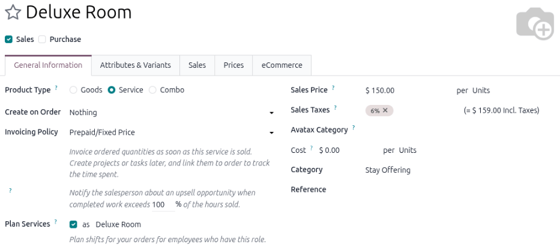
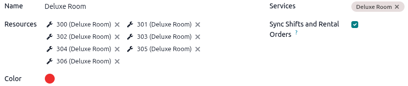

================================
Physical service rental products
================================

There are two types of service products in the **Rental** app that require different configurations:
physical and non-physical (labor). This document focuses on the configuration of physical rental
service products. A physical rental service product is a physical product that doesn't require any
stock movements. Some examples are:

- Hotel rooms
- Conference rooms
- Work stations
- Storage units

.. _rental/service_products/configuration:

Configuration
=============

Depending on the type of service product, the requirements differ. To learn more about the default
settings for rental products, refer to the :ref:`Configuration <rental/product_type/configuration>`
section on the Rental product types page.

To access the Rental app's settings, navigate to :menuselection:`Rental app --> Configuration -->
Settings`.

The following configurations assume the **Rental**, **Planning**, and **Sales** apps are installed.

Configure materials and a role for the physical product
=======================================================

Before creating a service product in the **Rental** app, configure :ref:`materials
<planning/materials>` and :ref:`create a role <planning/roles>` in the **Planning** app for the
physical rental products (such as storage units or conference rooms).

This allows the **Planning** app to create and assign shifts for the physical rental product, and
the *Role* links the rental materials to the rental service. Whenever the service is added to a
rental order, the **Rental** app syncs with the **Planning** app to check and update the material
shift availability.

.. tip::
   It's recommended to name the role after the service.

.. example::
   Shady Grove needs to add a new room tier to the **Rental** app, the *Deluxe Room*. There are
   seven rooms that belong in this tier. Create a new *Role* by navigating to the
   :menuselection:`Planning app --> Configuration --> Roles`. Click :guilabel:`New` and create the
   :guilabel:`Deluxe Room Role`.

   .. image:: service_products/example-planning-role.png
      :alt: Example of configured role for the Deluxe Room.

   To add the seven rooms as a resource for the *Role*, navigate to :menuselection:`Configuration
   --> Materials`. Click :guilabel:`New`, enter the room number, and :guilabel:`Deluxe Room` for the
   :guilabel:`Role` column. Repeat that process for all seven rooms.

   .. image:: service_products/example-planning-materials.png
      :alt: Example of configured materials for the Deluxe Room.

   Create the :guilabel:`Deluxe Room` as a new *Service* product type by navigating to
   :menuselection:`Rental app --> Products`. Click :guilabel:`New`, then configure the Deluxe Room
   as a :guilabel:`Service` type product with the :guilabel:`Plan Services` checkbox enabled and the
   :guilabel:`Deluxe Room` role assigned.

   .. image:: service_products/plan-services-field.png
      :alt: Example of the Plan Services field configured to the Deluxe Room role.

.. _rental/service_products/new-service:

Create a new service product
============================

To set up a new rental service, go to the :menuselection:`Rental app --> Products --> Products` and
then click :guilabel:`New`. The new product form displays with the :guilabel:`General Information`
tab open as default.

Initial product configuration
-----------------------------

.. important::
   The **Sales** and **Planning** apps must be installed for the *Prepaid/Fixed Price* option of the
   *Invoicing Policy* and *Plan Services* fields to be available. Enabling the *Sales* checkbox
   displays the *Invoicing Policy*.

In the new product window, the :guilabel:`Sales` checkbox is already enabled by default. Select the
:guilabel:`Product Type` as :guilabel:`Service`. In the :guilabel:`Invoicing Policy` drop-down menu,
select :guilabel:`Prepaid/Fixed Price`. Enable the :guilabel:`Plan Services` checkbox and either
:ref:`create a new role <planning/roles>` or select a pre-existing one.

Click the :icon:`oi-arrow-right` :guilabel:`(Internal link)` icon to open the product's *Role* page.
Enable the :guilabel:`Sync Shifts and Rental Orders` checkbox.

.. tip::
   Assign a :guilabel:`Category` for room booking. It separates rooms from other services and can be
   used for reports on room occupancy.

.. _rental/service_products/rental-periods-pricing:

Set a base rental period and price
----------------------------------

To set the base rental price for a rental product, open the *General Information* tab and enter the
lowest rental price in the :guilabel:`Sales Price` field. Next, click the :guilabel:`Sales` tab,
then configure the following *Rental* section fields where applicable:

- :guilabel:`Periodicity`: The unit of time the product will use for rental prices.
- :guilabel:`Padding Time`: Blocks a rental product from being available for reservations. The
  setting is set to an hourly unit. This is available only if :guilabel:`Hours` is selected in the
  :guilabel:`Periodicity` field and the **Inventory app** is installed.
- :guilabel:`Pickup`: The earliest time the customer can pick up the product to begin the rental
  period.
- :guilabel:`Return`: The latest time the customer can return the product.

Optional: specify rental variants
---------------------------------

.. important::
   The *Variants* feature must be enabled for this tab to display.

Click :guilabel:`Add a line`, then select any room amenity or room item from the
:guilabel:`Attribute` drop-down menu. To create a new one, enter the name and click
:guilabel:`Create and edit…` to configure the attribute and values.

.. example::
   Shady Grove has a list of amenities it wants to configure for their Deluxe Room. The room has two
   types of bed configurations: two double beds or one king bed. The maximum occupancy per room is
   two adults or two adults and a child.

   Navigate to the :menuselection:`Rental app --> Products` and click :guilabel:`New` to create a
   new product. On the :guilabel:`Attributes & Variants` tab, click :guilabel:`Add a line` and
   select the :guilabel:`Bed` as an :guilabel:`Attribute`. In the :guilabel:`Values` column, add
   :guilabel:`2 Double` and :guilabel:`1 King`. Repeat these steps until all amenities have been
   configured.

   .. image:: service_products/example-room-variants.png
      :alt: Example of the Attribute & Variants tab configured for a hotel room.

.. _rental/service_products/additional-pricing:

Add multiple rental prices
--------------------------

There are two ways to configure additional rental rates in the **Rental** app: :ref:`Pricelists
<rental/service_products/pricelist-method>` and the :ref:`Prices tab
<rental/service_products/prices-tab>`.

.. _rental/service_products/pricelist-method:

Using the Pricelists method
~~~~~~~~~~~~~~~~~~~~~~~~~~~

Creating a :ref:`new pricelist <sales/products/create-edit-pricelists>` allows for better
customization when applying rental rates to specific time periods, products, or customers by using
:guilabel:`Pricelist Rules`. It is a separate form that users can apply to quotations or select on
the rental product form to add new price rules to.

To create a new pricelist, go to :menuselection:`Rental app --> Products --> Pricelists` and click
:guilabel:`New`.

.. _rental/service_products/pricelists-example:

.. example::
   **Part 1**

   A photography studio rents out its photographers on an hourly and daily basis. The hourly rate is
   $30, but the studio offers a 20% discount for all-day sessions (eight hours or more). All
   reservations require a 24-hour notice to reserve a photographer. Navigate to
   :menuselection:`Rental app --> Products --> Products` and click the desired product.

   Enter the :guilabel:`Sales Price` and then click the :guilabel:`Sales` tab to configure the
   :guilabel:`Periodicity` and the :guilabel:`Padding Time`.

   .. image:: service_products/rental-sales-tab-rental-section.png
      :alt: Sample of the Rental section of the Sales tab of a service product.

   Using the Pricelist method, navigate to :menuselection:`Rental app --> Products --> Pricelists`
   and click :guilabel:`New`. Configure :guilabel:`Pricelist Rules` for the daily rate.

   .. image:: service_products/example-pricelist-rules.png
      :alt: Sample of the customized Pricelist of service product in the Rental app.

.. _rental/service_products/prices-tab:

Using the Prices tab method
~~~~~~~~~~~~~~~~~~~~~~~~~~~

.. important::
   The :ref:`Pricelists <sales/products/pricelist-configuration>` feature must be enabled for this
   tab to display.

Rental rates can also be configured as a new price rule for an existing pricelist using the
:guilabel:`Prices` tab on the product form. If no pricelist is configured beforehand, the *Default*
pricelist is selected.

It is recommended to create a new pricelist first instead of using the *Default* pricelist. Keeping
the *Default* pricelist blank ensures there is a clean pricelist for the base rental rate.

Navigate to :menuselection:`Products --> Products`, then click the desired product. Click the
:guilabel:`Prices` tab and click :guilabel:`Add a price`.

Select the desired :guilabel:`Pricelist`, then enter the minimum time required for the price change
to trigger in the :guilabel:`Min. Quantity` column. The :guilabel:`Min. Quantity` column is based on
the *Periodicity* field in the :guilabel:`Sales` tab.

Lastly, enter the :guilabel:`Price` rate. Click the :icon:`fa-cloud-upload` :guilabel:`(Save
manually)` icon near the top to save.

.. tip::
   Add a date range in the :guilabel:`Validity` column. To add a :guilabel:`Validity` column, click
   the :icon:`oi-settings-adjust` :guilabel:`(Settings)` icon and enable :guilabel:`Validity`.

.. example::
   **Part 2**

   Using the same scenario in the :ref:`Pricelists method example
   <rental/service_products/pricelists-example>`, use the :guilabel:`Prices` tab method by
   navigating to :menuselection:`Rental app --> Products --> Products` and click the desired product
   to configure. Click the :guilabel:`Prices` tab and configure a new daily rate.

   .. image:: service_products/example-prices-tab.png
      :alt: Sample of the Prices tab of service product in the Rental app.

eCommerce features
------------------

.. important::
   This tab is only available if the :guilabel:`eCommerce` module is installed.

The :guilabel:`eCommerce` tab configures the product page on the website. Refer to the :ref:`Product
visibility <ecommerce/products/publish-products>` and :ref:`Product configuration
<ecommerce/products/product-configuration>` sections for the **eCommerce** module for configuration
instructions.

Any selected days in the *Unavailability days* section in the :ref:`Rental app's settings
<rental/product_type/configuration>` are only applied to online booking. If the product isn't
published to the website then the setting does not go into effect.

.. _rental/service_products/pickup:

Process a rental order pickup
=============================

When a product is rented alongside a service, it is advised to pick it up before entering time on
the associated task.

If time is entered on the :guilabel:`Timesheets` tab of an associated task before the physical
rental product is picked up, the rental order status automatically changes to :guilabel:`Picked-up`.
The :guilabel:`Pickup` button is still available on the rental order if time is entered before
picking up the product.

When a customer picks up the product, navigate to the appropriate rental order and click
:guilabel:`Pickup`. Verify the list, then click :guilabel:`Validate` in the *Validate a pickup*
pop-up window that appears.

.. image:: service_products/pickup-popup.png
   :alt: Sample of a service product pick up pop-up window in the Rental.

Doing so places a :guilabel:`Picked-up` status banner on the rental order.

.. _rental/service_products/return:

Process a rental order return
=============================

Regardless of whether there is a product rented along with a service, the service or product must be
returned on the rental order.

When a customer returns the products or when the service has been completed, navigate to the
appropriate rental order and click :guilabel:`Return`. Validate the return by clicking
:guilabel:`Validate` in the *Validate a return* pop-up window that appears.

.. image:: service_products/validate-a-return-window.png
   :alt: Sample of returning a service product in the Rental app.

Doing so places a :guilabel:`Returned` status banner on the rental order.

.. example::
   The photography studio had a customer who wanted to rent one of their photographers and banner
   decorations for a home photo shoot. The booking was for two hours.

   On the :guilabel:`Validate a return` form for rental order, the banner line item matches the
   number of banners picked up, and the photographer line item matches the number of hours submitted
   on the :guilabel:`Timesheets` tab on the related task.

   .. image:: service_products/return-form-example-product-service.png
      :alt: Sample of a Validate a return form with a rental product and service listed.

.. seealso::
   - :doc:`../../../services/planning`
   - :doc:`../../sales/products_prices/prices/pricing`
