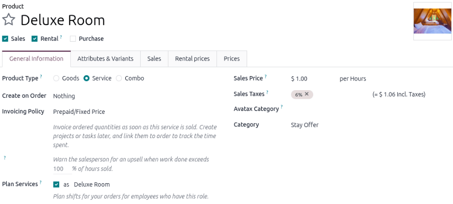
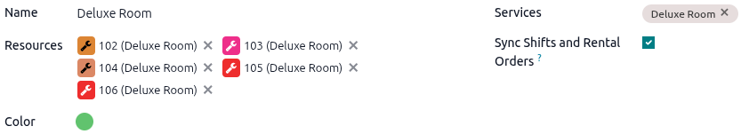
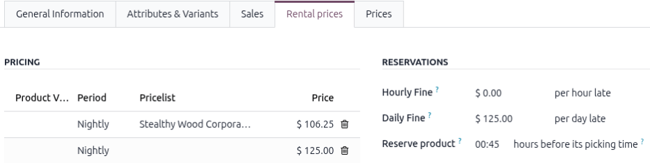
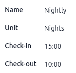

.. meta::
   :description: This page explains how to configure physical service rental products, including
                 Planning app materials and roles, product creation, rental periods and pricing,
                 variants, and eCommerce settings.

================================
Physical service rental products
================================

There are two types of service products in the **Rental** app that require different configurations:
physical and non-physical (labor). This document focuses on the configuration of physical rental
service products. A physical rental service product is a physical product that doesn't require any
stock movements. Some examples are:

- Hotel rooms
- Conference rooms
- Work stations
- Storage units

.. _rental/service_products/configuration:

Configuration
=============

Configuration requirements differ depending on the type of service product. To learn more about the
default settings for rental products, refer to the :ref:`Configuration
<rental/product_type/configuration>` section on the *Rental product type* page.

To access the **Rental** app's settings, navigate to :menuselection:`Rental app --> Configuration
--> Settings`.

The following configurations assume the **Rental**, **Planning**, and **Sales** apps are installed.

.. _rental/service_products/materials-and-roles:

Configure materials and a role for the physical service product
===============================================================

Before creating a service product in the **Rental** app, configure :ref:`materials
<planning/materials>` and :ref:`create a role <planning/roles>` in the **Planning** app for the
physical rental products (such as storage units or conference rooms).

This allows the **Planning** app to create and assign shifts for the physical rental product, and
the *Role* links the rental materials to the rental service. Whenever the service is added to a
rental order, the **Rental** app syncs with the **Planning** app to check and update the material
shift availability.

.. tip::
   It's recommended to name the role after the service.

.. example::
   Shady Grove needs to add a new room tier to the **Rental** app, the *Deluxe Room*. There are five
   rooms that belong in this tier. Create a new *Role* by navigating to the :menuselection:`Planning
   app --> Configuration --> Roles`. Click :guilabel:`New` and create the :guilabel:`Deluxe Room`
   role.

   .. image:: service_products/example-planning-role-room.png
      :alt: Example of configured role for the Deluxe Room.

   To add the five rooms as a resource for the *Role*, navigate to :menuselection:`Planning app -->
   Configuration --> Materials`. Click :guilabel:`New`, enter the room number, and :guilabel:`Deluxe
   Room` for the :guilabel:`Role` column. Repeat that process for all five rooms.

   .. image:: service_products/example-planning-materials.png
      :alt: Example of configured materials for the Deluxe Room.

   Create the :guilabel:`Deluxe Room` as a new *Service* product type by navigating to
   :menuselection:`Rental app --> Products`. Click :guilabel:`New`, then configure the Deluxe Room
   as a :guilabel:`Service` type product with the :guilabel:`Plan Services` checkbox enabled and the
   :guilabel:`Deluxe Room` role assigned.

   .. image:: service_products/plan-services-field-room.png
      :alt: Example of the Plan Services field configured to the Deluxe Room role.

.. _rental/service_products/new-service:

Create a new service product
============================

To set up a new rental service, go to :menuselection:`Rental app --> Products --> Products` and then
click :guilabel:`New`. The new product form displays with the *General Information* tab open as
default.

Initial product configuration
-----------------------------

.. important::
   The **Sales** and **Planning** apps must be installed for the following fields to become
   available:

   - :guilabel:`Prepaid/Fixed Price` option of the :guilabel:`Invoicing Policy` field.
   - :guilabel:`Plan Services` field.
   - :guilabel:`Invoicing Policy` field.

In the new product window, select the :guilabel:`Sales` checkbox. Select :guilabel:`Service` as the
:guilabel:`Product Type`. In the :guilabel:`Invoicing Policy` drop-down menu, select
:guilabel:`Prepaid/Fixed Price`. Enable the :guilabel:`Plan Services` checkbox and either
:ref:`create a new role <planning/roles>` or select a pre-existing one.

Click the :icon:`oi-arrow-right` :guilabel:`(Internal link)` icon to open the product's *Role* page.
Enable the :guilabel:`Sync Shifts and Rental Orders` checkbox.

.. tip::
   Assign a :guilabel:`Category` for room booking. It separates rooms from other services and can be
   used for reports on room occupancy.

.. _rental/service_products/rental-periods-prices:

Configuring rental periods and prices
-------------------------------------

No limit exists on how many rental prices can be added to a product. Multiple pricing options for
rental products are typically used to give discounts for customers who agree to longer rental
durations. When creating multiple pricing options for a rental product remember the **Rental** app's
:ref:`price computing logic <rental/price-computing>`.

To set rental rates for the product, click the :guilabel:`Rental prices` tab, in the *Pricing*
section, click :guilabel:`Add a price`. To enter a new rental rate:

#. Select a :guilabel:`rental period` (:dfn:`the unit of duration of the rental`) from the
   :guilabel:`Period` column.
#. (Optional) Select a pricelist option from the :guilabel:`Pricelist` column. This adds the new
   rental rate to the assigned pricelist.
#. Enter the price for that specific :guilabel:`Period`.

.. tip::
   Remember when considering pricing that renting for a day is usually limited to operating hours,
   not 24 hours.

The *Reservations* section contains the delay costs and padding time that when configured. These
values are automatically populated from the *Default Delay Costs* section, provided they have been
configured in :menuselection:`Rental app --> Configuration --> Settings`. If configured on the
product form, the settings override the settings in the *Default Delay Costs* section.

- :guilabel:`Hourly Fine`: The price per hour charged when the rental product is returned after the
  scheduled time.
- :guilabel:`Daily Fine`: The price per day charged when the rental product is returned after the
  scheduled time.
- :guilabel:`Reserve product`: The time the rental product is temporarily unavailable between two
  rental orders. Useful if maintenance or cleaning is required between rentals.

.. _rental/service_products/rental-period:

Creating a rental period
~~~~~~~~~~~~~~~~~~~~~~~~

The **Rental** app allows users to :ref:`create custom rental periods
<rental/products/rental-period>` to use in the *Rental Prices* tab. This is helpful when renting
rooms with special pricing for a set amount of time, such as offering a cheaper nightly room rate
for a standard hotel room for if the guests check out early.

To create a new rental period, go to :menuselection:`Rental app --> Configuration --> Rental
periods`.

.. _rental/service_products/variants:

Optional: specify rental variants
---------------------------------

.. important::
   The *Variants* feature must be enabled for this tab to display.

In the *Attributes & Variants* tab, click :guilabel:`Add a line`, then select or create an option
from the :guilabel:`Attribute` drop-down menu. To create a new one, enter the name and click
:guilabel:`Create and edit` to :ref:`configure the attribute and values
<products/variants/attributes>`.

.. example::
   Shady Grove has a list of amenities it wants to configure for their Deluxe Room. The room has two
   types of bed configurations: one king or two double. The maximum occupancy per room is two adults
   or two adults and a child. The hotel also offers breakfast and internet.

   Navigate to the :menuselection:`Rental app --> Products` and click :guilabel:`New` to create a
   new product. On the :guilabel:`Attributes & Variants` tab, click :guilabel:`Add a line` and
   select the :guilabel:`Bed` as an :guilabel:`Attribute`. In the :guilabel:`Values` column, add
   :guilabel:`1 King` and :guilabel:`2 Double`. Repeat these steps until all amenities have been
   configured.

   .. image:: service_products/example-room-variants.png
      :alt: Example of the Attribute & Variants tab configured for a hotel room.

.. _rental/service_products/ecommerce:

eCommerce features
------------------

.. important::
   The *Ecommerce* sections are only available if the :guilabel:`eCommerce` module is installed.

The :guilabel:`Sales` tab has the following sections that configure the product page on the website:
*Ecommerce shop*, *Ecommerce media*, and *Ecommerce description*. Refer to the :ref:`Product
visibility <ecommerce/products/publish-products>` and :ref:`Product configuration
<ecommerce/products/product-configuration>` sections for the **eCommerce** module for configuration
instructions.

.. seealso::
   - :doc:`labor_service_products`
   - :doc:`products`
   - :doc:`../../../services/planning`
   - :doc:`../../sales/products_prices/prices/pricing`
   - :doc:`../../sales/products_prices/products/variants`
   - :doc:`../rental_orders/create_rental_order`
   - :doc:`../rental_orders/pickup_return`
