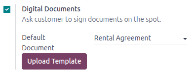
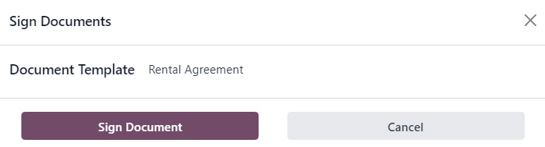
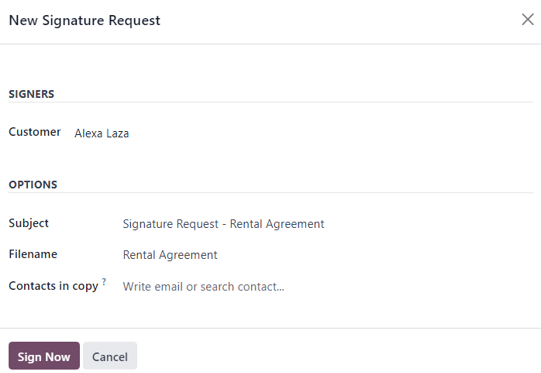
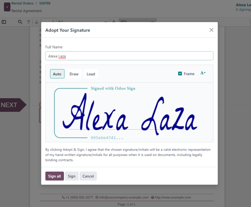
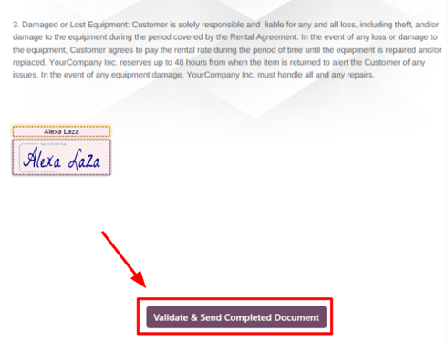

==================
Customer signature
==================

Odoo can request that the customer sign a rental or service agreement. Rental agreements outline the
terms between the company and the customer before the customer picks up the rental products. Such
documents can ensure everything is returned on time and in its original condition.

Service agreements detail the business relationship and mutual duties. These agreements protect both
the provider and the customer by creating clear, enforceable guidelines. Ideally, they should be
signed *before* any work begins or the pickup of any rental products.

This feature requires the :doc:`Sign <../../productivity/sign>` app. If necessary, Odoo
automatically installs it when the :guilabel:`Digital Documents` setting is activated.

Settings
========

The :guilabel:`Sign Documents` button/option **only** appears if the :guilabel:`Digital Documents`
feature has been activated in the *Rental* application settings. To do so, navigate to
:menuselection:`Rental app --> Configuration --> Settings`. In the *Rental* section, tick the
:guilabel:`Digital Documents` checkbox, and click :guilabel:`Save`.

Request a signature
===================

To request a customer signature on a rental agreement, navigate to the :menuselection:`Rental app
--> Orders --> Orders`, select a confirmed rental order, and click the :guilabel:`Sign Documents` to
reveal a *Sign Documents* pop-up window.

From here, select the desired document from the :guilabel:`Document Template` field. Then, click
:guilabel:`Sign Document`. Doing so reveals a *New Signature Request* pop-up window.

Upon confirming the information in the *New Signature Request* pop-up form, click :guilabel:`Sign
Now` to initiate the signing process. A separate page is then revealed, showcasing the document to
be signed, which is accessible to the customer via the customer portal.

Odoo guides the customer through the signing process with clear, clickable indicators and allows
them to create electronic signatures to quickly complete the form.

Once the document has been signed and completed, click the :guilabel:`Validate & Send Completed
Document` button at the bottom of the document.

Upon clicking the :guilabel:`Validate & Send Completed Document` button, Odoo offers the option to
download the signed document for record-keeping, if necessary.

.. seealso::
   `Odoo Tutorials: Sign <https://www.odoo.com/slides/sign-61>`_
