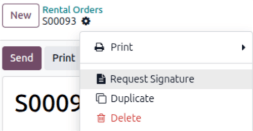

==================
Customer signature
==================

Odoo can request that the customer sign a rental or service agreement. Rental agreements outline the
terms between the company and the customer before the customer picks up the rental products. Such
documents can ensure everything is returned on time and in its original condition.

Service agreements detail the business relationship and mutual duties. These agreements protect both
the provider and the customer by creating clear, enforceable guidelines. Ideally, they should be
signed **before** any work begins or the pickup of any rental products.

App integration configuration
=============================

This feature requires the :doc:`Sign <../../productivity/sign>` app to be installed to be available.
The :guilabel:`Request Signature` feature allows the customer to sign the document via email or the
customer portal. The customer cannot sign the document through the user's **Sign** app.

Requesting a signature
======================

If signatures are required, go to the **Rental** app and from the default :guilabel:`Rental Orders`
dashboard, select the desired rental order. Go to the :icon:`fa-cog` :guilabel:`(Actions)` icon, and
click :guilabel:`Request Signature`.

A *New Signature Request* pop-up window displays. Select the desired document from the
:guilabel:`Template` drop-down menu.

.. image:: customer_signature/sign-documents-popup.png
   :alt: The Sign Documents pop-up window that appears in the Odoo Rental application.

Doing so reveals a second *New Signature Request* pop-up window. Upon confirming the information in
the form, click :guilabel:`Send` to initiate the signing process.

.. image:: customer_signature/new-signature-request-form.png
   :alt: The New Signature Request pop-up window that appears in the Odoo Rental application.

A link to the signature request appears in the record's chatter. The document is accessible to the
customer via the customer portal or email.

Signing a document from an email link
-------------------------------------

When the customer clicks :guilabel:`Sign document`, a separate page is displayed, showing the
document to be signed. The customer begins the process by clicking :guilabel:`Click to start`. The
app guides the signer to the required signature locations and allows them to create electronic
signatures to complete the form.

.. image:: customer_signature/adopt-signature-popup.png
   :alt: The adopt your signature pop-up window that appears in the Odoo Rental application.

Once the document has been signed and completed, click :guilabel:`Validate & Send Completed
Document` at the bottom of the document. Odoo presents the option to download the signed document
for record-keeping purposes, if necessary.

.. image:: customer_signature/validate-send-doc-button.png
   :alt: The validate and send completed document button in the Odoo Rental application.

.. seealso::
   `Odoo Tutorials: Sign <https://www.odoo.com/slides/sign-61>`_
