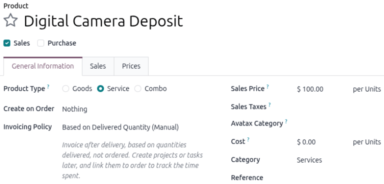
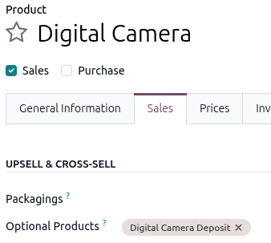
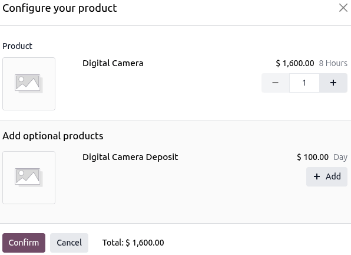
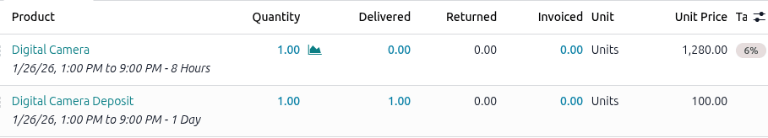
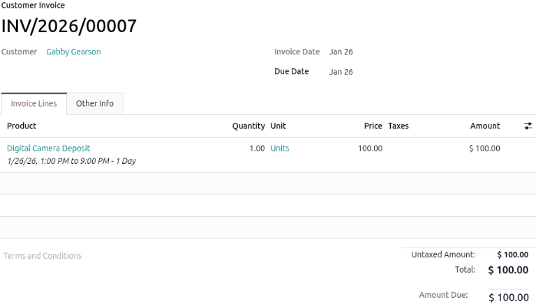
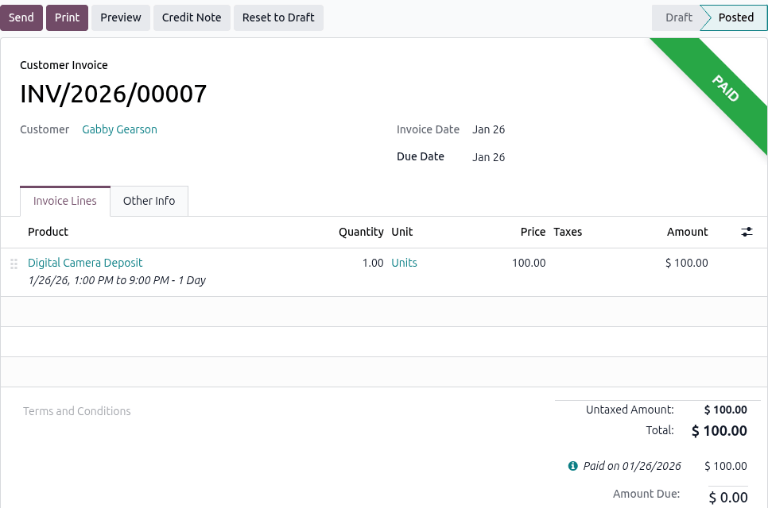
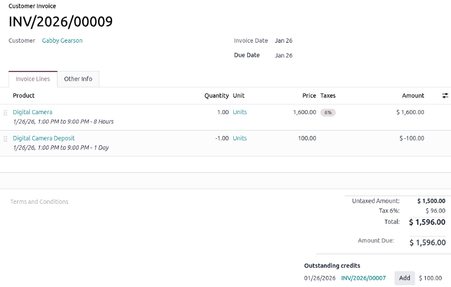
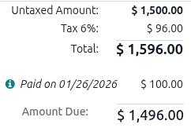

===============
Manage deposits
===============

Requiring fixed deposits is common in many rental scenarios, such as collecting security deposits.
Security deposits are insurance in case of damage, theft, or unpaid fees. It is typically refunded
when the rented product is returned in good condition, and all terms of the rental or service
agreement are met.

This document covers the standard options for :ref:`configuring <rental/manage_deposits/config>`,
:ref:`collecting <rental/manage_deposits/optional-product>`, and :ref:`refunding
<rental/manage_deposits/refund>` deposits within the **Rentals** app.

App integration configuration
=============================

The following apps are essential for configuring deposit service products and processing deposit
refunds:

- **Sales** app: Enables the :guilabel:`Price` tab on product forms when
  :doc:`../sales/products_prices/prices` is enabled. Also enables the use of quotation templates.
- **Accounting** app: Enables the use of :doc:`Credit Notes
  <../../finance/accounting/customer_invoices/credit_notes>` on rental orders, which are required
  when returning a deposit.

.. _rental/manage_deposits/config:

Configuration
=============

For every rental product that requires a deposit, create a *deposit service product* representing
the deposit amount to be collected.

Go to :menuselection:`Rental --> Products --> Products`, click :guilabel:`New`, and clearly name the
service product as a deposit.

.. tip::
   Including the product name within the deposit service product name improves organizational
   clarity and simplifies deposit tracking. If the deposit service product is intended for the
   *Digital Camera* rental product, enter the name as `Digital Camera Deposit`.

Next, set :guilabel:`Product Type` to :guilabel:`Service`, :guilabel:`Invoicing Policy` to
:guilabel:`Delivered quantities`, :guilabel:`Sales Price` to the desired amount, and the unit of
measure to :guilabel:`Unit`.

Choose whether to include :ref:`Sales Taxes <taxes/product>` for the deposit service product.
Finally, :icon:`fa-cloud-upload` :guilabel:`(save)` the deposit service product.

.. _rental/manage_deposit/add-deposit:

Adding a deposit to a rental order
==================================

There are several methods to add a deposit service product to a rental order, alongside the related
product:

- :ref:`Manually <rental/service_products/create-rental-order>`
- :ref:`rental/manage_deposits/optional-product`
- :ref:`rental/manage_deposits/use-quotation-template`

.. _rental/manage_deposits/optional-product:

Adding deposits through the optional product menu
-------------------------------------------------

To :ref:`configure an optional product <sales/sales_quotations/config-optional-product>` for a
deposit, select the desired product or create one. On the product's form, click the
:guilabel:`Sales` tab and add the :ref:`deposit <rental/manage_deposits/config>` to the
:guilabel:`Optional Products` field in the *Upsell & Cross-sell* section.

.. note::
   If :ref:`creating a new product <rental/physical-products>`, be sure to configure the rental
   product's prices on the :guilabel:`Prices` tab.

    its deposit.

Then create a :ref:`rental order <rental/order>` and add the rental product in the :guilabel:`Order
Lines` tab. A *Configure your product* pop-up window will appear. Click :icon:`fa-plus`
:guilabel:`Add` for the deposit item, then click :guilabel:`Confirm`.

.. tip::
   If :doc:`eCommerce <../../websites/ecommerce>` is installed, add a :guilabel:`Short Description`
   to the rental product's :guilabel:`Sales` tab stating a deposit is required.

   When a customer adds the rental product to their cart, a :guilabel:`Configure your product`
   pop-up displays the deposit service product under :guilabel:`Available options`.

   Once the customer clicks :icon:`fa-shopping-cart` :guilabel:`Add`, the rental product and the
   deposit service product are added to their cart.

.. _rental/manage_deposits/use-quotation-template:

Using a quotation template
--------------------------

Using quotation templates helps tailor the product list to the customer while ensuring the necessary
deposits are included in the order. Navigate to :menuselection:`Rental app --> Configuration -->
Quotation Templates` and click :guilabel:`New` to get started.

:ref:`Create a quotation template <sales/send_quotations/create_templates>` and then create a
:ref:`rental order <rental/order>`. Select the desired template in the :guilabel:`Quotation
Template` field.

Process a deposit on a rental order
===================================

Once the rental order is confirmed by the customer, the deposit should be invoiced either before or
at the time the customer picks up the rented product.

To do so, change the :guilabel:`Delivered` column for the deposit service product to `1`. The text
color changes from black to blue, indicating that the line is ready for invoicing.

Click :guilabel:`Create Invoice` and select :guilabel:`Regular invoice` from the *Create invoice(s)*
pop-up window. Click :guilabel:`Create Draft` to generate the invoice. After verifying that the
draft is correct, click :guilabel:`Confirm`, then click :guilabel:`Send` to email the invoice to the
customer.

For in-person transactions, click :guilabel:`Pay`, verify the *Pay* pop-up window,then click
:guilabel:`Create Payment` and click Send to email a copy of the receipt.

.. _rental/manage_deposits/refund:

Refund deposits upon return
===========================

To process a deposit return, the **Accounting** app must be installed. When a customer :ref:`returns
the rented item <rental/return-products>`, begin the deposit return by preparing a :doc:`credit note
<../../finance/accounting/customer_invoices/credit_notes>` against the original deposit invoice.

First, go to the :menuselection:`Rental app --> Orders --> Orders`, and select the correct rental
order. Click the :guilabel:`Invoices` smart button, find the invoice for the deposit, and create a
:doc:`credit note <../../finance/accounting/customer_invoices/credit_notes>`.

.. tip::
   In the *Credit Note* pop-up window, enter `Security Deposit Refund` in the :guilabel:`Reason
   displayed on the Credit Note` field.

   .. image:: manage_deposits/credit-note-pop-up-window.png
      :alt: Credit Note pop-up window with Security Deposit Refund entered in the Reason field.

Return to the rental order using the :guilabel:`Sale Orders` smart button. Set the *delivered
quantity* for the deposit to `0`. This step ensures the deposit is marked as returned.

Then, review any rental refunds due before creating a final invoice for the remaining charges by
clicking :guilabel:`Create Invoice`.

In the draft invoice, the deposit line will appear as a negative amount, which shows the amount to
refund. At the bottom, review the :guilabel:`Outstanding Credits` section for the credit note
created for the deposit refund.

Click :guilabel:`Add` to apply these credits to the invoice. This completes the refund process.

Invoice the remaining rental charges
====================================

On the new invoice draft, the :guilabel:`Total` amount displays the applied credit note amount and
deposit date. After verifying the totals, click :guilabel:`Confirm` to finalize the invoice.

Click :guilabel:`Send` to email the final invoice to the customer. For in-person transactions, click
:guilabel:`Pay` to process the payment.

