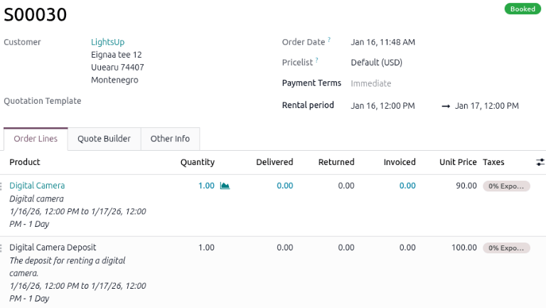
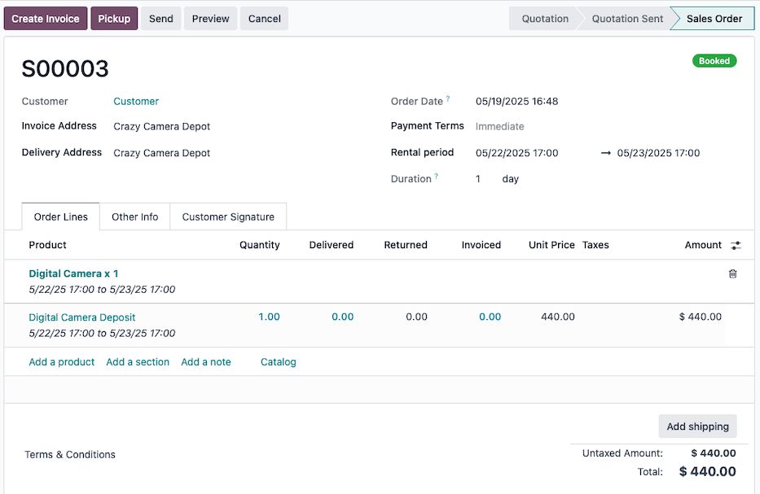

===============
Manage deposits
===============

Requiring fixed deposits is common in many rental scenarios; such as collecting security deposits.

This document covers the standard options for collecting and refunding deposits within the
**Rentals** app:

#. :ref:`rental/manage_deposits/config-optional-product`: Users are prompted to add the deposit to
   the sales order upon selecting the rental product.
#. :ref:`rental/manage_deposits/config-combo-product`: The deposit is automatically added to the
   sales order upon selecting the rental product.
#. :ref:`rental/manage_deposits/refund`: Reimburse deposits with a credit note.

.. _rental/manage_deposits/config-service-product:

Configuration
-------------

First create a *deposit service product* for each rental product that requires a deposit.

To do so, go to :menuselection:`Rental --> Products` and create a :guilabel:`New` product.

On the product form, give the product a name that indicates it is a deposit.

.. example::
   If this deposit service product is intended for the *Digital Camera* rental product, the name may
   be entered as `Digital Camera Deposit`.

Next, set the :guilabel:`Product Type` to :guilabel:`Service` and assign a :guilabel:`Sales Price`
with the amount to collect for the deposit. Choose whether or not to include :guilabel:`Sales Taxes`
for this deposit service product.

Be sure that the :guilabel:`Rental` checkbox is ticked at the top of the product form.

Finally, :icon:`fa-cloud-upload` :guilabel:`(save)` the deposit service product.

.. _rental/manage_deposits/config-optional-product:

Collect deposits from an optional product
-----------------------------------------

On the rental product's form, go to the :guilabel:`Sales` tab and add the :ref:`deposit service
product <rental/manage_deposits/config-service-product>` to the :guilabel:`Optional Products`.

Be sure to configure the rental product's prices on the :ref:`Rental prices <rental/pricing>` tab.

With the above configuration, a :ref:`rental order <rental/order>` can be created.

.. important::
   After selecting the rental product in the :guilabel:`Order Lines` tab, be sure to :icon:`fa-plus`
   :guilabel:`Add` the deposit service product in the :guilabel:`Configure your product` pop-up.

.. tip::
   If :doc:`eCommerce <../../websites/ecommerce>` is installed, add an :guilabel:`Ecommerce
   Description` stating the deposit is required in the rental product's :guilabel:`Sales` tab.

   When a customer adds the rental product to their cart, a :guilabel:`Configure your product`
   pop-up displays the deposit service product under :guilabel:`Available options`.

   Once the customer clicks :icon:`fa-shopping-cart` :guilabel:`Add` the rental product and the
   deposit service product are added to their cart.

.. _rental/manage_deposits/config-combo-product:

Collect deposits from a combo product
-------------------------------------

On the rental product's form, set the :guilabel:`Product Type` to :guilabel:`Combo`. Then, create a
new :guilabel:`Combo Choices`.

In the :guilabel:`Create Combo Choices` pop-up, give the :guilabel:`Combo Choice` a title, and
select the :ref:`deposit service product <rental/manage_deposits/config-service-product>` in the
:guilabel:`Product` list.

Finally, set an :guilabel:`Extra Price` equal to the :guilabel:`Original Price` of the deposit
service product and :guilabel:`Save`.

Be sure to configure the rental product's prices on the :ref:`Rental prices <rental/pricing>` tab.

With the above configuration, a :ref:`rental order <rental/order>` can be created.

.. important::
   After selecting the rental product in the :guilabel:`Order Lines` tab, be sure to
   :guilabel:`Confirm` the combo option in the rental product's pop-up.

.. tip::
   If :doc:`eCommerce <../../websites/ecommerce>` is installed, add an :guilabel:`Ecommerce
   Description` stating the deposit is required in the rental product's :guilabel:`Sales` tab.

   When a customer adds the rental product to their cart, the deposit service product is
   automatically added as well.

.. _rental/manage_deposits/refund:

Refund deposits upon return
---------------------------

Once a customer :ref:`returns the rented product <rental/return>`, reimburse their deposit with a
:doc:`credit note <../../finance/accounting/customer_invoices/credit_notes>` from the invoice, and
change the *delivered quantity* to `0` on the linked sales order.
