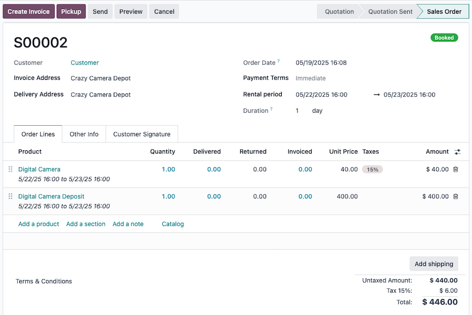

===============
Manage deposits
===============

Requiring fixed deposits is common in many rental scenarios; such as collecting security deposits.

This document covers the standard options for :ref:`configuring <rental/manage_deposits/config>`,
:ref:`collecting <rental/manage_deposits/product>` and :ref:`refunding
<rental/manage_deposits/refund>` deposits within the **Rentals** app.

.. _rental/manage_deposits/config:

Configuration
-------------

First, create a *deposit service product* for each rental product that requires a deposit.

To do so, go to :menuselection:`Rental --> Products` and create a :guilabel:`New` product.

On the product form, give the product a name that indicates it is a deposit.

.. example::
   If this deposit service product is intended for the *Digital Camera* rental product, the name may
   be entered as `Digital Camera Deposit`.

Next, set the :guilabel:`Product Type` to :guilabel:`Service`, the :guilabel:`Invoicing Policy` to
:guilabel:`Delivered quantities` and then assign a :guilabel:`Sales Price` with the amount to
collect for the deposit. Choose whether or not to include :guilabel:`Sales Taxes` for this deposit
service product.

Finally, :icon:`fa-cloud-upload` :guilabel:`(save)` the deposit service product.

.. _rental/manage_deposits/product:

Collect deposits from an optional product
-----------------------------------------

On the rental product's form, go to the :guilabel:`Sales` tab and add the :ref:`deposit service
product <rental/manage_deposits/config>` to the :guilabel:`Optional Products`.

Be sure to configure the rental product's prices on the :ref:`Rental prices <rental/pricing>` tab.

With the above configuration, a :ref:`rental order <rental/order>` can be created.

.. important::
   After selecting the rental product in the :guilabel:`Order Lines` tab, be sure to :icon:`fa-plus`
   :guilabel:`Add` the deposit service product in the :guilabel:`Configure your product` pop-up.

   The :guilabel:`Configure your product` pop-up only appears if the optional product is set on the
   rental product.

.. tip::
   If :doc:`eCommerce <../../websites/ecommerce>` is installed, add an :guilabel:`Ecommerce
   Description` stating the deposit is required in the rental product's :guilabel:`Sales` tab.

   When a customer adds the rental product to their cart, a :guilabel:`Configure your product`
   pop-up displays the deposit service product under :guilabel:`Available options`.

   Once the customer clicks :icon:`fa-shopping-cart` :guilabel:`Add` the rental product and the
   deposit service product are added to their cart.

.. _rental/manage_deposits/refund:

Refund deposits upon return
---------------------------

Once a customer :ref:`returns the rented product <rental/return-products>`, reimburse their deposit with a
:doc:`credit note <../../finance/accounting/customer_invoices/credit_notes>` from the invoice, and
change the *delivered quantity* to `0` on the linked sales order.
