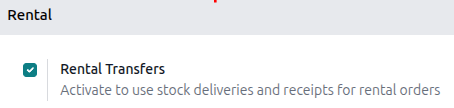
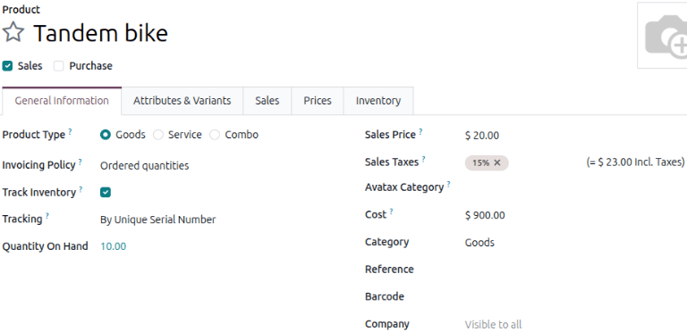
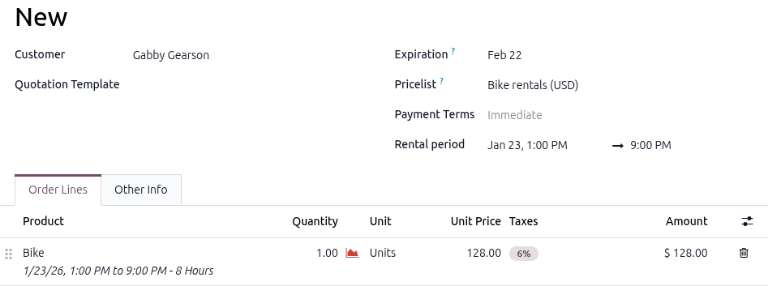
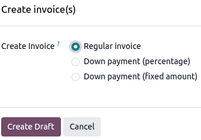
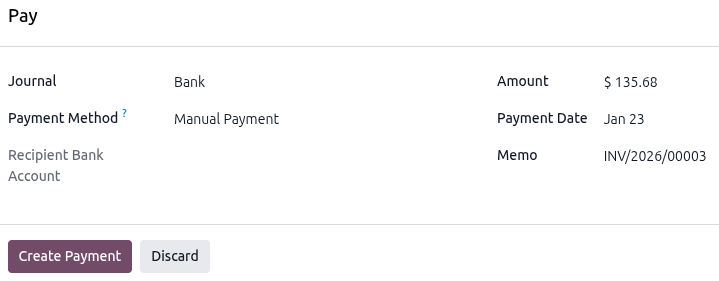
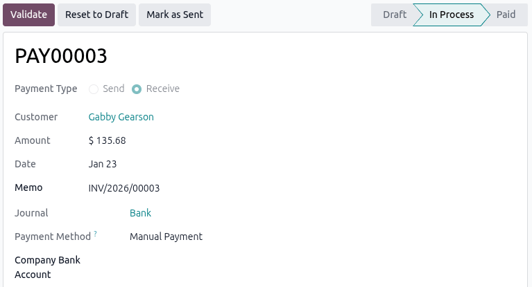
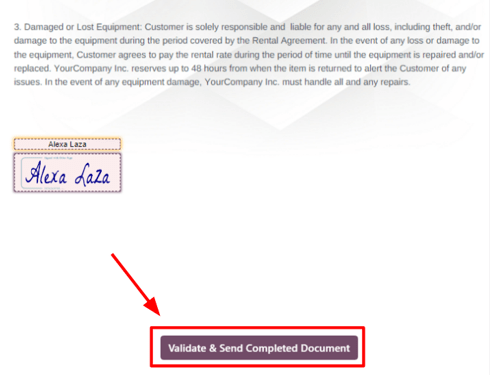
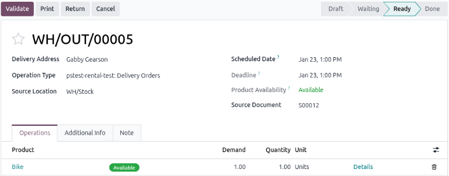
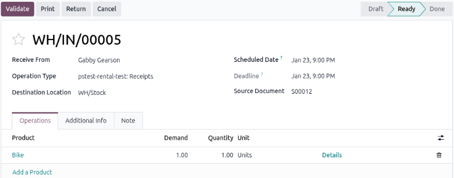

========================
Physical rental products
========================

Odoo **Rental** app allows users to customize the scheduling, pricing, and inventory for rental
physical products. Users can set up multiple pickup and drop-off locations and track rental products
by serial number.

Settings
========

To configure default settings on rental products, navigate to :menuselection:`Rental app -->
Configuration --> Settings`.

In the **Rental** section, under the :guilabel:`Default Delay Costs` subsection, fill in the
:guilabel:`Apply after` field.

.. note::
   For finer control, configure the costs of late returns for the :guilabel:`Per Hour` and
   :guilabel:`Per Day` fields at the product level. If the defaults apply to all products, leave the
   :guilabel:`Product` field blank.

In the :guilabel:`Default Padding Time` section, fill in the :guilabel:`Padding` field. Next, enable
:guilabel:`Rental Transfers`.

In the :guilabel:`Rent Online` section, fill in the :guilabel:`Minimal Rental Duration` field and
designate :guilabel:`Unavailability` days.

Click **Save** to apply the changes.

Multi-location management and transfers
=======================================

Tracking the location of high-value physical products is essential. The **Rental** app helps by
facilitating rental transfers and creating stock deliveries and receipts for all rental orders.

For multi-location management and rental item transfer tracking, go to the :menuselection:`Inventory
app --> Configuration --> Settings` and in the :guilabel:`Warehouse` section, enable
:guilabel:`Storage Locations`. Click **Save** to apply the changes.

Next, navigate to :menuselection:`Inventory app --> Configuration --> Locations`. Click
:guilabel:`New` to configure a new internal location.

In the new location page, enter the :guilabel:`Location Name` and ensure that the :guilabel:`Parent
Location` field is :guilabel:`WH`. Click the :icon:`fa-cloud-upload` :guilabel:`(Save manually)`
icon near the top to save.

Rental products
===============

To view all products that can be rented in the database, navigate to :menuselection:`Rentals app -->
Products`. By default, the :guilabel:`Rental` filter appears in the search bar, and the view is
Kanban.

Each product Kanban card displays the name of the product, rental rate, amount of units on hand, and
product image (if applicable).

Create a new physical product
=============================

To set up a new physical rental product, go to the :menuselection:`Rental app --> Products`, then
click :guilabel:`New`. In the new product window, the :guilabel:`Rental` checkbox is already ticked
by default.

Select the :guilabel:`Product Type` as :guilabel:`Goods` and tick the :guilabel:`Track Inventory`
checkbox. Next to the :guilabel:`Track Inventory` checkbox, select the :guilabel:`By Unique Serial
Number` from the drop-down menu. For the :guilabel:`Category` field, select :guilabel:`Goods` from
the drop-down menu or create a new category by typing in the name and clicking :guilabel:`Create`.

Click the :guilabel:`Rental prices` tab and in the :guilabel:`Pricing` section, click :guilabel:`Add
a price` to enter a new rental rate. Choose a *pricing period* (:dfn:`the unit of duration of the
rental`) in the :guilabel:`Period` column, or create a new pricing period by typing in the name and
clicking :guilabel:`Create and edit`.

.. note::
   Creating a new pricing period opens a pop-up :guilabel:`Create period` window. Fill in the
   :guilabel:`Name`, :guilabel:`Duration`, and :guilabel:`Unit`, and click :guilabel:`Save`. The new
   pricing period automatically applies.

   .. image:: products/new-rental-period.png
      :alt: Sample of a New Period view in the Rental app.

Next, enter the :guilabel:`Price` for that specific :guilabel:`Period`. To apply the configured
rental rate to an existing pricelist, click in the :guilabel:`Pricelist` column and select the
desired list from the drop-down menu.

In the :guilabel:`Reservations` section, fill in the :guilabel:`Hourly Fine`, :guilabel:`Daily
Fine`, and the :guilabel:`Reserve product` time. These values are automatically populated from the
:guilabel:`Default Delay Costs` section, provided they have been configured in the
:menuselection:`Rental app --> Configuration --> Settings`.

Click the :icon:`fa-cloud-upload` :guilabel:`(Save manually)` icon near the top to save.

.. example::
   A bike rental business only rents out tandem bikes for the local park for two hours. The hourly
   rental rate for their tandem bikes is $20, but since tandem bikes are popular they want to set a
   fixed price of $35. To ensure the business gets their bikes returned on time they set the late
   return fee as $20 per hour and $160 per day ($20 x 8 hrs).

   Create a new pricing period by navigating to :menuselection:`Rental app --> Configuration -->
   Rental periods`. Click :guilabel:`New` and configure a the period for 2 hours.

   Navigate to the tandem bike product and in the :guilabel:`Rental prices` tab and add the 2 hour
   period set at $35. Manually save to apply changes.

   .. image:: products/rental-prices-tab-with-rental-period.png
       :alt: Sample of a rental product with the custom rental period applied.

.. _rental/order:

Create a rental order
=====================

To create a rental order in the *Rental* app, navigate to :menuselection:`Rental app --> Orders -->
Orders`, and click :guilabel:`New`. Doing so reveals a blank rental order form.

Start by adding a :guilabel:`Customer`, then configure the desired duration of the rental in the
:guilabel:`Rental period` field.

To adjust the rental duration, click the first date in the :guilabel:`Rental period` field, and
select the range of dates and time to represent the rental duration from the pop-up calendar form
that appears.

.. image:: products/rental-period-field-popup.png
   :alt: Sample of a rental period calendar pop-up window in the Odoo Rental application.

Once complete, click :guilabel:`Apply` in the calendar pop-up form. Following that, the pop-up form
disappears, and the designated time period of the rental is represented in the :guilabel:`Duration`
field.

Next, add a rental product in the :guilabel:`Order Lines` tab, by clicking :guilabel:`Add a
product`, and selecting the desired rental product to add to the form.

.. note::
   If a rental product is added *before* the :guilabel:`Rental period` field has been properly
   configured, the user can *still* adjust the :guilabel:`Rental period` field accordingly.

   Select the desired range of dates to represent the duration of the rental, then click
   :guilabel:`Update Rental Prices` in the :guilabel:`Duration` field.

   .. image:: products/rental-update-rental-prices.png
      :alt: The update rental prices option that appears in the Odoo Rental application.

   Doing so reveals a :guilabel:`Confirmation` pop-up window. If everything is correct, click
   :guilabel:`Ok`, and Odoo recalculates the rental price accordingly.

Once all the information has been entered correctly on the rental order form, click :guilabel:`Send`
to send the quotation to the customer and when the customer confirms the quotation, click
:guilabel:`Confirm` to confirm the order. A :guilabel:`Pickup` banner displays on the rental order.

Create an invoice
=================

Navigate to the desired invoice by navigating to **Rental** app and on the :guilabel:`Rental Orders`
dashboard, in the :guilabel:`INVOICE STATUS` section, click :guilabel:`To Invoice` to view all the
rental orders that require to be sent.

.. image:: products/invoice-status-section.png
   :alt: Sample of the INVOICE STATUS section in the Rental app.

Click on the desired rental order and click :guilabel:`Create Invoice`. Select :guilabel:`Regular
invoice` from the :guilabel:`Create invoice(s)` window and click :guilabel:`Create Draft`.

If all the details are correct, click :guilabel:`Confirm` and click :guilabel:`Send` to email the
invoice to the customer or :guilabel:`Print` and then click :guilabel:`Pay` if the customer is in
person. In the :guilabel:`Pay` pop-up window, select a :guilabel:`Journal` and click
:guilabel:`Create Payment`.

Click on the :guilabel:`Payments` smart button that appears on the top of the rental order. Click
:guilabel:`Validate` on the Payment page.

Customer signature
==================

Odoo has the ability to request the customer sign a rental agreement, outlining the arrangement
between the company and customer, *before* they pick up the rental products. Such documents can
ensure everything is returned on-time and in its original condition.

.. note::
   Requesting a signature can be done during any stage of the order. This feature also requires the
   :doc:`Sign <../../productivity/sign>` app.

If signatures are required, go to the **Rental** app and from the default :guilabel:`Rental Orders`
dashboard, select the desired rental order. To go the :icon:`fa-cog` :guilabel:`(Actions)` icon, and
click :guilabel:`Request Signature`.

.. image:: products/request-signature.png
   :alt: The Request Signature option in the Odoo Rental application.

A :guilabel:`Sign Documents` pop-up window displays. Select the desired document from the
:guilabel:`Template` drop-down menu.

.. image:: products/sign-documents-popup.png
   :alt: The Sign Documents pop-up window that appears in the Odoo Rental application.

Doing so reveals a :guilabel:`New Signature Request` pop-up window. Upon confirming the information
in the :guilabel:`New Signature Request` pop-up form, click :guilabel:`Send` to initiate the signing
process.

.. image:: products/new-signature-request-form.png
   :alt: The New Signature Request pop-up window that appears in the Odoo Rental application.

A link to the signature request will appear in the record's chatter. The document is accessible to
the customer via the customer portal or email.

When the customer clicks :guilabel:`Sign document`, a separate page is then revealed, showcasing the
document to be signed. The customer begins the process by clicking :guilabel:`Click to start`. The
app guides the signee to the required signature locations and allows them to create electronic
signatures to complete the form.

.. image:: products/adopt-signature-popup.png
   :alt: The adopt your signature pop-up window that appears in the Odoo Rental application.

Once the document has been signed and completed, click :guilabel:`Validate & Send Completed
Document` at the bottom of the document. Odoo presents the option to download the signed document
for record-keeping purposes, if necessary.

.. seealso::
   `Odoo Tutorials: Sign <https://www.odoo.com/slides/sign-61>`_

Pickup products
===============

When a customer picks up products, navigate to the appropriate rental order, click
:guilabel:`Pickup`. The **Rental** app displays a warehouse delivery form listing the reserved
rental products. Click :guilabel:`Validate` to move the order to the :guilabel:`Done` stage.

Doing so places a :guilabel:`Pickedup` status banner on the rental order.

.. _rental/return-products:

Return products
===============

When a customer returns products, navigate to the desired rental order, click :guilabel:`Return`.
The **Rental** app displays a warehouse receipt form listing the checked out rental products.

Enter the same amount of products the customer returned in the :guilabel:`Quantity` column. If any
of the products have serial numbers, enter them into the :guilabel:`Serial Numbers` column.

Click :guilabel:`Validate` to move the order to the :guilabel:`Done` stage. A :guilabel:`Returned`
status banner appears on the rental order.

Print pickup and return receipts
================================

Pickup and return receipts can be printed for customers when they pick up and/or return rental
products.

To print pickup and/or return receipts, navigate to the appropriate rental order, click the
:icon:`fa-cog` :guilabel:`(Actions)` icon to reveal a drop-down menu.

.. image:: products/print-pickup-return-receipt.png
   :alt: The pickup and return receipt print option in the Odoo Rental application.

From this drop-down menu, hover over the :guilabel:`Print` option to reveal a sub-menu. Then select
:guilabel:`Pickup and Return Receipt`.

Odoo generates and downloads a PDF, detailing all information about the current status of the rented
items.

