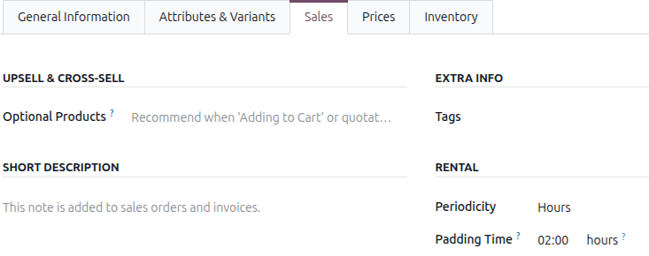
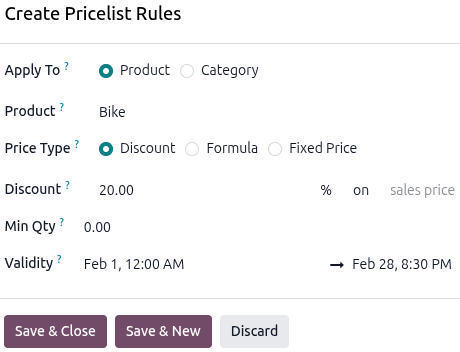

========================
Physical rental products
========================

The Odoo **Rental** app allows users to customize scheduling, pricing, and inventory for physical
rental products. Users can set up multiple pickup and drop-off locations and track rental products
by serial number.

Settings
========

To configure default settings on rental products, navigate to :menuselection:`Rental app -->
Configuration --> Settings`.

.. image:: products/rental-settings.png
   :alt: The Rental setting view in the Rental app.

In the **Rental** section, tick the :guilabel:`Rental Transfers` checkbox.

Click **Save** to apply the change.

.. important::
   If the product has multiple rental rates, the **Sales** app is required, and
   :guilabel:`Pricelists` must be enabled.

View rental products
====================

To view all products that can be rented in the database, navigate to :menuselection:`Rentals app -->
Products`. By default, the :guilabel:`Rental` filter appears in the search bar, and the view is
Kanban.

Each product Kanban card displays the product name, rental rate, number of units on hand, and
product image (if applicable).

Create a new physical product
=============================

To set up a new physical rental product, go to the :menuselection:`Rental app --> Products`, then
click :guilabel:`New`. In the new product window, the :guilabel:`Sales` checkbox is already ticked
by default.

.. image:: products/new-product.png
   :alt: The new product view in the Rental app.

Select the :guilabel:`Product Type` as :guilabel:`Goods` and tick the :guilabel:`Track Inventory`
checkbox. Next to the :guilabel:`Track Inventory` checkbox, select the :guilabel:`By Unique Serial
Number` from the drop-down menu.

For the :guilabel:`Category` field, select :guilabel:`Goods` from the drop-down menu or create a new
category by typing in the name and clicking :guilabel:`Create`.

Set a base rental period and price
----------------------------------

Set up a base rental rate by entering the lowest rental price in the :guilabel:`Sales Price` field.
Next, click the :guilabel:`Sales` tab, then in the *Rental* section select a unit of time from the
:guilabel:`Periodicity` dropdown menu.

Then enter the :guilabel:`Padding Time` to make the product unavailable for pickup for the
configured duration.

.. important::
   To set a pricelist for additional rental rates, the **Sales** app must be installed, and
   *Pricelists* must be enabled. Otherwise, the :guilabel:`Prices` tab is not available.

Set additional rental periods and pricing
-----------------------------------------

There are two ways to configure additional rental rates in the **Rental** app: :ref:`Pricelists
<rental/products/pricelist>` and the :ref:`Prices tab <rental/products/price-tab>`.

.. _rental/products/pricelist:

Using the Pricelists method
~~~~~~~~~~~~~~~~~~~~~~~~~~~

Creating a new :guilabel:`Pricelist` allows for better customization when applying rental rates to
specific time periods, products, or customers by using :guilabel:`Pricelist Rules`. To set up
additional rental rates, go to :menuselection:`Rental app --> Products --> Pricelists` and click
:guilabel:`New` to :ref:`create a new pricelist <sales/products/create-edit-pricelists>`. A *Create
Pricelist Rules* window displays.

.. tip::
   It is recommended to create a new :guilabel:`Pricelist` first, then select the customized
   :guilabel:`Pricelist` in the :guilabel:`Prices` tab instead of using the :guilabel:`Default`
   pricelist. Keeping the :guilabel:`Default` pricelist blank ensures there is a clean pricelist for
   the base rental rate.

.. _rental/products/price-tab:

Using the Prices tab method
~~~~~~~~~~~~~~~~~~~~~~~~~~~

Prices can also be configured directly on the product using the :guilabel:`Prices` tab. Navigate to
:menuselection:`Products --> Products`, then click the desired product.

Click the :guilabel:`Prices` tab and click :guilabel:`Add a price`. Select the desired
:guilabel:`Pricelist`, then enter the minimum time required for the price change to trigger in the
:guilabel:`Min. Quantity` column. The :guilabel:`Min. Quantity` column is based on the
:guilabel:`Periodicity` field in the :guilabel:`Sales` tab.

Lastly, enter the :guilabel:`Price` rate. Click the :icon:`fa-cloud-upload` :guilabel:`(Save
manually)` icon near the top to save.

.. example::
   A bike rental business rents out its bikes on an hourly and daily basis. The hourly rental rate
   for their tandem bikes is $20, but the daily rate is $128. All bike reservations require at least
   a 30-minute notice.

   Enter the :guilabel:`Sales Price`, then click the :guilabel:`Sales` tab to configure the
   :guilabel:`Periodicity` and :guilabel:`Padding Time`.

   .. image:: products/rental-sales-tab-rental-section.png
      :alt: Add alt text.

   Using the Pricelist method, navigate to :menuselection:`Rental app --> Products --> Pricelists`
   and click :guilabel:`New`. Configure :guilabel:`Pricelist Rules` for the daily rate.

   .. image:: products/example-rental-pricelist-rules.png
       :alt: Sample of a rental product with the custom rental pricelist applied.

   Using the :guilabel:`Prices` tab method, navigate to :menuselection:`Rental app --> Products -->
   Products` and click the Bike product.  Click the :guilabel:`Prices` tab, then add a new price for
   the daily rate.

   .. image:: products/example-rental-prices-tab.png
      :alt: Sample of a rental product's Price tab.

.. _rental/order:

Create a rental order
=====================

To create a rental order in the **Rental** app, navigate to :menuselection:`Rental app --> Orders
--> Orders`, and click :guilabel:`New`. Doing so reveals a blank rental order form.

.. image:: products/rental-order.png
   :alt: Sample of a filled out rental order available in the Odoo Rental application.

Start by adding a :guilabel:`Customer`, then set the desired duration in the :guilabel:`Rental
period` field.

To adjust the rental duration, click the first date in the :guilabel:`Rental period` field, and
select the range of dates and times to represent the rental duration from the pop-up calendar form
that appears.

.. image:: products/rental-period-field-popup.png
   :alt: Sample of a rental period calendar pop-up window in the Odoo Rental application.

Once complete, click :guilabel:`Apply` in the calendar pop-up form. Next, add a rental product in
the :guilabel:`Order Lines` tab by clicking :guilabel:`Add a product` and selecting the desired
rental product to add to the form.

.. note::
   If a rental product is added *before* the :guilabel:`Rental period` field is properly configured,
   the user can *still* adjust it accordingly.

   Select the desired date range to represent the rental duration, then click the :guilabel:`Update
   Rental Prices`.

   .. image:: products/rental-update-rental-prices.png
      :alt: The update rental prices option that appears in the Odoo Rental application.

   Odoo recalculates the rental price accordingly.

Once all information has been entered correctly on the rental order form, click :guilabel:`Send` to
send the quotation to the customer. When the customer confirms the quotation, click
:guilabel:`Confirm` to confirm the order. A :guilabel:`Pickup` banner displays on the rental order.

Create an invoice
=================

Navigate to the desired invoice by opening the **Rental** app and landing on the :guilabel:`Rental
Orders` dashboard. Click :guilabel:`To Invoice` in the :guilabel:`Invoice Status` section to view
all the rental orders that need to be sent.

.. image:: products/invoice-status-section.png
   :alt: Sample of the INVOICE STATUS section in the Rental app.

Click the desired rental order , then click :guilabel:`Create Invoice`. Select :guilabel:`Regular
invoice` from the *Create invoice(s)* window and click :guilabel:`Create Draft`.

.. image:: products/create-invoices.png
   :alt: Sample of Create invoices window in the Rental app.

If all the details are correct, click :guilabel:`Confirm` and then :guilabel:`Send` to email the
invoice to the customer. For in-person transactions, click :guilabel:`Print` and then click
:guilabel:`Pay`.

In the *Pay* pop-up window, select a :guilabel:`Journal` and click :guilabel:`Create Payment`.

.. image:: products/pay-page.png
   :alt: Sample of the Pay page in the Rental app.

Click the :guilabel:`Payments` smart button at the top of the rental order. Click
:guilabel:`Validate` to complete the payment.

.. image:: products/payment-page-validate.png
   :alt: Sample of the Payment page in the Rental app.

Request a customer signature
============================

Before the customer picks up the rental product, Odoo can request that the customer sign a rental
agreement. Rental agreements outline the arrangement between the company and customer to ensure
everything is returned on time and in its original condition.

.. note::
   The customer signature can be requested during any stage of the order. This feature requires the
   :doc:`Sign <../../productivity/sign>` app.

To request a signature, open the **Rental** app and select the desired rental order. Click the
:icon:`fa-cog` :guilabel:`(Actions)` icon, then click :guilabel:`Request Signature`.

.. image:: products/request-signature.png
   :alt: The Request Signature option in the Odoo Rental application.

A :guilabel:`Sign Documents` pop-up window displays. Select the desired document from the
:guilabel:`Template` drop-down menu.

.. image:: products/sign-documents-popup.png
   :alt: The Sign Documents pop-up window that appears in the Odoo Rental application.

Doing so reveals a *New Signature Request* pop-up window. Confirm the information in the *New
Signature Request* pop-up window, then click :guilabel:`Send` to initiate the signing process.

.. image:: products/new-signature-request-form.png
   :alt: The New Signature Request pop-up window that appears in the Odoo Rental application.

.. tip::
   If the agreement is configured to require a signature from the rental company, a :guilabel:`Sign
   Now` button displays on the pop-up window. The user can add a signature via the **Sign** app
   integration before sending it to the customer.

A link to the signature request will appear in the chatter. The document is accessible to the
customer via the customer portal or email.

Signing a document from an email link
-------------------------------------

When the customer clicks :guilabel:`Sign document`, the document displays in a new webpage. The
customer uses the :guilabel:`Click to start` button to begin the process. The app guides the
customer to the required signature locations and allows them to create electronic signatures to
complete the form.

.. image:: products/adopt-signature-popup.png
   :alt: The adopt your signature pop-up window that appears in the Odoo Rental application.

Once the document has been signed and completed, click :guilabel:`Validate & Send Completed
Document` at the bottom of the document. The signed document can be downloaded for record-keeping
purposes, if necessary.

.. image:: products/validate-send-doc-button.png
   :alt: The validate and send completed document button in the Odoo Rental application.

.. seealso::
   `Odoo Tutorials: Sign <https://www.odoo.com/slides/sign-61>`_

.. _rental/multi-location-management:

Multi-location management and transfers
=======================================

The **Rental** app makes it easy to track the location of high-value physical products with the
:guilabel:`Rental Transfers` feature.

When the :guilabel:`Rental Transfers` feature is enabled, the system treats rental movements in the
same way as sales. The **Rental** app generates a receipt and a delivery order every time a physical
product is rented or returned.

For multi-location management and rental item transfer tracking, navigate to :menuselection:`Rental
app --> Configuration --> Settings` and in the :guilabel:`Rental` section, tick the
:guilabel:`Rental Transfers` checkbox.

.. image:: products/rental-settings.png
   :alt: Sample of the Rental settings with the Rental Transfers enabled.

The **Inventory** app automatically creates an internal default location when the *Rental Transfers*
feature is enabled. Odoo uses the new default location, :guilabel:`Customer/Rental`, to track
products during the rental period (moving them from :guilabel:`Stock` to :guilabel:`Customer/Rental`
upon rental, and back upon return).

.. warning::
   **Do not** modify the `Customer/Rental` location to avoid corrupting inventory tracking.

Next, go to :menuselection:`Inventory app --> Configuration --> Settings` and in the
:guilabel:`Warehouse` section, tick the :guilabel:`Storage Locations` checkbox. Click
:guilabel:`Save` to apply the changes.

To configure new locations, navigate to :menuselection:`Inventory app --> Configuration -->
Locations`. Click :guilabel:`New` to configure a new internal location.

On the new location page, enter the :guilabel:`Location Name` and for the :guilabel:`Parent
Location` field, select :guilabel:`WH`. Click the :icon:`fa-cloud-upload` (:guilabel:`Save
manually`) icon near the top to save.

.. example::
   A bike rental business has two store locations within the same city. Both locations allow for
   pickup and dropoff of their bikes. The company wants to track its bikes accurately at each
   location.

   Ensure the **Rental** and **Inventory** apps are configured by enabling :guilabel:`Rental
   Transfers` in the **Rental app** and :guilabel:`Storage Locations` in the **Inventory** app.

   Next, go to the :menuselection:`Inventory app > Configuration > Locations`. Create a new location
   for each storefront.

   .. image:: products/configured-locations.png
      :alt: Sample of internal inventory locations that represent different rental store locations.

Process a rental order pickup
=============================

When a customer picks up rental products, navigate to the desired rental order and click
:guilabel:`Pickup`. The **Rental** app displays a warehouse delivery form listing the reserved
rental products. Verify the list, then click :guilabel:`Validate` to move the order to the
:guilabel:`Done` stage.

.. image:: products/pickup-page.png
   :alt: Sample of a Pickup page in the Rental app.

Doing so places a :guilabel:`Pickedup` status banner on the rental order.

.. _rental/return-products:

Process a rental order return
=============================

When a customer returns products, navigate to the desired rental order and click :guilabel:`Return`.
The **Rental** app displays a warehouse receipt form listing the checked-out rental products.

Enter the same amount of each product being returned by the customer in the :guilabel:`Quantity`
column. If any of the products have serial numbers, enter them in the :guilabel:`Serial Numbers`
column.

.. image:: products/return-page.png
   :alt: Sample of the Return page in the Rental app.

Click :guilabel:`Validate` to move the order to the :guilabel:`Done` stage. A :guilabel:`Returned`
status banner appears on the rental order.

Download pickup and return receipts
===================================

Pickup and return receipts can be created and downloaded for customers when they pick up and/or
return rental products.

To create pickup and/or return receipts, navigate to the desired rental order, click the
:icon:`fa-cog` :guilabel:`(Actions)` icon to reveal a drop-down menu.

.. image:: products/print-pickup-return-receipt.png
   :alt: The pickup and return receipt print option in the Odoo Rental application.

From this drop-down menu, hover over the :guilabel:`Print` option to reveal a sub-menu. Then select
:guilabel:`Pickup and Return Receipt`.

Odoo downloads a PDF detailing all information about the current status of the rented items.

