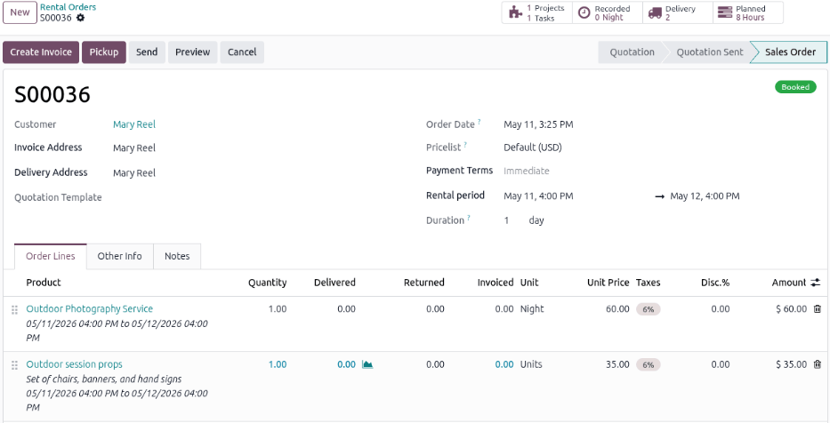
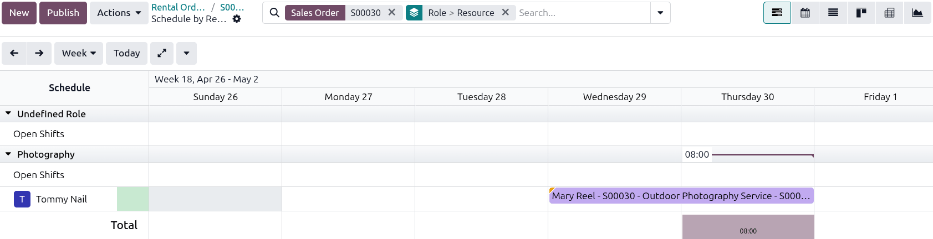
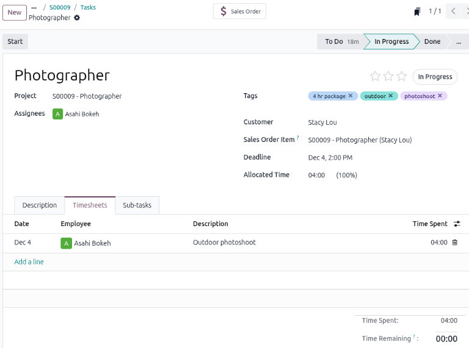

=====================
Create a rental order
=====================

In Odoo **Rental**, quotations are created and sent to customers, similar to **Sales** quotations.
Once a quotation is confirmed, it becomes a *rental order* and can be invoiced and paid for. Only
after a rental order is confirmed can rental products be picked up.

.. important::
   To configure quotation settings, the **Sales** app **must** be installed. Refer to
   :ref:`sales/quotation-settings` for detailed instructions.

Create a rental quote
=====================

To create a rental quote, navigate to :menuselection:`Rental app --> Orders --> Orders`, and click
:guilabel:`New`. Doing so reveals a blank rental order form.

Start by adding a :guilabel:`Customer`, then set the desired rental duration in the
:guilabel:`Rental period` fields. To adjust the rental duration, click the first date in the
:guilabel:`Rental period` field, and select the range of dates and times to represent the rental
duration from the pop-up calendar form that appears. Once complete, click :guilabel:`Apply` in the
calendar pop-up form.

.. important::
   There can only be one rental period per rental order. Multiple rental product orders with
   different rental periods require a rental order for each rental period.

Next, add a rental product in the :guilabel:`Order Lines` tab by clicking :guilabel:`Add a product`
and selecting the desired rental product to add to the form.

.. note::
   If a rental product is added *before* the :guilabel:`Rental period` field is properly configured,
   the user can still adjust it accordingly.

   Select the desired date range to represent the rental duration, then click :icon:`fa-refresh`
   :guilabel:`Update Rental Prices` next to the :guilabel:`Pricelist` field.

   Doing so reveals a :guilabel:`Confirmation` pop-up window. If everything is correct, click
   :guilabel:`Ok`, and Odoo recalculates the rental price accordingly.

Once all the information has been entered correctly on the rental order form, click :guilabel:`Send`
to send the quotation to the customer. When the customer confirms the quotation, click
:guilabel:`Confirm` to finalize the order. A :guilabel:`Booked` banner displays on the rental order.

When a rental order is confirmed, the following smart buttons appear at the top of the form:

- :icon:`fa-puzzle-piece` :guilabel:`Tasks`: Linked to the **Projects** app and shows any projects
  or tasks related to the rental order.
- :icon:`fa-clock-o` :guilabel:`Recorded`: Linked to the **Timesheets** app and shows how many hours
  are related to the rental order.
- :icon:`fa-tasks` :guilabel:`Planned`: Linked to the **Planning** app and shows how many shifts are
  related to the rental order.
- :icon:`fa-truck` :guilabel:`Delivery`: Linked to the **Inventory** app and shows any delivery and
  receipt orders related to the rental order.

.. important::
   For the appropriate smart buttons to display, the **Project**, **Timesheet**, **Planning**, and
   **Inventory** apps are needed. The selected service product on the rental order must be
   :ref:`properly configured <rental/service_products/service>` to integrate with the recommended
   apps.

Request a customer signature
============================

Odoo can request the customer sign a rental agreement, outlining the arrangement between the company
and customer, *before* they pick up the rental products. Such documents can ensure everything is
returned on time and in its original condition.

.. note::
   Requesting a signature can be done during any stage of the order. This feature also requires the
   :doc:`Sign <../../../productivity/sign>` app.

If signatures are required, go to the **Rental** app and from the default :guilabel:`Rental Orders`
dashboard, select the desired rental order. Go to the :icon:`fa-cog` :guilabel:`(Actions)` icon, and
click :icon:`fa-file-text` :guilabel:`Request Signature`.

In the *Sign Documents* pop-up window, either :ref:`select an existing document template
<sign/request-signatures/template-odoo-record>` or :ref:`create a new one
<sign/request-signatures/one-off-record>`. After sending the request, a link to the signature
request appears in the record's chatter. The document is accessible to the customer via the customer
portal or email.

.. seealso::
   `Odoo Tutorials: Sign <https://www.odoo.com/slides/sign-61>`_

Manage employee shifts for rental services
==========================================

Confirmed rental orders containing :doc:`service products <../configure_products/service_products>`
trigger the automatic creation of shifts. These shifts are generated for the assigned employee role
when the availability matches the designated rental period. This automation is made possible by the
integration with the **Planning** app and by configuring the service product.

Click the :icon:`fa-tasks` :guilabel:`Planned` smart button to open the *Schedule by Resource* page.
The page defaults to a Gantt view of all the open shifts and shifts for the associated role that are
available for the rental period of the rental order. :ref:`Customize the shifts <planning/shifts>`
as needed.

.. tip::
   Project templates allow for automated task assignment. When integrated with the **Planning** app,
   the system automatically schedules and publishes an employee’s shift if their availability
   matches the rental period. Priority is given to employees with the relevant :ref:`roles
   <planning/planning-roles>` if applicable.

Manage a project created from a rental order
============================================

Click the :icon:`fa-puzzle-piece` :guilabel:`Tasks` smart button on top of the rental order to
display a Kanban view of all the tasks automatically created when confirming the rental order.
:doc:`Customize the project's tasks <../../../services/project/tasks/task_creation>` as needed.

.. image:: create_rental_order/rental-order-task-card.png
   :alt: Photography task generated from the rental order.

.. tip::
   Configuring the use of :doc:`../../../services/project/project_management/project_templates` on
   the product form creates new projects with predefined tasks, priority levels, and assigned
   employees.

Enter the time for the rental service task
------------------------------------------

To enter time worked on a :doc:`service product <../configure_products/service_products>`, select
the respective service task, then click the :guilabel:`Timesheets` tab. Click :guilabel:`Add a line`
to enter the:

- :guilabel:`Date`: The date the work was performed.
- :guilabel:`Employee`: The employee who performed the work. Description: A brief description of the
  work performed.
- :guilabel:`Time Spent`: The number of hours worked on the task for that entry.

Click the :icon:`fa-dollar` :guilabel:`Sales Order` smart button to return to the rental order.

.. note::
   Once time is added in the :guilabel:`Timesheets` tab of a task, the rental order status is
   automatically changed to :guilabel:`Picked-up`, and a :guilabel:`Return` button appears.

Track delivered time on a rental order
~~~~~~~~~~~~~~~~~~~~~~~~~~~~~~~~~~~~~~

When time is entered on the :guilabel:`Timesheets tab` of an associated task, the delivered time is
automatically tracked on the rental order. To view the delivered time, navigate to the desired
rental order and click the :icon:`fa-clock-o` :guilabel:`Recorded` smart button at the top of the
rental order. The total hours worked appear in the :guilabel:`Recorded Time` field.

Create an invoice
=================

Navigate to the desired invoice in the **Rental** app. On the :guilabel:`Rental Orders` dashboard,
in the *Invoice Status* section, click :guilabel:`To Invoice` to view all rental orders that need to
be sent.

Click the desired rental order, then click :guilabel:`Create Invoice`. Select :guilabel:`Regular
invoice` from the :guilabel:`Create invoice(s)` window and click :guilabel:`Create Draft`.

Finalize time for physical service products
-------------------------------------------

For physical service products, such as hotel rooms, workstations, and conference rooms, a final
adjustment to the time may be needed on the invoice.

Enter the amount in the :guilabel:`Quantity` column. If new charges were accrued during the rental
period, click :guilabel:`Add a line` to include them in the invoice draft.

Confirm and pay
---------------

If all the details are correct on the invoice draft, either click :guilabel:`Confirm` and click
:guilabel:`Send` to email the invoice to the customer, or  click :guilabel:`Print` and then click
:guilabel:`Pay` if the customer is in person. In the :guilabel:`Pay` pop-up window, select a
:guilabel:`Journal` and click :guilabel:`Create Payment`.

Click the :guilabel:`Payments` smart button that appears at the top of the rental order. Click
:guilabel:`Validate` on the Payment page.

.. seealso::

   - `Odoo Tutorials: Create a Rental Order <https://youtu.be/hpQHu6U_IKk?si=Fy_Z82kzQNPBrD8v>`_
   - `Odoo Tutorials: Configuring a Rental Product
     <https://youtu.be/CE-SahTUC9A?si=ur6ci-SlKJSvQY5Q>`_
